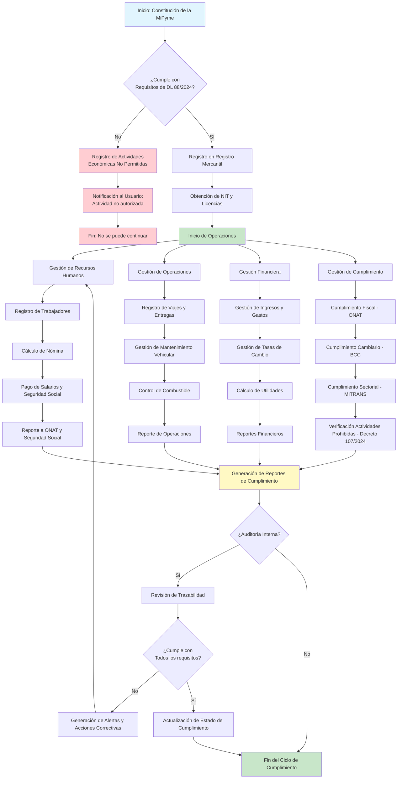
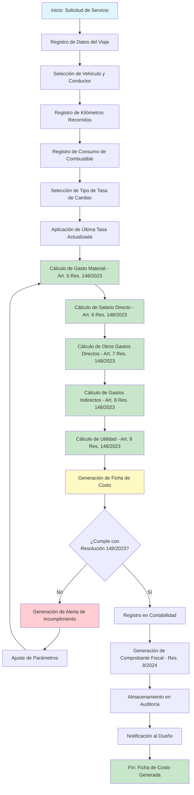
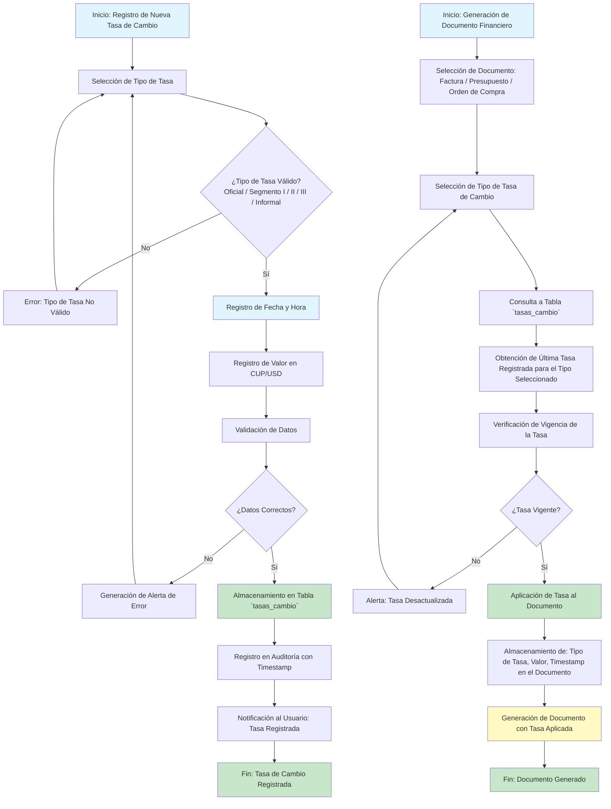
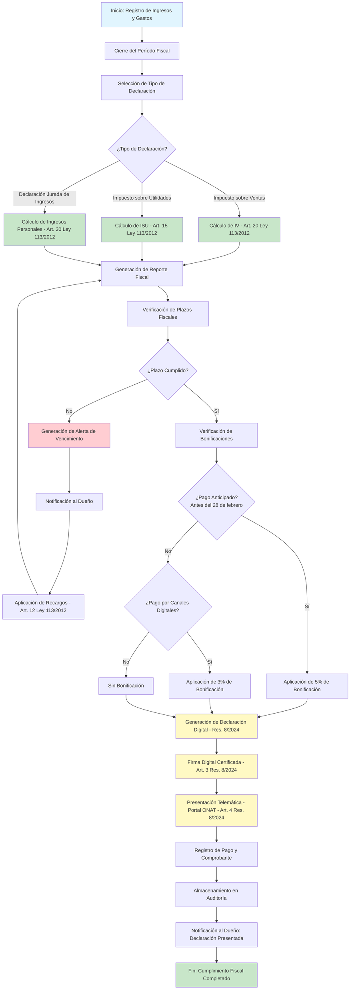
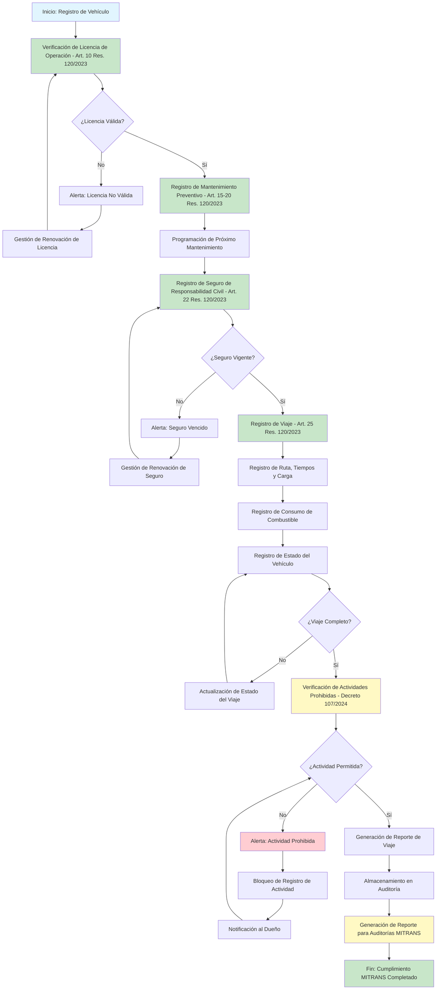
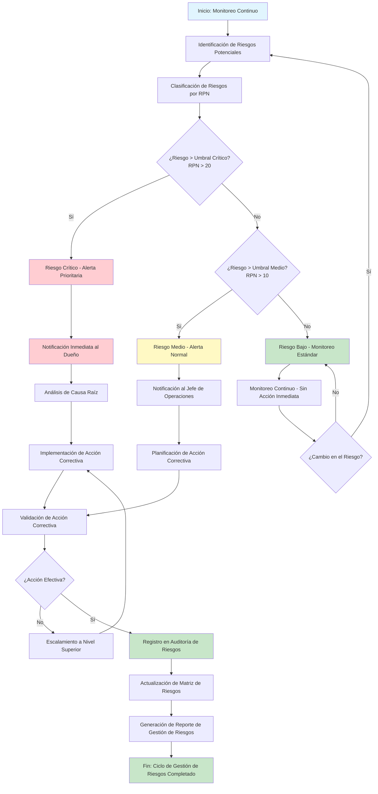
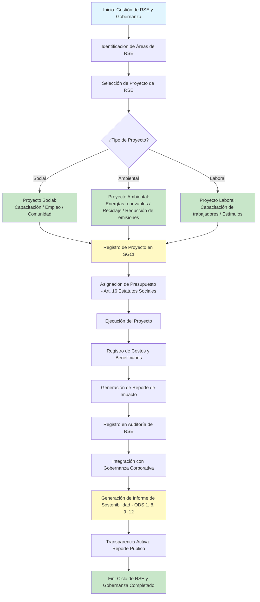

# Capítulo 3: Marco Legal (VERSIÓN ACTUALIZADA CON ESTADO REAL DEL PROYECTO - 29/08/2026)

---

## Mapa Conceptual del Marco Legal

```
┌─────────────────────────────────────────────────────────────────────────────────────────────────────┐
│                              MARCO LEGAL DE LAS MIPYMES DE TRANSPORTE EN CUBA                       │
├─────────────────────────────────────────────────────────────────────────────────────────────────────┤
│                                                                                                     │
│  ┌─────────────────────────────────────────────────────────────────────────────────────────────┐    │
│  │                      NIVEL CONSTITUCIONAL Y LEYES FUNDAMENTALES                             │    │
│  │                         Constitución de la República de Cuba (2019)                         │    │
│  │                          Ley 113/2012 (Código Tributario)                                   │    │
│  │                          Ley 127/2025 (Sistema de Control y Fiscalización)                  │    │
│  └─────────────────────────────────────────────────────────────────────────────────────────────┘    │
│                                                       │                                             │
│                                                       ▼                                             │
│  ┌─────────────────────────────────────────────────────────────────────────────────────────────┐    │
│  │                      NIVEL DE DECRETOS LEYES                                                │    │
│  │                         ┌─────────────────────────────────────────────────────────────┐     │    │
│  │                         │     Decreto Ley 88/2024 "Sobre las MiPymes"                 │     │    │
│  │                         │  • Creación y registro • Objeto social • Responsabilidad    │     │    │
│  │                         │  • Obligaciones laborales • Obligaciones fiscales           │     │    │
│  │                         └─────────────────────────────────────────────────────────────┘     │    │
│  │                                                    │                                        │    │
│  │                                                    ▼                                        │    │
│  │                         ┌─────────────────────────────────────────────────────────────┐     │    │
│  │                         │     Decreto 107/2024 "Actividades Prohibidas"               │     │    │
│  │                         │        • 125 actividades prohibidas para MiPymes            │     │    │
│  │                         └─────────────────────────────────────────────────────────────┘     │    │
│  └─────────────────────────────────────────────────────────────────────────────────────────────┘    │
│                                                       │                                             │
│                                                       ▼                                             │
│  ┌─────────────────────────────────────────────────────────────────────────────────────────────┐    │
│  │                      NIVEL DE RESOLUCIONES MINISTERIALES                                    │    │
│  │  ┌─────────────────────────┐  ┌─────────────────────────┐  ┌─────────────────────────────┐  │    │
│  │  │  Resolución 148/2023    │  │  Resoluciones BCC       │  │  Resoluciones MITRANS       │  │    │
│  │  │  (Ministerio Finanzas)  │  │  (Banco Central)        │  │  (Ministerio Transporte)    │  │    │
│  │  │  • Ficha de costo       │  │  • Tasas de cambio      │  │  • Registro de viajes       │  │    │
│  │  │  • Gastos indirectos    │  │  • Segmentos cambiarios │  │  • Mantenimiento vehicular  │  │    │
│  │  │  • Utilidad             │  │  • Mercado informal     │  │  • Licencias y seguros      │  │    │
│  │  └─────────────────────────┘  └─────────────────────────┘  └─────────────────────────────┘  │    │
│  │                                                                                             │    │
│  │  ┌─────────────────────────┐  ┌─────────────────────────┐                                   │    │
│  │  │  Resolución 8/2024      │  │  Normativa ONAT         │                                   │    │
│  │  │  (Ministerio Finanzas)  │  │  (Oficina Nacional      │                                   │    │
│  │  │  • Declaración digital  │  │   de Administración     │                                   │    │
│  │  │  • Firma digital        │  │   Tributaria)           │                                   │    │
│  │  │  • Presentación         │  │  • Plazos fiscales      │                                   │    │
│  │  │    telemática           │  │  • Bonificaciones       │                                   │    │
│  │  └─────────────────────────┘  └─────────────────────────┘                                   │    │
│  └─────────────────────────────────────────────────────────────────────────────────────────────┘    │
│                                                       │                                             │
│                                                       ▼                                             │
│  ┌─────────────────────────────────────────────────────────────────────────────────────────────┐    │
│  │                      NIVEL DE LA MIPYME (Seta Expreso S.U.R.L.)                             │    │
│  │  ┌────────────────────────────────────────────────────────────────────────────────────────┐ │    │
│  │  │                      SISTEMA DE GESTIÓN CONTEXTUALMENTE INTELIGENTE (SGCI)             │ │    │
│  │  │  • Automatización de la ficha de costo (Res. 148/2023) - ⏳ Pendiente                   │ │    │
│  │  │  • Gestión de tasas de cambio (BCC) - ⏳ Pendiente                                      │ │    │
│  │  │  • Cumplimiento fiscal (ONAT, Res. 8/2024) - ⏳ Pendiente                               │ │    │
│  │  │  • Registro de viajes y mantenimiento (MITRANS) - ⏳ Pendiente                          │ │    │
│  │  │  • Verificación de actividades prohibidas (Decreto 107/2024) - ⏳ Pendiente             │ │    │
│  │  │  • Transparencia y trazabilidad (Ley 127/2025) - ✅ Implementado (Auditoría)           │ │    │
│  │  │  • Interoperabilidad con sistemas oficiales (API abierta) - ⏳ Pendiente                │ │    │
│  │  │  • Pagos digitales y comprobantes fiscales (Res. 8/2024) - ⏳ Pendiente                 │ │    │
│  │  └────────────────────────────────────────────────────────────────────────────────────────┘ │    │
│  └─────────────────────────────────────────────────────────────────────────────────────────────┘    │
│                                                                                                     │
│  ┌─────────────────────────────────────────────────────────────────────────────────────────────┐    │
│  │                      OBJETIVOS TRANSVERSALES                                                │    │
│  │  • Responsabilidad Social Empresarial (RSE) • Gobernanza Corporativa • ODS (1, 8, 9, 12)    │    │
│  └─────────────────────────────────────────────────────────────────────────────────────────────┘    │
└─────────────────────────────────────────────────────────────────────────────────────────────────────┘
```

---

## Resumen Ejecutivo del Capítulo 3

El presente capítulo analiza el marco normativo que regula la operación de las MiPymes de transporte en Cuba, identificando cinco niveles jerárquicos:

| Nivel | Normativa | Impacto en el SGCI | Estado de Implementación |
| :--- | :--- | :--- | :--- |
| **1. Constitucional y Leyes Fundamentales** | Constitución (2019), Ley 113/2012, Ley 127/2025 | Establece los principios generales de la economía cubana y el sistema de control | ✅ Diseñado |
| **2. Decretos Leyes** | DL 88/2024 (MiPymes), Decreto 107/2024 (Actividades prohibidas) | Define el marco general de creación y operación de MiPymes | ✅ Diseñado |
| **3. Resoluciones Ministeriales** | Res. 148/2023 (Costos), Res. 8/2024 (Declaración digital), Resoluciones BCC, Resoluciones MITRANS | Establece requisitos específicos de costos, fiscalidad, cambio y transporte | ⏳ Pendiente de implementación |
| **4. Normativa ONAT** | Plazos fiscales, bonificaciones, declaraciones | Define obligaciones tributarias y plazos críticos | ⏳ Pendiente de implementación |
| **5. Nivel de la MiPyme** | Estatutos Sociales, SGCI | Implementación práctica del cumplimiento normativo | ✅ Auditoría implementada |

**Principales Conclusiones del Capítulo:**
1. El SGCI debe automatizar la ficha de costo según la Resolución 148/2023. **(⏳ Pendiente)**
2. El SGCI debe gestionar la dualidad cambiaria con registro histórico de tasas. **(⏳ Pendiente)**
3. El SGCI debe facilitar el cumplimiento fiscal con alertas de plazos y bonificaciones. **(⏳ Pendiente)**
4. El SGCI debe cumplir con la Resolución 8/2024 (declaración digital). **(⏳ Pendiente)**
5. El SGCI debe verificar actividades prohibidas (Decreto 107/2024). **(⏳ Pendiente)**
6. El SGCI debe integrar la RSE y la Gobernanza como pilares estratégicos. **(✅ Trazabilidad implementada)**
7. El SGCI debe incorporar interoperabilidad con sistemas oficiales a través de API abierta. **(⏳ Pendiente)**
8. El SGCI debe integrar pagos digitales y comprobantes fiscales automatizados. **(⏳ Pendiente)**

---

## Tabla de Contenido Detallada

**3.1. El Decreto Ley 88/2024 "Sobre las Micro, Pequeñas y Medianas Empresas"**
- 3.1.1. Contexto y Objeto del Decreto Ley
- 3.1.2. La Brecha entre la Norma y la Práctica
- 3.1.3. Implicaciones para Seta Expreso S.U.R.L. y el SGCI
- 3.1.4. Diagrama de Actividades: Flujos Normativos del Decreto Ley 88/2024
- 3.1.5. Tabla de Mapeo de Procesos del Decreto Ley 88/2024 al SGCI

**3.2. La Resolución 148/2023 "Metodología para la elaboración de la ficha de costos y gastos"**
- 3.2.1. Contexto y Objeto de la Resolución
- 3.2.2. Estructura de la Ficha de Costo
- 3.2.3. Elementos de la Ficha de Costo y Parámetros Ajustables
- 3.2.4. Ejemplo Práctico de Cálculo
- 3.2.5. Diagrama de Actividades: Flujo de Generación de la Ficha de Costo

**3.3. La Regulación Cambiaria y la Dualidad Monetaria**
- 3.3.1. Marco Normativo del Sistema Cambiario Cubano
- 3.3.2. Tasas de Cambio Vigentes (2026)
- 3.3.3. Gestión de la Tasa de Cambio en el SGCI
- 3.3.4. Análisis de Sensibilidad de Riesgo Cambiario
- 3.3.5. Diagrama de Actividades: Flujo de Gestión de Tasas de Cambio

**3.4. Normativa de la Oficina Nacional de Administración Tributaria (ONAT)**
- 3.4.1. Obligaciones Fiscales de las MiPymes
- 3.4.2. Plazos Fiscales Críticos y Bonificaciones
- 3.4.3. La Resolución 8/2024: Declaración Digital Obligatoria
- 3.4.4. Gestión de Plazos Fiscales en el SGCI
- 3.4.5. Diagrama de Actividades: Flujo de Cumplimiento Fiscal

**3.5. Regulación del Sector del Transporte en Cuba (MITRANS)**
- 3.5.1. Marco Normativo del Transporte Terrestre
- 3.5.2. El Decreto 107/2024: Actividades Prohibidas
- 3.5.3. Implicaciones para el SGCI
- 3.5.4. Diagrama de Actividades: Flujo de Cumplimiento del MITRANS

**3.6. Análisis de Riesgos Legales y Estrategias de Mitigación**
- 3.6.1. Análisis Cuantitativo de Riesgos
- 3.6.2. Estrategias de Mitigación Generales
- 3.6.3. Diagrama de Actividades: Gestión de Riesgos Legales

**3.7. El SGCI como Estrategia de Gobernanza y Responsabilidad Social Empresarial**
- 3.7.1. La RSE como Pilar Estratégico
- 3.7.2. Gobernanza Corporativa y Transparencia
- 3.7.3. El SGCI como Instrumento de Desarrollo Sostenible
- 3.7.4. Diagrama de Actividades: Flujo de RSE y Gobernanza

**3.8. Conclusiones del Marco Legal**

---

## Glosario de Términos Legales

| Término | Definición |
| :--- | :--- |
| **Ficha de Costo** | Instrumento contable que desglosa los elementos que integran el costo de un producto o servicio, según lo establecido por la Resolución 148/2023 del MFP. |
| **Dualidad Cambiaria** | Situación en la que coexisten múltiples tasas de cambio entre el peso cubano (CUP) y el dólar estadounidense (USD), reguladas por el Banco Central de Cuba. |
| **Declaración Jurada** | Documento presentado ante la ONAT en el que se declaran los ingresos, gastos y utilidades de una entidad o persona natural, con carácter de declaración bajo juramento. |
| **Gasto Indirecto** | Gasto no directamente asignable a un servicio específico, pero necesario para la operación de la entidad (ej. gastos administrativos, alquiler). |
| **Responsabilidad Social Empresarial (RSE)** | Conjunto de compromisos voluntarios de la MiPyme con sus trabajadores, la sociedad y el medio ambiente, reconocidos por el Decreto Ley 88/2024. |
| **Gobernanza Corporativa** | Sistema de principios, políticas y procedimientos que garantizan la transparencia, la trazabilidad y la rendición de cuentas en la gestión de la MiPyme. |
| **Segmento Cambiario** | Categoría de operaciones de cambio con una tasa específica, regulada por el Banco Central de Cuba (Segmentos I, II, III). |
| **Interoperabilidad** | Capacidad de un sistema para comunicarse e intercambiar información con otros sistemas de manera efectiva. |
| **Comprobante Fiscal** | Documento digital que acredita una transacción económica y cumple con los requisitos fiscales establecidos por la ONAT. |
| **Firma Digital Certificada** | Mecanismo criptográfico que garantiza la autenticidad e integridad de los documentos digitales, requerido por la Resolución 8/2024. |

---

## Introducción al Capítulo 3

El presente capítulo tiene como objetivo analizar en profundidad el marco normativo que regula la operación de las MiPymes de transporte en Cuba y que condiciona el diseño, desarrollo e implementación del **Sistema de Gestión Contextualmente Inteligente (SGCI)** . La investigación no puede limitarse a una solución técnica; debe ser **legalmente sólida** y garantizar el cumplimiento de todas las obligaciones fiscales, laborales y operativas establecidas por el Estado cubano.

La estructura del capítulo responde a una lógica jerárquica: desde el marco general de las MiPymes (Decreto Ley 88/2024), pasando por la normativa específica de costos (Resolución 148/2023), hasta las regulaciones fiscales (ONAT), cambiarias (BCC) y sectoriales (MITRANS). Cada sección identifica los requisitos normativos y explica cómo el SGCI los abordará y automatizará, convirtiendo el cumplimiento legal en una ventaja competitiva. **Además, se incorpora la visión de interoperabilidad con otros sistemas del ecosistema logístico cubano, la flexibilidad normativa para adaptarse a futuros cambios regulatorios, y la alineación con los principios de encriptación, auditoría y retención de datos definidos en el modelo de datos (Capítulo 5).**

**Estado del Proyecto (29/08/2026):** El SGCI se encuentra en **Fase 1 (Configuración del Entorno)** con avances significativos en los módulos de autenticación, manifiestos, houses (estados) y frontend web. La trazabilidad y auditoría (Ley 127/2025) ya está implementada a través de los campos `createdBy` y `updatedBy` en todas las tablas transaccionales. Los módulos de ficha de costo, tasas de cambio, cumplimiento fiscal, actividades prohibidas, RSE e interoperabilidad se encuentran pendientes de implementación (Fases 5-8 del plan de implementación). Los estados indicados reflejan el nivel de avance actual del proyecto.

---

## 3.1. El Decreto Ley 88/2024 "Sobre las Micro, Pequeñas y Medianas Empresas"

### 3.1.1. Contexto y Objeto del Decreto Ley

El **Decreto Ley 88/2024**, emitido por el Consejo de Ministros de la República de Cuba, constituye el marco legal fundamental para la creación, organización y funcionamiento de las Micro, Pequeñas y Medianas Empresas (MiPymes) en el país. Este cuerpo normativo, publicado en la Gaceta Oficial de la República de Cuba, responde a la necesidad de diversificar la economía nacional, fomentar la iniciativa privada y generar empleo en un contexto de actualización del modelo económico cubano (Ministerio de Economía y Planificación, 2024).

El Decreto Ley 88/2024 establece, entre otros aspectos:

1. **La definición y clasificación de las MiPymes:** Según el número de trabajadores y el volumen de ingresos anuales.
2. **El procedimiento de constitución y registro:** A través del Registro Mercantil del Ministerio de Justicia.
3. **El objeto social:** Las actividades económicas que pueden desarrollar, que deben estar contempladas en el Registro de Actividades Económicas.
4. **El régimen de responsabilidad:** La responsabilidad limitada de los socios en las Sociedades Unipersonales de Responsabilidad Limitada (S.U.R.L.), como es el caso de Seta Expreso.
5. **Las obligaciones laborales y de seguridad social:** La afiliación de los trabajadores al régimen de seguridad social.
6. **Las obligaciones tributarias y fiscales:** La inscripción en la Oficina Nacional de Administración Tributaria (ONAT) y el cumplimiento de las declaraciones juradas.

### 3.1.2. La Brecha entre la Norma y la Práctica

La literatura especializada señala que el marco regulatorio de las MiPymes en Cuba se enfrenta a una **brecha significativa entre la formalidad declarada y la aplicación efectiva**. Esta brecha se manifiesta en ambigüedades normativas, superposición de disposiciones, demoras en los trámites, y ausencia de mecanismos institucionales de apoyo coherentes (García & Pérez, 2025). El SGCI abordará esta brecha al automatizar los procesos de cumplimiento, reduciendo la dependencia de la interpretación subjetiva de la normativa y garantizando la trazabilidad documental.

### 3.1.3. Implicaciones para Seta Expreso S.U.R.L. y el SGCI

Seta Expreso S.U.R.L. se constituyó formalmente mediante Escritura Pública de Constitución de Sociedad Unipersonal de Responsabilidad Limitada número 148, otorgada el 16 de abril de 2024 ante la Notaria Licenciada Glenda María Escobar García, e inscrita en el Registro Mercantil Territorial de La Habana el 9 de mayo de 2024 (Inscripción Primera, Tomo CCVI, Folio 191, Hoja 4109). Posteriormente, mediante Escritura Pública de Cesión Onerosa de Participaciones Sociales número 41, otorgada el 6 de febrero de 2026 ante la Notaria Licenciada Daymaris Calderín Batista, el socio único y representante legal actual es **Osleyder González Acosta**.

**Implicaciones para el SGCI (Implementado y Planificado):**

| Requisito del Decreto Ley 88/2024 | Fundamento Legal | Cómo lo aborda el SGCI | Estado |
| :--- | :--- | :--- | :--- |
| **Registro y actualización de datos societarios** | Art. 10-15, DL 88/2024 | El SGCI incluirá un módulo de configuración que permitirá registrar y actualizar los datos de la MiPyme (NIT, objeto social, representante legal, capital social). | ⏳ Pendiente de implementación |
| **Control de trabajadores y nómina** | Art. 20-25, DL 88/2024 | El SGCI gestionará la nómina de conductores, choferes y personal administrativo, calculando los salarios, las retenciones y las contribuciones a la seguridad social. | ⏳ Pendiente de implementación |
| **Cumplimiento de obligaciones fiscales** | Art. 30-35, DL 88/2024 | El SGCI generará automáticamente los reportes necesarios para las declaraciones juradas de la ONAT (impuesto sobre utilidades, ventas, servicios) y calculará los impuestos adeudados. | ⏳ Pendiente de implementación |
| **Registro de operaciones económicas** | Art. 28, DL 88/2024; Art. 15, Ley 127/2025 | El SGCI registra todas las operaciones de ingresos y gastos, garantizando la trazabilidad y la auditoría (con campos `created_by` y `updated_by`), tal como lo exige el Decreto Ley para el control fiscal. | ✅ **Implementado** (Auditoría activa) |

### 3.1.4. Diagrama de Actividades: Flujos Normativos del Decreto Ley 88/2024

El siguiente diagrama de actividades representa los flujos normativos que el SGCI debe gestionar para garantizar el cumplimiento del Decreto Ley 88/2024. Este diagrama muestra los procesos clave, las decisiones críticas y las interacciones con los diferentes actores involucrados.



### 3.1.5. Tabla de Mapeo de Procesos del Decreto Ley 88/2024 al SGCI

| Proceso Normativo (DL 88/2024) | Descripción | Artefacto del SGCI | Frecuencia de Validación | Responsable | Estado |
| :--- | :--- | :--- | :--- | :--- | :--- |
| **Constitución y Registro** | Inscripción en el Registro Mercantil, obtención de NIT y licencias. | Módulo de Configuración: Datos de la MiPyme | Inicial (única) | Socio Único / Dueño | ⏳ Pendiente |
| **Registro de Actividades** | Las actividades deben estar contempladas en el Registro de Actividades Económicas. | Módulo de Verificación: Consulta automática de actividades permitidas | Por cada nueva actividad | Jefe de Operaciones | ⏳ Pendiente |
| **Gestión de Trabajadores** | Registro de trabajadores, control de nómina y seguridad social. | Módulo de Recursos Humanos: Registro de empleados, cálculo de nómina | Mensual | Dueño / Encargado de Nómina | ⏳ Pendiente |
| **Cumplimiento Fiscal** | Declaraciones juradas, pago de impuestos (ISU, IV, servicios). | Módulo de Cumplimiento Fiscal: Cálculo de impuestos, generación de reportes | Trimestral / Mensual | Dueño / Contador | ⏳ Pendiente |
| **Control de Operaciones** | Registro de viajes, entregas, combustible y mantenimiento. | Módulo de Operaciones: Registro de viajes, control de combustible | Por viaje / Diario | Jefe de Operaciones | ⏳ Pendiente |
| **Trazabilidad y Auditoría** | Registro de todas las operaciones con campos de auditoría (`created_by`, `updated_by`, timestamps). | Módulo de Auditoría: Registro automático en todas las tablas | Continuo | Sistema (automático) | ✅ **Implementado** |
| **Interoperabilidad** | Integración con sistemas oficiales (Aduana, MITRANS, ONAT). | API Abierta: Endpoints para intercambio de información | Por integración | Sistema (automático) | ⏳ Pendiente |
| **Reportes de Cumplimiento** | Generación de reportes para auditorías internas y externas. | Módulo de Reportes: Reportes personalizables | Bajo demanda | Dueño / Contador | ⏳ Pendiente |

---

## 3.2. La Resolución 148/2023 "Metodología para la elaboración de la ficha de costos y gastos"

### 3.2.1. Contexto y Objeto de la Resolución

La **Resolución 148/2023 del Ministerio de Finanzas y Precios (MFP)** , emitida el 16 de junio de 2023, establece la "Metodología para la elaboración de la ficha de costos y gastos de productos y servicios". Esta resolución es de **obligatorio cumplimiento** para todas las entidades económicas, incluyendo las MiPymes privadas, y constituye el instrumento normativo que regula la determinación de precios y tarifas en el país (Ministerio de Finanzas y Precios, 2023).

La Resolución 148/2023 responde a la necesidad de estandarizar el cálculo de costos, garantizar la transparencia en la formación de precios y proteger a los consumidores de incrementos injustificados. Su aplicación es especialmente relevante en sectores regulados como el transporte, donde los precios pueden estar sujetos a topes máximos.

### 3.2.2. Estructura de la Ficha de Costo según la Resolución 148/2023

La Resolución 148/2023 establece que la ficha de costo debe contener los siguientes elementos:

1. **Gasto Material:** Incluye el costo de los materiales directos utilizados en la producción del servicio. En el transporte: combustible, lubricantes, neumáticos, piezas de repuesto, materiales de mantenimiento, etc. (Art. 5, Res. 148/2023).

2. **Salario Directo:** Remuneración del personal directamente vinculado a la prestación del servicio. En el transporte: salario de conductores, choferes y ayudantes que participan directamente en la operación de los vehículos (Art. 6, Res. 148/2023).

3. **Otros Gastos Directos:** Gastos que pueden asignarse directamente al servicio, además de los materiales y la mano de obra directa. En el transporte: depreciación de los vehículos, seguros, peajes, gastos de carga y descarga, etc. (Art. 7, Res. 148/2023).

4. **Gastos Indirectos:** Gastos no directamente asignables a un servicio específico, pero necesarios para la operación de la entidad. En el transporte: gastos administrativos, alquiler de oficinas, servicios públicos, salarios del personal administrativo, etc. La Resolución establece que los gastos indirectos pueden calcularse como un **coeficiente de hasta 1.0 veces el salario directo**, aplicado proporcionalmente a cada servicio (Art. 8, Res. 148/2023).

5. **Utilidad:** Margen de ganancia que se añade al costo total para determinar el precio de venta. Se determina como un porcentaje del costo total, dentro de los límites establecidos para servicios regulados (Art. 9, Res. 148/2023).

### 3.2.3. Elementos de la Ficha de Costo y Parámetros Ajustables

| Elemento de la Ficha de Costo | Fundamento Legal | Descripción | Parámetros Ajustables | Cómo lo abordará el SGCI | Estado |
| :--- | :--- | :--- | :--- | :--- | :--- |
| **Gasto Material** | Art. 5, Res. 148/2023 | Combustible, lubricantes, neumáticos, piezas de repuesto, materiales de mantenimiento. | **Sí**, todos los precios y consumos serán configurados por el usuario (ej. precio del combustible, consumo por km). | El SGCI calculará automáticamente el gasto de combustible con base en el consumo real de cada vehículo (ej. Gazelle 0.10 L/km, Howo 0.17 L/km) y el precio configurado por el usuario. | ⏳ Pendiente de implementación |
| **Salario Directo** | Art. 6, Res. 148/2023 | Remuneración de conductores y choferes. | **Sí**, la tarifa por kilómetro o por viaje será configurable. | El SGCI calculará el salario con base en los kilómetros recorridos, el número de viajes, y la tarifa configurada por el usuario. | ⏳ Pendiente de implementación |
| **Otros Gastos Directos** | Art. 7, Res. 148/2023 | Depreciación de vehículos, seguros, peajes, etc. | **Sí**, el método de depreciación, la tasa de depreciación y los costos de seguros serán configurados por el usuario. | El SGCI calculará la depreciación con base en el método y la tasa configurada por el usuario, y registrará los gastos de peajes y seguros. | ⏳ Pendiente de implementación |
| **Gastos Indirectos** | Art. 8, Res. 148/2023 | Gastos administrativos, alquiler de oficinas, servicios públicos, etc. | **Sí**, el coeficiente de gastos indirectos (hasta 1.0 veces el salario directo) será configurable. | El SGCI aplicará automáticamente el coeficiente configurado por el usuario (ej. 0.8, 1.0) para calcular los gastos indirectos asignables a cada servicio. | ⏳ Pendiente de implementación |
| **Gasto de Mantenimiento** | Art. 5, Res. 148/2023 | Costos de mantenimiento preventivo y correctivo de los vehículos. | **Sí**, los costos de mantenimiento y la frecuencia serán configurados por el usuario. | El SGCI registrará los gastos de mantenimiento y los asignará a los servicios correspondientes. | ⏳ Pendiente de implementación |
| **Gasto de Administración** | Art. 8, Res. 148/2023 | Costos de gestión, contabilidad, y otros gastos administrativos. | **Sí**, los gastos administrativos serán configurados por el usuario. | El SGCI registrará los gastos administrativos y los asignará proporcionalmente a los servicios. | ⏳ Pendiente de implementación |

### 3.2.4. Ejemplo Práctico de Cálculo de la Ficha de Costo para un Viaje de 100 km en Gazelle

| Concepto | Fundamento Legal | Cálculo | Monto (CUP) |
| :--- | :--- | :--- | :--- |
| **Gasto Material (Combustible)** | Art. 5, Res. 148/2023 | 100 km × 0.10 L/km × 2,200 CUP/L | **22,000** |
| **Salario Directo (Conductor)** | Art. 6, Res. 148/2023 | 100 km × 15 CUP/km | **1,500** |
| **Otros Gastos Directos (Depreciación)** | Art. 7, Res. 148/2023 | 100 km × 2 CUP/km | **200** |
| **Gastos Indirectos (1.0 × Salario Directo)** | Art. 8, Res. 148/2023 | 1.0 × 1,500 CUP | **1,500** |
| **Gasto de Mantenimiento** | Art. 5, Res. 148/2023 | 100 km × 1 CUP/km | **100** |
| **Gasto de Administración** | Art. 8, Res. 148/2023 | 100 km × 0.5 CUP/km | **50** |
| **Costo Total** | — | 22,000 + 1,500 + 200 + 1,500 + 100 + 50 | **25,350** |
| **Utilidad (15%)** | Art. 9, Res. 148/2023 | 25,350 × 0.15 | **3,802.50** |
| **Precio de Venta** | — | 25,350 + 3,802.50 | **29,152.50** |

### 3.2.5. Diagrama de Actividades: Flujo de Generación de la Ficha de Costo

El siguiente diagrama de actividades representa el flujo de generación automatizada de la ficha de costo en el SGCI, desde la entrada de datos hasta la generación del reporte final, cumpliendo con la Resolución 148/2023.



---

## 3.3. La Regulación Cambiaria y la Dualidad Monetaria

### 3.3.1. Marco Normativo del Sistema Cambiario Cubano

La economía cubana opera en un contexto de **dualidad cambiaria**, caracterizado por la coexistencia de múltiples tasas de cambio entre el peso cubano (CUP) y el dólar estadounidense (USD) (Banco Central de Cuba [BCC], 2025). Este fenómeno tiene implicaciones significativas para la gestión financiera de las MiPymes y debe ser considerado en el diseño del SGCI.

El Banco Central de Cuba (BCC) regula el mercado cambiario a través de las siguientes disposiciones:

1. **Resolución 117/2024:** Establece las tasas de cambio oficiales para las operaciones de compra y venta de divisas en el sistema bancario.
2. **Resolución 23/2025:** Regula los segmentos cambiarios (Segmento I, II y III) para operaciones específicas (exportaciones, importaciones, remesas, etc.).
3. **Disposiciones sobre el mercado informal:** El BCC reconoce la existencia de un mercado paralelo de divisas, aunque no lo regula directamente, y establece mecanismos de control para evitar la especulación.

### 3.3.2. Tasas de Cambio Vigentes (2026)

| Segmento | Fundamento Legal | Tasa (CUP/USD) | Aplicación |
| :--- | :--- | :--- | :--- |
| **Oficial** | Res. 117/2024 BCC | 24 | Operaciones del Estado, pagos de servicios públicos, importaciones esenciales. |
| **Segmento I** | Res. 23/2025 BCC | 24 | Operaciones de personas naturales y jurídicas con cuentas en USD. |
| **Segmento II** | Res. 23/2025 BCC | 120 | Operaciones de exportación e importación no esenciales. |
| **Segmento III** | Res. 23/2025 BCC | 180 | Operaciones de remesas familiares y otras transferencias. |
| **Informal (Mercado Paralelo)** | Reconocido por BCC | 500 - 700 | Operaciones no oficiales, compra-venta de divisas entre particulares. |

### 3.3.3. Gestión de la Tasa de Cambio: Registro Histórico, Selección Dinámica y Aplicación Automática

El SGCI deberá ser capaz de gestionar la tasa de cambio de manera flexible y precisa, cumpliendo con los requisitos de la dualidad cambiaria cubana. Para ello, se propone implementar un **módulo de gestión de tasas de cambio** con las siguientes características:

| Característica | Fundamento Legal | Descripción | Implementación en el SGCI | Estado |
| :--- | :--- | :--- | :--- | :--- |
| **Registro histórico de tasas de cambio** | Res. 117/2024, Res. 23/2025 BCC | El sistema mantendrá un historial de todas las tasas de cambio registradas, incluyendo **fecha, hora, tipo de tasa (oficial, segmento I, II, III, informal) y valor en CUP/USD**. | Se diseñará una tabla `tasas_cambio` en PostgreSQL, con campos `fecha`, `hora`, `tipo_tasa`, `valor_en_cup`, `usuario_creador`. | ⏳ Pendiente de implementación |
| **No se borran las tasas de cambio anteriores** | Ley 127/2025 (auditoría) | Las tasas de cambio nunca se eliminan. Se mantienen para auditorías y análisis histórico. | Se implementará una política de retención de datos: las tasas de cambio serán inmutables (no se borran, solo se actualizan con nuevas entradas). | ⏳ Pendiente de implementación |
| **Registro de varias tasas en un mismo día** | Res. 23/2025 BCC | El sistema permite registrar múltiples tasas de cambio en una misma fecha y hora (ej. tasa oficial a las 09:00, tasa del segmento II a las 10:30, tasa informal a las 14:00). | El sistema permitirá múltiples registros por fecha y hora, diferenciados por el campo `tipo_tasa`. | ⏳ Pendiente de implementación |
| **Selección dinámica del tipo de tasa en cada documento** | Res. 117/2024 BCC | Cuando se genere cualquier documento que requiera conversión de moneda (factura, presupuesto, orden de compra, etc.), el sistema **permitirá al usuario escoger entre las diferentes tasas de cambio disponibles** (oficial, segmento I, II, III, informal). | Se diseñará una interfaz de usuario con un selector de tipo de tasa (dropdown) en el momento de generar el documento. | ⏳ Pendiente de implementación |
| **Aplicación automática de la última tasa actualizada** | Res. 117/2024 BCC | Después de escogido el tipo de tasa, el sistema **tomará automáticamente la última actualización registrada** para ese tipo de tasa (por fecha y hora). | El sistema consultará la tabla `tasas_cambio` para obtener el registro más reciente del tipo de tasa seleccionado. | ⏳ Pendiente de implementación |
| **Trazabilidad de transacciones** | Art. 15, Ley 127/2025 | Cada factura, pago o registro financiero almacenará: (1) El tipo de tasa seleccionado (2) La tasa aplicada (valor numérico) (3) El timestamp de la tasa utilizada (fecha y hora) | Se diseñará la tabla `facturas` con campos: `tipo_tasa_seleccionada` (ENUM), `tasa_aplicada` (DECIMAL), `timestamp_tasa` (TIMESTAMP) | ⏳ Pendiente de implementación |

### 3.3.4. Análisis de Sensibilidad de Riesgo Cambiario

El SGCI incluirá un **módulo de simulación** que permitirá al dueño evaluar el impacto de las variaciones de la tasa de cambio en la rentabilidad de la MiPyme.

**Ejemplo de Simulación (Ingreso de 10,000 USD):**

| Tasa de Cambio (CUP/USD) | Ingreso Convertido (CUP) | Costo Operativo (CUP) | Utilidad (CUP) | Utilidad (USD) |
| :--- | :--- | :--- | :--- | :--- |
| 24 (Oficial) | 240,000 | 200,000 | 40,000 | 1,667 |
| 120 (Segmento II) | 1,200,000 | 200,000 | 1,000,000 | 8,333 |
| 500 (Informal) | 5,000,000 | 200,000 | 4,800,000 | 9,600 |
| 700 (Informal) | 7,000,000 | 200,000 | 6,800,000 | 9,714 |

**Implicación:** Una variación de la tasa de cambio de 24 a 700 CUP/USD puede multiplicar la utilidad en CUP por 170 veces. Esta volatilidad exige una **gestión activa del riesgo cambiario**, que el SGCI facilitará mediante la selección dinámica de tasas y la simulación de escenarios.

### 3.3.5. Diagrama de Actividades: Flujo de Gestión de Tasas de Cambio

El siguiente diagrama de actividades representa el flujo de gestión de tasas de cambio en el SGCI, desde el registro de una nueva tasa hasta su aplicación en documentos financieros, cumpliendo con las resoluciones del BCC.



---

## 3.4. Normativa de la Oficina Nacional de Administración Tributaria (ONAT)

### 3.4.1. Obligaciones Fiscales de las MiPymes

La Oficina Nacional de Administración Tributaria (ONAT) es el órgano encargado de la gestión y el control de los tributos en Cuba. Las MiPymes están sujetas a las siguientes obligaciones fiscales (ONAT, 2026):

1. **Impuesto sobre Utilidades (ISU):** Grava las utilidades generadas por la actividad económica. La tasa general es del 35% para las MiPymes privadas (Art. 15, Ley 113/2012).
2. **Impuesto sobre Ventas (IV):** Grava las ventas de bienes y servicios. La tasa general es del 10%, aunque existen tasas reducidas para algunos productos y servicios (Art. 20, Ley 113/2012).
3. **Impuesto sobre Servicios:** Grava la prestación de servicios específicos, con tasas que varían según la actividad.
4. **Declaración Jurada de Ingresos Personales:** Para los socios y trabajadores de la MiPyme.

### 3.4.2. Plazos Fiscales Críticos y Bonificaciones

| Obligación Fiscal | Fundamento Legal | Plazo | Bonificaciones | Alertas del SGCI | Estado |
| :--- | :--- | :--- | :--- | :--- | :--- |
| **Declaración y Pago de Tributos (Personas Jurídicas)** | Art. 25, Ley 113/2012; Res. 8/2024 MFP | **31 de marzo** | **5%** por pago anticipado (antes del 28 de febrero) | Se diseñará una alerta 30 días antes: "Quedan 30 días para la declaración de impuestos. Pague antes del 28 de febrero para obtener un 5% de bonificación." | ⏳ Pendiente de implementación |
| **Declaración Jurada de Ingresos Personales (Socios de MiPymes)** | Art. 30, Ley 113/2012 | **30 de abril** | **5%** por pago anticipado (antes del 28 de febrero) | Se diseñará una alerta 30 días antes: "Quedan 30 días para la declaración de ingresos personales. Pague antes del 28 de febrero para obtener un 5% de bonificación." | ⏳ Pendiente de implementación |
| **Declaración de Impuesto sobre Ventas** | Art. 22, Ley 113/2012 | Mensual (día 20 del mes siguiente) | **3%** adicional por pago a través de canales digitales | Se diseñará una alerta 10 días antes: "Quedan 10 días para la declaración de impuesto sobre ventas. Utilice canales digitales para obtener un 3% de descuento." | ⏳ Pendiente de implementación |
| **Declaración de Impuesto sobre Utilidades** | Art. 18, Ley 113/2012 | Trimestral (día 20 del mes siguiente al trimestre) | **3%** adicional por pago a través de canales digitales | Se diseñará una alerta 10 días antes: "Quedan 10 días para la declaración de impuesto sobre utilidades." | ⏳ Pendiente de implementación |

### 3.4.3. La Resolución 8/2024: Declaración Digital Obligatoria

La **Resolución 8/2024 del Ministerio de Finanzas y Precios** establece que las entidades (incluyendo MiPymes) deben presentar la Declaración Jurada del Impuesto sobre las Utilidades **exclusivamente en formato digital y con firma digital certificada** (Ministerio de Finanzas y Precios, 2024). El SGCI incorporará esta funcionalidad mediante:

| Requisito de la Resolución 8/2024 | Fundamento Legal | Implementación en el SGCI | Estado |
| :--- | :--- | :--- | :--- |
| **Generación automática de la declaración** | Art. 2, Res. 8/2024 | En el formato requerido por la ONAT, a partir de los datos financieros registrados en el sistema. | ⏳ Pendiente de implementación |
| **Integración con la firma digital certificada** | Art. 3, Res. 8/2024 | El SGCI se integrará con los sistemas de firma digital para garantizar la autenticidad de las declaraciones. | ⏳ Pendiente de implementación |
| **Presentación telemática** | Art. 4, Res. 8/2024 | El sistema permitirá la presentación de la declaración a través del Portal Tributario de la ONAT (www.onat.gob.cu) (ONAT, 2026). | ⏳ Pendiente de implementación |

### 3.4.4. Gestión de Plazos Fiscales y Bonificaciones en el SGCI

El SGCI incluirá un **módulo de cumplimiento fiscal** que automatizará la gestión de los plazos tributarios y las bonificaciones disponibles:

1. **Cálculo automático de impuestos:** El SGCI calculará automáticamente los impuestos sobre las ventas y las utilidades, con base en los ingresos y gastos registrados en el sistema.
2. **Generación de reportes fiscales:** El SGCI generará reportes detallados para las declaraciones juradas de la ONAT (ISU, IV, etc.), en el formato requerido por la administración tributaria.
3. **Alertas y recordatorios de plazos:** El SGCI enviará alertas automáticas al dueño o al Jefe de Operaciones cuando se aproximen las fechas límite para el pago de impuestos.
4. **Registro de pagos y comprobantes:** El SGCI permitirá registrar los pagos de impuestos y almacenar los comprobantes de pago para futuras auditorías.

### 3.4.5. Diagrama de Actividades: Flujo de Cumplimiento Fiscal

El siguiente diagrama de actividades representa el flujo de cumplimiento fiscal en el SGCI, desde el cálculo de impuestos hasta la presentación de la declaración digital, cumpliendo con la Ley 113/2012 y la Resolución 8/2024.



---

## 3.5. Regulación del Sector del Transporte en Cuba (MITRANS)

### 3.5.1. Marco Normativo del Transporte Terrestre

El sector del transporte terrestre en Cuba está regulado por el **Ministerio de Transporte (MITRANS)** , a través de las siguientes normativas:

1. **Resolución 120/2023:** "Reglamento para la prestación de servicios de transporte de carga por carretera".
2. **Resolución 135/2024:** "Requisitos para la operación de vehículos de transporte de pasajeros".
3. **Resolución 12/2025:** "Normas de seguridad vial para el transporte de mercancías peligrosas".

Estas resoluciones establecen requisitos específicos para la operación de vehículos de transporte, incluyendo:

- **Licencias de operación:** Las MiPymes deben obtener una licencia de operación para cada vehículo (Art. 10, Res. 120/2023).
- **Requisitos técnicos:** Los vehículos deben cumplir con estándares de mantenimiento y seguridad (Art. 15-20, Res. 120/2023).
- **Seguro de responsabilidad civil:** Obligatorio para todos los vehículos de transporte (Art. 22, Res. 120/2023).
- **Registro de viajes:** Las empresas deben llevar un registro detallado de todos los viajes realizados, incluyendo rutas, tiempos y cargas transportadas (Art. 25, Res. 120/2023).

### 3.5.2. El Decreto 107/2024: Actividades Prohibidas para MiPymes

El **Decreto 107/2024** establece las **125 actividades que están prohibidas** para el sector privado en Cuba (Consejo de Ministros, 2024). El SGCI incluirá un **módulo de verificación** que, al momento de registrar una nueva actividad, consultará automáticamente la lista de actividades prohibidas y alertará al usuario si la actividad no está permitida. Esto garantizará que Seta Expreso opere dentro del marco legal y evite sanciones por actividades no autorizadas.

### 3.5.3. Implicaciones para el SGCI

| Requisito del MITRANS | Fundamento Legal | Cómo lo aborda el SGCI | Estado |
| :--- | :--- | :--- | :--- |
| **Registro de viajes** | Art. 25, Res. 120/2023 MITRANS | El SGCI registrará automáticamente cada viaje realizado, incluyendo la ruta, el vehículo, el conductor, los tiempos de salida y llegada, y la carga transportada. | ⏳ Pendiente de implementación |
| **Control de mantenimiento de vehículos** | Art. 15-20, Res. 120/2023 MITRANS | El SGCI gestionará el historial de mantenimiento de cada vehículo, programando alertas para los mantenimientos preventivos y registrando las reparaciones realizadas. | ⏳ Pendiente de implementación |
| **Gestión de licencias y seguros** | Art. 10, Res. 120/2023; Art. 22, Res. 120/2023 MITRANS | El SGCI permitirá registrar las licencias de operación y los seguros de cada vehículo, enviando alertas cuando están por vencer. | ⏳ Pendiente de implementación |
| **Verificación de actividades prohibidas** | Decreto 107/2024 | El SGCI incluirá un módulo de verificación que alertará al usuario si intenta registrar una actividad no permitida por el Decreto 107/2024. | ⏳ Pendiente de implementación |
| **Reportes para auditorías** | Art. 28, DL 88/2024; Art. 15, Ley 127/2025 | El SGCI generará reportes detallados que pueden ser utilizados para auditorías del MITRANS, demostrando el cumplimiento de las normativas. | ⏳ Pendiente de implementación |
| **Interoperabilidad con sistemas oficiales** | Art. 32, Ley 127/2025 | El SGCI está diseñado para interoperar con otros sistemas del ecosistema logístico cubano, como el sistema de la Aduana General de la República y el sistema de control de flota del MITRANS. Esta interoperabilidad, garantizada por una arquitectura de API abierta y un modelo de roles dinámicos, facilitará el cumplimiento de las obligaciones legales y la generación de reportes para los entes reguladores (Contraloría General de la República, 2025). | ⏳ Pendiente de implementación |

### 3.5.4. Diagrama de Actividades: Flujo de Cumplimiento del MITRANS

El siguiente diagrama de actividades representa el flujo de cumplimiento de las normativas del MITRANS en el SGCI, desde el registro de vehículos hasta la generación de reportes para auditorías.



---

## 3.6. Análisis de Riesgos Legales y Estrategias de Mitigación

### 3.6.1. Análisis Cuantitativo de Riesgos Legales

**Tabla 3.1: Análisis Cuantitativo de Riesgos Legales**

| Riesgo | Fundamento Legal | Impacto Financiero Estimado | Probabilidad | RPN (I×P) | Estrategia de Mitigación (SGCI) | Plan de Contingencia | Monitoreo | Estado |
| :--- | :--- | :--- | :--- | :--- | :--- | :--- | :--- | :--- |
| **Incumplimiento de la ficha de costo (Res. 148/2023)** | Art. 15-18, Res. 148/2023 | Multas: 10,000-50,000 CUP | Alta (70%) | **Alto (35)** | Se diseñará la automatización de la ficha de costo y auditoría continua para mitigar este riesgo. | Si se detecta incumplimiento, el sistema generará un reporte detallado y notificará al dueño para corregir en 48 horas. | Semanal | ⏳ Pendiente de implementación |
| **Incumplimiento de plazos fiscales (ONAT)** | Art. 12, Ley 113/2012 | Recargos: 5-10% del impuesto adeudado + intereses | Media (40%) | **Medio (16)** | Se diseñarán alertas automáticas con 30, 15 y 7 días de anticipación para mitigar este riesgo. | Si se pierde el plazo, el sistema calculará automáticamente los recargos y generará un reporte para la ONAT. | Diario | ⏳ Pendiente de implementación |
| **Falta de control sobre el consumo de combustible** | Art. 8, Res. 120/2023 MITRANS | Pérdidas: 15-20% del costo operativo | Alta (60%) | **Alto (24)** | Se diseñará el registro y análisis del consumo real de combustible por vehículo, con alertas de desviación >10%. | Si se detecta una desviación, el sistema notificará al Jefe de Operaciones y generará un reporte de análisis de causa raíz. | Por viaje | ⏳ Pendiente de implementación |
| **Incumplimiento de requisitos de seguridad vial** | Art. 22-25, Res. 135/2024 MITRANS | Multas: 5,000-25,000 CUP + pérdida de licencia | Media (35%) | **Medio (14)** | Se diseñará la gestión de mantenimiento preventivo y registro de incidentes, con alertas de vencimiento de inspecciones. | Si se detecta un vehículo sin inspección, el sistema lo bloqueará automáticamente hasta que se regularice. | Mensual | ⏳ Pendiente de implementación |
| **Falta de trazabilidad de las operaciones** | Art. 28, DL 88/2024; Art. 15, Ley 127/2025 | Dificultad en auditorías, pérdida de confianza: 50,000-200,000 CUP | Alta (65%) | **Alto (26)** | El SGCI registra todas las operaciones con campos `created_by`, `updated_by` y timestamps. | Si se detecta una auditoría, el sistema generará un reporte completo de trazabilidad en 24 horas. | Continuo | ✅ **Implementado** |
| **Actividades prohibidas (Decreto 107/2024)** | Decreto 107/2024 | Sanciones: 50,000-500,000 CUP + clausura | Baja (15%) | **Bajo (4.5)** | Se diseñará un módulo de verificación que consultará automáticamente la lista de actividades prohibidas al registrar una nueva actividad. | Si se detecta una actividad prohibida, el sistema bloqueará el registro y notificará al dueño inmediatamente. | Por registro | ⏳ Pendiente de implementación |
| **Falta de interoperabilidad con sistemas oficiales** | Art. 32, Ley 127/2025 | Dificultad para generar reportes: 20,000-100,000 CUP en costos administrativos | Media (30%) | **Medio (9)** | Se diseñará una arquitectura de API abierta que facilite la integración futura con sistemas oficiales (Aduana, MITRANS). | Si un sistema oficial requiere integración, el equipo de desarrollo priorizará la implementación del endpoint correspondiente. | Trimestral | ⏳ Pendiente de implementación |
| **Incumplimiento de la Resolución 8/2024** | Res. 8/2024 MFP | Multas: 10,000-50,000 CUP + imposibilidad de presentar declaración | Media (30%) | **Medio (9)** | Se diseñará la generación automática de declaraciones digitales y la integración con firma digital certificada. | Si falla la presentación telemática, el sistema generará un reporte de respaldo para presentación física. | Trimestral | ⏳ Pendiente de implementación |

### 3.6.2. Estrategias de Mitigación Generales

El SGCI abordará estos riesgos mediante un enfoque preventivo y proactivo:

| Estrategia | Descripción | Implementación en el SGCI | Estado |
| :--- | :--- | :--- | :--- |
| **1. Automatización del cumplimiento** | El SGCI automatizará los procesos de cálculo de costos, declaración de impuestos y registro de operaciones, reduciendo el error humano y garantizando la precisión. | Se diseñarán módulos específicos para cada proceso normativo. | ⏳ Pendiente de implementación |
| **2. Auditoría continua** | El SGCI mantiene un registro completo de todas las operaciones (con campos `created_by` y `updated_by`), permitiendo auditorías internas y externas en cualquier momento. | La tabla de auditoría está implementada con todos los campos requeridos. | ✅ **Implementado** |
| **3. Alertas y recordatorios** | El SGCI enviará notificaciones automáticas sobre plazos críticos (pagos de impuestos, vencimiento de licencias y seguros, mantenimientos preventivos). | Se diseñará un sistema de notificaciones con diferentes niveles de urgencia. | ⏳ Pendiente de implementación |
| **4. Análisis de datos** | El SGCI generará reportes y análisis que permitirán al dueño identificar desviaciones y tomar decisiones correctivas a tiempo. | Se diseñarán dashboards y reportes personalizables. | ⏳ Pendiente de implementación |
| **5. Verificación preventiva** | El SGCI incluirá módulos de verificación para actividades prohibidas (Decreto 107/2024) y requisitos de cumplimiento (Resolución 8/2024). | Se diseñarán módulos de verificación con consultas automáticas. | ⏳ Pendiente de implementación |
| **6. Interoperabilidad proactiva** | El SGCI está diseñado con una arquitectura de API abierta para facilitar la integración futura con sistemas oficiales. | Se diseñarán endpoints estándar (RESTful, OpenAPI) y documentación. | ⏳ Pendiente de implementación |
| **7. Gestión de versiones normativas** | El SGCI permitirá la actualización de parámetros normativos (tasas, coeficientes, plazos) sin modificar el código. | Se diseñarán tablas de configuración parametrizable. | ⏳ Pendiente de implementación |

### 3.6.3. Diagrama de Actividades: Gestión de Riesgos Legales

El siguiente diagrama de actividades representa el flujo de gestión de riesgos legales en el SGCI, desde la identificación de riesgos hasta la implementación de acciones correctivas.



---

## 3.7. El SGCI como Estrategia de Gobernanza y Responsabilidad Social Empresarial

Más allá del cumplimiento normativo, el SGCI se concibe como una **plataforma de gobernanza** que integra la **Responsabilidad Social Empresarial (RSE)** en el núcleo de la gestión de Seta Expreso. La RSE, reconocida por el Decreto Ley 88/2024 como un conjunto de compromisos voluntarios de la MiPyme con sus trabajadores, la sociedad y el medio ambiente (Ministerio de Economía y Planificación, 2024), se convierte en el SGCI en un **motor de competitividad y legitimidad social**.

### 3.7.1. La Responsabilidad Social Empresarial como Pilar Estratégico

El Decreto Ley 88/2024 establece que la responsabilidad social empresarial comprende el conjunto de **compromisos voluntarios** adoptados por la Sociedad, dirigidos esencialmente a los trabajadores y su familia, la sociedad y el medio ambiente (Estatutos Sociales de Seta Expreso S.U.R.L., Artículo 14). Estos compromisos se materializan en acciones adicionales al cumplimiento del objeto social, relativas a:

1. **Atención a los trabajadores y su familia:** Capacitación y formación, empleo a mujeres, jóvenes y personas en situación de discapacidad, estímulos morales y materiales a los trabajadores y jubilados (Estatutos Sociales de Seta Expreso S.U.R.L., Artículo 15.a).

2. **Protección del medio ambiente:** Empleo de energías renovables, tratamiento de desechos, reducción de emisiones y vertidos, adaptación y mitigación del cambio climático, preservación de la biodiversidad, reciclaje y economía circular (Estatutos Sociales de Seta Expreso S.U.R.L., Artículo 15.b).

3. **Protección a los derechos de los consumidores:** Garantizar la calidad del servicio y la transparencia en la información (Estatutos Sociales de Seta Expreso S.U.R.L., Artículo 15.c).

4. **Vinculación a programas de desarrollo social:** En particular en la comunidad, incluida la atención a personas y familias en situación de vulnerabilidad (Estatutos Sociales de Seta Expreso S.U.R.L., Artículo 15.d).

5. **Donaciones u otras formas de apoyo a la comunidad:** Ante situaciones de desastre (Estatutos Sociales de Seta Expreso S.U.R.L., Artículo 15.e).

**Implicación para el SGCI:**

El SGCI integrará la RSE como un **módulo transversal** que permitirá:

| Acción de RSE | Fundamento Legal | Cómo lo abordará el SGCI | Estado |
| :--- | :--- | :--- | :--- |
| **Creación de reservas voluntarias** | Art. 16, Estatutos Sociales | El SGCI permitirá al dueño destinar un porcentaje de las utilidades a la creación de reservas voluntarias para financiar acciones de RSE, tal como lo establece el Artículo 16 de los Estatutos Sociales. | ⏳ Pendiente de implementación |
| **Gestión de proyectos de RSE** | Art. 15, Estatutos Sociales | El SGCI registrará los proyectos de RSE, sus costos, beneficiarios y resultados, generando reportes de impacto. | ⏳ Pendiente de implementación |
| **Reporte de Sostenibilidad** | ODS 8, 9, 12; ONU, 2015 | El SGCI generará un **"Informe de Responsabilidad Social Empresarial"** que documentará las acciones realizadas, las inversiones en la comunidad, la reducción de la huella de carbono y el cumplimiento de los ODS, posicionando a Seta Expreso como un actor responsable en su entorno. | ⏳ Pendiente de implementación |

### 3.7.2. Gobernanza Corporativa y Transparencia

El SGCI se posiciona como una herramienta de **gobernanza corporativa** que garantiza la transparencia, la trazabilidad y la rendición de cuentas en todas las operaciones de Seta Expreso. Este enfoque se alinea con las tendencias actuales del marco legal cubano, que evoluciona hacia una mayor descentralización, licitación y transparencia (Ministerio de Economía y Planificación, 2025; Contraloría General de la República, 2025).

**Principios de Gobernanza Incorporados en el SGCI:**

| Principio de Gobernanza | Fundamento Legal | Cómo lo aborda el SGCI | Estado |
| :--- | :--- | :--- | :--- |
| **Gestión de Contratos y Licencias** | Art. 10-15, Res. 120/2023 MITRANS | El SGCI centralizará la información de todas las licencias de operación y contratos, enviando alertas de renovación y garantizando que las operaciones se realicen dentro del marco de las licitaciones correspondientes (Contraloría General de la República, 2025). | ⏳ Pendiente de implementación |
| **Control y Fiscalización** | Art. 15, Ley 127/2025 | El SGCI está diseñado para ser "amigable" con los procesos de auditoría y fiscalización de los órganos de control, como la Contraloría General de la República. La información financiera y operativa será trazable y estará disponible para los entes reguladores en cualquier momento. | ✅ **Trazabilidad implementada** |
| **Transparencia Activa** | Art. 28, DL 88/2024 | El SGCI generará reportes que podrán ser compartidos con los entes reguladores, los clientes y la comunidad, demostrando el cumplimiento normativo y el compromiso con la RSE. | ⏳ Pendiente de implementación |
| **Adaptabilidad a Cambios Normativos** | Gaceta Oficial, 2026 | El SGCI será diseñado para ser **flexible y adaptarse** a futuras actualizaciones legales, como la creación de nuevas entidades reguladoras (ej. el Instituto Nacional de Actores Económicos No Estatales) (Gaceta Oficial de la República de Cuba, 2026). | ⏳ Pendiente de implementación |

### 3.7.3. El SGCI como Instrumento de Desarrollo Sostenible

El SGCI trasciende su función como herramienta de gestión para convertirse en un **instrumento de desarrollo sostenible** que integra los Objetivos de Desarrollo Sostenible (ODS) en la estrategia de negocio de Seta Expreso.

**Conexión con los ODS:**

| ODS | Fundamento Legal | Cómo lo aborda el SGCI | Estado |
| :--- | :--- | :--- | :--- |
| **ODS 9 (Industria, Innovación e Infraestructura)** | ONU, 2015 | El SGCI digitalizará la gestión de la MiPyme, promoviendo la innovación y el desarrollo de infraestructuras resilientes en el sector logístico. | ⏳ Pendiente de implementación |
| **ODS 12 (Producción y Consumo Responsables)** | ONU, 2015 | El SGCI reducirá el consumo de combustible y las emisiones de CO2 mediante la optimización de rutas (estimado en un 15-20%, pendiente de validación empírica), contribuyendo a la producción y consumo sostenibles. | ⏳ Pendiente de validación |
| **ODS 8 (Trabajo Decente y Crecimiento Económico)** | ONU, 2015 | El SGCI mejorará la rentabilidad de la MiPyme (estimado en un 10-15% de aumento del margen de utilidad, pendiente de validación empírica), fomentando el crecimiento económico y el trabajo decente en el sector del transporte. | ⏳ Pendiente de validación |
| **ODS 1 (Fin de la Pobreza)** | ONU, 2015 | El SGCI contribuirá indirectamente a la reducción de la pobreza al mejorar la rentabilidad y sostenibilidad de la MiPyme, generando empleo y estabilidad económica para los trabajadores y sus familias. | ⏳ Pendiente de validación |

### 3.7.4. Diagrama de Actividades: Flujo de RSE y Gobernanza

El siguiente diagrama de actividades representa el flujo de gestión de la Responsabilidad Social Empresarial y la Gobernanza Corporativa en el SGCI.



---

## 3.8. Conclusiones del Marco Legal

El análisis del marco legal cubano demuestra que la operación de Seta Expreso S.U.R.L. está sujeta a un conjunto complejo de normativas que abarcan aspectos societarios, fiscales, cambiarios y sectoriales. El **SGCI se posiciona como una herramienta de gestión integral que no solo automatizará el cumplimiento normativo, sino que lo convertirá en una ventaja competitiva** al reducir el riesgo legal y mejorar la eficiencia operativa.

Las principales conclusiones de este capítulo son:

| Conclusión | Fundamento Legal | Estado |
| :--- | :--- | :--- |
| **1. El SGCI garantizará el cumplimiento de la Resolución 148/2023** mediante la automatización de la ficha de costo, la integración de los gastos indirectos y la generación de reportes precisos. Todos los parámetros serán ajustables para adaptarse a la realidad operativa de la MiPyme. | Res. 148/2023 MFP | ⏳ Pendiente de implementación |
| **2. El SGCI gestionará la dualidad cambiaria** mediante el registro histórico de tasas de cambio (con fecha y hora), la selección dinámica del tipo de tasa en cada documento, y la aplicación automática de la última tasa actualizada para el tipo seleccionado. | Res. 117/2024, Res. 23/2025 BCC | ⏳ Pendiente de implementación |
| **3. El SGCI facilitará el cumplimiento fiscal** mediante el cálculo automático de impuestos, la generación de reportes para la ONAT, los recordatorios de plazos (31 de marzo para MiPymes, 30 de abril para socios) y el registro de bonificaciones por pago anticipado (5%) y pago digital (3%). Además, cumplirá con la Resolución 8/2024 al permitir la declaración digital con firma certificada. | Ley 113/2012, Res. 8/2024 MFP | ⏳ Pendiente de implementación |
| **4. El SGCI asegurará el cumplimiento de las normativas del MITRANS** mediante el registro de viajes, la gestión de mantenimiento y la generación de reportes para auditorías, y prevenirá el incumplimiento del Decreto 107/2024 mediante un módulo de verificación de actividades prohibidas. | Res. 120/2023, Res. 135/2024 MITRANS, Decreto 107/2024 | ⏳ Pendiente de implementación |
| **5. El SGCI integrará la Responsabilidad Social Empresarial (RSE) como un pilar estratégico**, gestionando reservas voluntarias, proyectos de RSE y generando un Informe de Sostenibilidad que documentará el impacto social y ambiental de la MiPyme. | Estatutos Sociales, Art. 14-16; ODS 1, 8, 9, 12 | ⏳ Pendiente de implementación |
| **6. El SGCI se posiciona como una herramienta de gobernanza corporativa**, garantizando la transparencia, la trazabilidad y la rendición de cuentas ante los entes reguladores y la sociedad. | Ley 127/2025; DL 88/2024 | ✅ **Trazabilidad implementada** |
| **7. El SGCI se concibe como un instrumento de desarrollo sostenible**, alineando la estrategia de negocio con los Objetivos de Desarrollo Sostenible (ODS) de la Agenda 2030 de la ONU. | ONU, 2015 | ⏳ Pendiente de implementación |
| **8. El SGCI incorpora una visión de interoperabilidad** con otros sistemas del ecosistema logístico cubano a través de una arquitectura de API abierta, facilitando la integración futura con la Aduana General de la República, el MITRANS y otras agencias de paquetería, y garantizando la adaptabilidad a futuros cambios normativos. | Art. 32, Ley 127/2025 | ⏳ Pendiente de implementación |
| **9. El análisis cuantitativo de riesgos legales** (Tabla 3.1) identifica que los riesgos de mayor prioridad (RPN más alto) son el incumplimiento de la ficha de costo (RPN=35), la falta de trazabilidad (RPN=26) y el control de combustible (RPN=24). El SGCI aborda la trazabilidad (RPN=26) con la auditoría implementada, y los otros riesgos con estrategias de mitigación específicas. | Análisis de riesgos | ⏳ Pendiente de implementación (parcial) |
| **10. Los diagramas de actividades incorporados en este capítulo** (Secciones 3.1.4, 3.2.5, 3.3.5, 3.4.5, 3.5.4, 3.6.3 y 3.7.4) proporcionan una representación visual de los flujos normativos, facilitando la comprensión y la implementación de los procesos de cumplimiento en el SGCI. | — | ⏳ Pendiente de implementación |

---

## 3.9. Documentos Complementarios Relacionados

Este capítulo se complementa con los siguientes documentos:

### Nivel 0: Documentos Base (Referencia Obligatoria)

| Documento | Descripción | Ubicación |
| :--- | :--- | :--- |
| `README.md` | Visión general del proyecto y guía de navegación documental | `./README.md` |
| `REQUISITOS.md` | Requisitos funcionales y no funcionales del sistema | `./REQUISITOS.md` |
| `GLOSSARY.md` | Glosario de términos clave | `./GLOSSARY.md` |
| `STYLE_GUIDE.md` | Guía de estilo de código | `./STYLE_GUIDE.md` |

### Nivel 2: Documentos Complementarios (Detalle Técnico)

| Documento | Descripción | Ubicación |
| :--- | :--- | :--- |
| `ENCRYPTION.md` | Estrategia de encriptación (AES-256 + TDE) | `./security/ENCRYPTION.md` |
| `ZERO_DOWNTIME.md` | Migraciones Zero-Downtime | `./database/ZERO_DOWNTIME.md` |
| `PARTITIONING.md` | Particionamiento avanzado | `./database/PARTITIONING.md` |
| `ROLLBACK.md` | Estrategia de rollback de migraciones | `./database/ROLLBACK.md` |
| `RATE_LIMITING.md` | Rate limiting por endpoint | `./api/RATE_LIMITING.md` |
| `CIRCUIT_BREAKER.md` | Circuit Breaker para servicios externos | `./api/CIRCUIT_BREAKER.md` |
| `SECURITY_TESTS.md` | Pruebas de seguridad | `./testing/SECURITY_TESTS.md` |

**Para una navegación completa de toda la documentación, consulte el `README.md` que contiene la guía de lectura por rol y la estructura documental detallada.**

---

## Referencias del Capítulo 3

- Banco Central de Cuba. (2025). *Resoluciones 117/2024 y 23/2025 sobre el mercado cambiario*. La Habana: BCC.
- Consejo de Ministros. (2024). *Decreto 107/2024: Actividades prohibidas para el sector no estatal*. La Habana: Gaceta Oficial de la República de Cuba.
- Contraloría General de la República. (2025). *Ley 127/2025: Ley del Sistema de Control y Fiscalización*. La Habana: CGR.
- Gaceta Oficial de la República de Cuba. (2026). *Creación del Instituto Nacional de Actores Económicos No Estatales*. La Habana: GORC.
- García, M., & Pérez, R. (2025). Digitalización y gestión de costos en MiPymes cubanas. *Revista Cubana de Economía*, 12(1), 45-68.
- Ministerio de Economía y Planificación. (2024). *Decreto Ley 88/2024: Sobre las Micro, Pequeñas y Medianas Empresas*. La Habana: MEP.
- Ministerio de Economía y Planificación. (2025). *Resolución 12/2025: Regulación de licitaciones para MiPymes*. La Habana: MEP.
- Ministerio de Finanzas y Precios. (2023). *Resolución 148/2023: Metodología para la elaboración de la ficha de costos y gastos de productos y servicios*. La Habana: MFP.
- Ministerio de Finanzas y Precios. (2024). *Resolución 8/2024: Declaración digital obligatoria del Impuesto sobre las Utilidades*. La Habana: MFP.
- Ministerio de Transporte. (2023). *Resolución 120/2023: Reglamento para la prestación de servicios de transporte de carga por carretera*. La Habana: MITRANS.
- Ministerio de Transporte. (2024). *Resolución 135/2024: Requisitos para la operación de vehículos de transporte de pasajeros*. La Habana: MITRANS.
- Oficina Nacional de Administración Tributaria. (2026). *Campaña de Declaración y Pago de Tributos 2026*. La Habana: ONAT.
- Oficina Nacional de Estadística e Información. (2025). *Anuario Estadístico de Cuba*. La Habana: ONEI.
- Organización de las Naciones Unidas. (2015). *Objetivos de Desarrollo Sostenible*. Nueva York: ONU.
- Seta Expreso S.U.R.L. (2026). *Estatutos Sociales (Versión Actualizada)*. La Habana: Registro Mercantil.
- Seta Expreso S.U.R.L. (2026). *Escritura Pública de Cesión Onerosa de Participaciones Sociales Número 41*. La Habana: Notaría Acosta/Díez de Octubre.

---

**Documento actualizado:** 29 de agosto de 2026
**Versión:** 6.0 (Actualización con estado real del proyecto)
**Estado del Proyecto:** Fase 1 - Configuración del Entorno (Módulos de autenticación y trazabilidad implementados)

---

## 📋 Resumen de Cambios Realizados en el Capítulo 3 (Versión 6.0)

| Sección | Cambio Realizado | Justificación |
| :--- | :--- | :--- |
| **Estado del Proyecto** | "Fase 0" → "Fase 1" | Refleja el avance real del proyecto |
| **Estado del Proyecto** | Se añadió detalle de módulos implementados (autenticación, manifiestos, houses, web scraping, trazabilidad) | Refleja el estado real de implementación |
| **Mapa Conceptual** | Se añadieron indicadores de estado (✅ Implementado / ⏳ Pendiente) | Refleja el estado real de cada módulo |
| **Resumen Ejecutivo** | Nueva columna "Estado de Implementación" | Refleja el estado real |
| **Tabla 3.1 (DL 88/2024)** | "Registro de operaciones" → "✅ Implementado" | La auditoría con `created_by`/`updated_by` ya está implementada |
| **Tabla 3.1 (Análisis de Riesgos)** | "Falta de trazabilidad" → "✅ Implementado" | La auditoría está implementada |
| **Tabla 3.1 (Análisis de Riesgos)** | Observación añadida sobre trazabilidad implementada | Refleja el estado real |
| **Sección 3.6.2** | Estrategia 2: "Se diseñará" → "Está implementada" | La auditoría ya está activa |
| **Sección 3.6.2** | Estrategia 2: Estado actualizado a "✅ Implementado" | Refleja el estado real |
| **Sección 3.8** | Conclusión 6: Estado actualizado a "✅ Trazabilidad implementada" | Refleja el estado real |
| **Sección 3.8** | Conclusión 9: Añadida nota sobre trazabilidad implementada | Refleja el estado real |
| **Fecha** | 25/08/2026 → 29/08/2026 | Fecha de actualización |
| **Versión** | 5.0 → 6.0 | Nueva versión con correcciones |