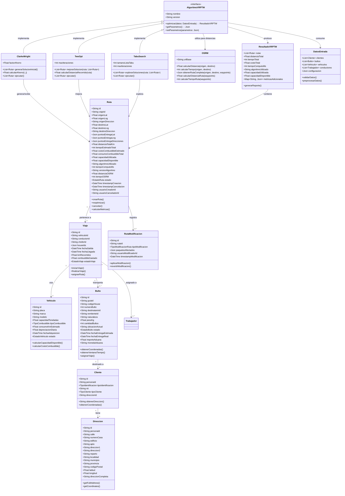
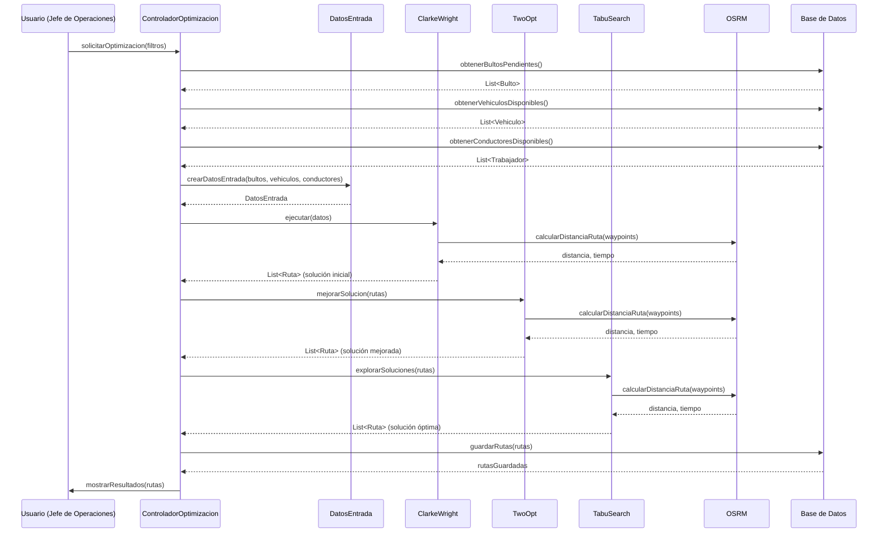
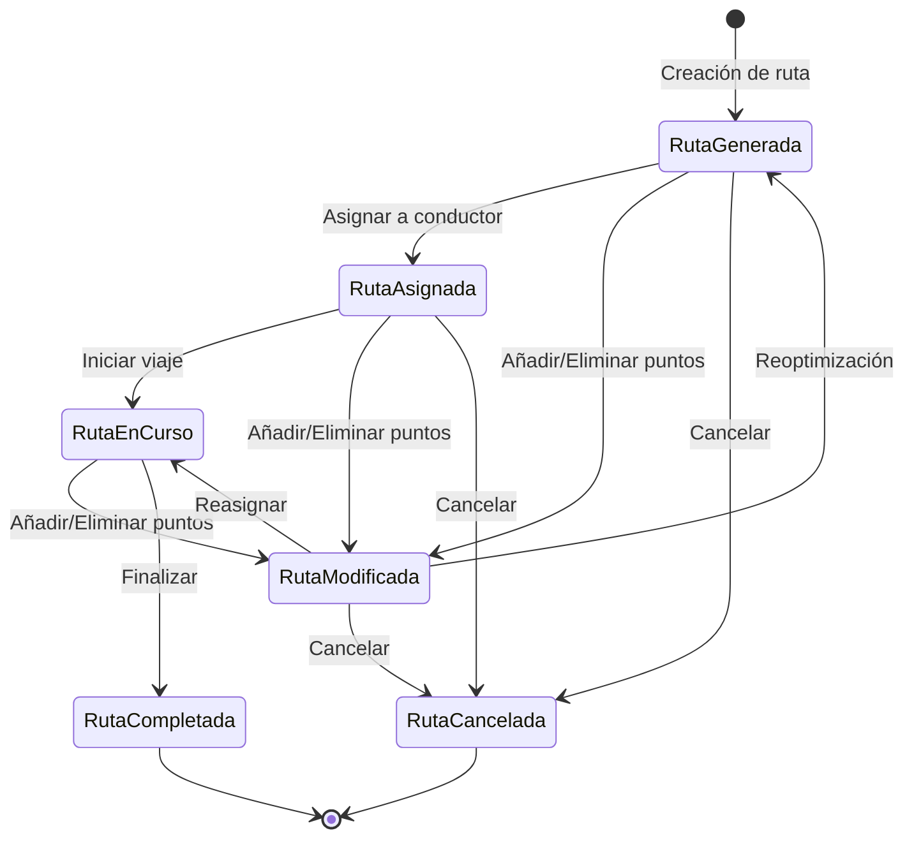

# Capítulo 5: Modelo de Datos (VERSIÓN FINAL CON REFERENCIAS ACTUALIZADAS - 25/08/2026)

---

## Introducción al Capítulo 5

El presente capítulo presenta el diseño detallado del modelo de datos del Sistema de Gestión Contextualmente Inteligente (SGCI). La base de datos es el **corazón del sistema**, donde se almacenan y relacionan todos los datos de la operación: personas, clientes, trabajadores, agencias de envíos, guías, bultos, vehículos, viajes, rutas, costos, inventarios, tasas de cambio, proyectos de RSE, contratos, roles y permisos, entre otros.

El modelo de datos ha sido diseñado siguiendo los principios de **integridad referencial**, **normalización** (hasta la tercera forma normal, con uso estratégico de desnormalización), **rendimiento** (índices y consultas optimizadas), **flexibilidad** (uso de JSONB para datos semiestructurados) y **escalabilidad** (particionamiento para tablas de alto volumen). La base de datos elegida es **PostgreSQL 16.15 con la extensión PostGIS 3.5.0** para consultas geoespaciales.

**Estado Actual del Modelo de Datos (25/08/2026):**
- **Total de Tablas:** 37 (34 originales + 3 para interoperabilidad)
- **Módulos Funcionales:** 10
- **Extensiones PostgreSQL:** PostGIS 3.5.0 (geoespacial), JSONB (datos semiestructurados), pg_trgm (búsqueda de texto), pg_cron (programación)
- **Estrategias de Seguridad:** Encriptación AES-256 a nivel de aplicación para datos sensibles (CI, NIT, teléfonos); TDE (Transparent Data Encryption) a nivel de disco para PostgreSQL; RLS (Row Level Security)
- **Estrategias de Auditoría:** Campos `created_by` y `updated_by` en todas las tablas transaccionales; triggers automáticos de auditoría
- **Framework ORM:** Prisma 7.9.1 con adapter-pg

**Estrategia de Implementación (YAGNI):** 
El modelo de datos completo (37 tablas) es un **diseño blueprint**. La implementación será **incremental**: las tablas se crearán en la base de datos **solo cuando la funcionalidad correspondiente se desarrolle**, siguiendo el principio YAGNI (You Aren't Gonna Need It) y la matriz de trazabilidad definida en la Tabla 5.0. Esto garantiza que no existan tablas "huérfanas" o código no utilizado.

---

## 5.0. Matriz de Trazabilidad - Tablas por Fase de Implementación

Para garantizar una implementación incremental y alineada con el principio YAGNI, se establece la siguiente matriz de trazabilidad que vincula cada tabla con la fase de desarrollo en la que será creada:

**Tabla 5.0: Matriz de Trazabilidad - Tablas por Fase de Implementación**

| Fase | Período | Funcionalidad | Tablas a Crear |
| :--- | :--- | :--- | :--- |
| **Fase 1** | Meses 3-5 | Autenticación, roles, permisos, auditoría | `usuarios`, `roles`, `permisos`, `roles_permisos`, `auditoria` |
| **Fase 2** | Meses 6-8 | Gestión de guías, bultos, clientes, agencias, importación de manifiestos, geocodificación, web scraping | `personas`, `clientes`, `direcciones`, `agencias_envios`, `guias`, `bultos`, `web_scraping_pendiente`, `web_scraping_log` |
| **Fase 3** | Meses 9-11 | Gestión de vehículos, conductores, optimización de rutas (VRP/VRPTW) | `vehiculos`, `trabajadores`, `viajes`, `rutas`, `rutas_modificaciones` |
| **Fase 4** | Meses 12-14 | Seguimiento GPS (Traccar 6.14), app móvil offline-first, notificaciones | `vehiculo_ubicaciones`, `geocercas`, `sincronizacion_pendiente`, `conflictos_offline`, `notificaciones` |
| **Fase 5** | Meses 15-16 | Costos, fichas de costo, tasas de cambio, RSE, roles dinámicos, inventarios, taller | `fichas_costo`, `fichas_costo_partidas`, `ingresos`, `gastos`, `tasas_cambio`, `proveedores`, `contratos`, `reservas_voluntarias`, `proyectos_rse`, `actividades_prohibidas`, `repuestos`, `movimientos_inventario`, `ordenes_trabajo`, `ventas_repuestos` |
| **Fase 6** | Meses 17-18 | Interoperabilidad (API abierta), integración con sistemas externos, validación empírica | `integraciones`, `logs_api`, `webhooks` |

**Nota:** Las tablas de infraestructura (`notificaciones`, `web_scraping_pendiente`, `web_scraping_log`) se crearán en la fase correspondiente a la funcionalidad que las requiera (Fase 2 para web scraping, Fase 4 para notificaciones).

---

## 5.1. Modelo Conceptual de Datos

El modelo conceptual del SGCI se organiza en torno a los siguientes **módulos funcionales**:

1. **Módulo de Personas y Clientes:** Gestiona las personas (base para clientes y trabajadores), los clientes (destinatarios, remitentes, agencias), las direcciones (con geolocalización y búsqueda de texto completo) y los trabajadores (conductores, choferes, mecánicos, administrativos).

2. **Módulo de Guías y Bultos:** Gestiona las guías de envío (con su `codigo_awb` único) y los bultos individuales (con su `codigo_house` único, estado, ubicación actual y fechas de entrega). Incluye campos para el importe real de aduana (`importeAduana`, `monedaAduana`).

3. **Módulo de Vehículos, Viajes y Rutas:** Gestiona los vehículos (con depreciación diaria), los viajes (con conductor, chofer y lista de bultos en JSONB) y las rutas optimizadas (con origen, destino y puntos de entrega en JSONB). Este módulo es el **corazón de la optimización de rutas (VRP/VRPTW)**.

4. **Módulo de Costos y Finanzas:** Gestiona las fichas de costo (con partidas individuales para una trazabilidad granular), los ingresos y gastos (con soporte multi-moneda), las tasas de cambio (con par de monedas y tipo de tasa), y los proveedores.

5. **Módulo de Inventarios y Taller:** Gestiona los repuestos (con stock y precios), los movimientos de inventario, las órdenes de trabajo y las ventas de repuestos (con plazos de crédito).

6. **Módulo de RSE y Gobernanza:** Gestiona las reservas voluntarias, los proyectos de RSE y las actividades prohibidas (Decreto 107/2024).

7. **Módulo de Contratos:** Gestiona los contratos con agencias de envíos, incluyendo tarifas en CUP, USD y MXN.

8. **Módulo de Usuarios y Roles:** Gestiona los usuarios del sistema, los roles dinámicos y los permisos granulares.

9. **Módulo de Infraestructura y Auditoría:** Gestiona las ubicaciones GPS de los vehículos, las tareas de web scraping, las notificaciones y las modificaciones de rutas.

10. **Módulo de Interoperabilidad:** Gestiona la integración con sistemas externos (Aduana, MITRANS, otras agencias) a través de una API abierta.

---

## 5.2. Enums Globales

El modelo de datos define los siguientes enums globales en Prisma. **Nota:** Estos enums son parte del diseño blueprint y se implementarán en la base de datos cuando las tablas correspondientes sean creadas en cada fase.

```prisma
enum TipoPersona {
  natural
  juridica
}

enum TipoIdentificacion {
  carnet
  passport
  nit
}

enum TipoCliente {
  destinatario
  remitente
  ambos
}

enum TipoTrabajador {
  conductor
  chofer
  mecanico
  administrativo
}

enum EstadoTrabajador {
  activo
  inactivo
}

enum EstadoGuia {
  creada
  enviada
  arribo
  proceso_aduana
  facturada
  recibida
  proceso_transportacion
  proceso_entrega
  parcialmente_entregada
  entregada
}

enum EstadoBulto {
  creado
  enviado
  arribo
  presencial
  faltante_origen
  facturado
  recibido
  proceso_transportacion
  proceso_entrega
  entregado
  no_entregado
}

enum TipoCombustible {
  diesel
  gasolina
}

enum EstadoVehiculo {
  activo
  mantenimiento
  inactivo
}

enum EstadoViaje {
  planificado
  en_curso
  completado
  cancelado
}

enum EstadoRuta {
  generada
  asignada
  en_curso
  completada
  cancelada
}

enum TipoActividad {
  paqueteria
  pasajeros
  alquiler
  taller
  venta_repuestos
}

enum Moneda {
  CUP
  USD
  MXN
}

enum TipoPartida {
  gasto_material
  salario_directo
  otros_gastos_directos
  gastos_indirectos
  utilidad
}

enum TipoIngreso {
  transporte_carga
  transporte_pasajeros
  alquiler_vehiculos
  venta_repuestos
  taller_reparacion
}

enum TipoGasto {
  combustible
  mantenimiento
  salario
  impuestos
  compra_repuestos
  servicios_publicos
  alquiler_local
  seguros
  depreciacion
  otros
}

enum ParMoneda {
  USD_CUP
  USD_MXN
  MXN_CUP
  EUR_CUP
  EUR_MXN
  EUR_USD
}

enum TipoTasa {
  oficial
  segmento_i
  segmento_ii
  segmento_iii
  informal
}

enum EstadoOrdenTrabajo {
  pendiente
  en_proceso
  completada
  cancelada
}

enum TipoClienteVenta {
  particular
  estatal
}

enum EstadoProyectoRSE {
  planificado
  en_curso
  completado
}

enum EstadoContrato {
  activo
  vencido
  cancelado
}

enum EstadoUsuario {
  activo
  inactivo
  bloqueado
}

enum TipoModificacionRuta {
  eliminacion_paquetes
  adicion_paquetes
  cancelacion
  reoptimizacion
}

enum EstadoNotificacion {
  pendiente
  enviado
  fallido
}

enum EstadoWebScraping {
  pendiente
  en_proceso
  completado
  fallido
}

enum TipoIntegracion {
  aduana
  mitrans
  agencia_paqueteria
  otro
}

enum EstadoIntegracion {
  activa
  inactiva
  error
}
```

**Cambios Importantes en los Enums (vs. versión anterior):**

| Enum | Cambio | Justificación | Fase de Implementación |
| :--- | :--- | :--- | :--- |
| **EstadoGuia** | Añadidos: `proceso_aduana`, `facturada`, `recibida`, `proceso_transportacion`, `proceso_entrega` | Refleja el flujo real de la logística de paquetería internacional | Fase 2 |
| **EstadoBulto** | Añadidos: `presencial`, `faltante_origen`, `facturado`, `recibido`, `proceso_transportacion`, `proceso_entrega` | Refleja el flujo real de los bultos individuales | Fase 2 |
| **TipoIntegracion** | Nuevo enum | Soporte para interoperabilidad con sistemas externos | Fase 6 |
| **EstadoIntegracion** | Nuevo enum | Estado de las integraciones con sistemas externos | Fase 6 |

---

## 5.3. Módulo de Personas y Clientes

### Tabla: `Persona` (Base)

```prisma
model Persona {
  id                 String      @id @default(cuid())
  nombreCompleto     String      @map("nombre_completo")
  ci                 String      @unique  // 🔒 Encriptado AES-256 a nivel de aplicación
  telefonoPrincipal  String?     @map("telefono_principal")  // 🔒 Encriptado AES-256 a nivel de aplicación
  telefonoSecundario String?     @map("telefono_secundario") // 🔒 Encriptado AES-256 a nivel de aplicación
  email              String?     // 🔒 Encriptado AES-256 a nivel de aplicación
  tipoPersona        TipoPersona @map("tipo_persona")
  razonSocial        String?     @map("razon_social")
  createdAt          DateTime    @default(now()) @map("created_at")
  updatedAt          DateTime    @updatedAt @map("updated_at")
  createdBy          String?     @map("created_by")
  updatedBy          String?     @map("updated_by")

  cliente     Cliente?
  trabajador  Trabajador?
  usuario     Usuario?
  direcciones Direccion[]

  @@index([ci])
  @@index([email])
  @@map("personas")
}
```

| # | Campo | Tipo | Descripción | Encriptación |
|---|-------|------|-------------|--------------|
| 1 | `id` | String (PK) | Identificador único de la persona (cuid) | — |
| 2 | `nombreCompleto` | String | Nombre completo de la persona | — |
| 3 | `ci` | String (UNIQUE) | Carnet de identidad (normalizado a 11 dígitos) | ✅ AES-256 |
| 4 | `telefonoPrincipal` | String? | Número de teléfono principal | ✅ AES-256 |
| 5 | `telefonoSecundario` | String? | Número de teléfono secundario | ✅ AES-256 |
| 6 | `email` | String? | Correo electrónico | ✅ AES-256 |
| 7 | `tipoPersona` | Enum | Tipo de persona | — |
| 8 | `razonSocial` | String? | Razón social (solo para personas jurídicas) | — |
| 9 | `createdAt` | DateTime | Fecha de creación | — |
| 10 | `updatedAt` | DateTime | Fecha de última actualización | — |
| 11 | `createdBy` | String? | Usuario que creó el registro | — |
| 12 | `updatedBy` | String? | Usuario que actualizó el registro | — |

**Índices:** `(ci)`, `(email)`

---

### Tabla: `Dirección`

```prisma
model Direccion {
  id                String   @id @default(cuid())
  personaId         String?  @map("persona_id")
  calle             String
  numeroCasa        String   @map("numero_casa")
  edificio          String?
  apto              String?
  direccion1        String?  @map("direccion_1")
  direccion2        String?  @map("direccion_2")
  reparto           String?
  localidad         String?
  municipio         String?
  provincia         String?
  codigoPostal      String?  @map("codigo_postal")
  latitud           Float?
  longitud          Float?
  direccionCompleta String?  @map("direccion_completa")
  createdAt         DateTime @default(now()) @map("created_at")
  updatedAt         DateTime @updatedAt @map("updated_at")
  createdBy         String?  @map("created_by")
  updatedBy         String?  @map("updated_by")

  persona Persona? @relation(fields: [personaId], references: [id])

  agenciaEnvios AgenciaEnvios[]
  clientes      Cliente[]

  @@index([municipio, provincia])
  @@index([latitud, longitud])
  @@map("direcciones")
}
```

---

### Tabla: `Cliente` (Hereda de Persona)

```prisma
model Cliente {
  id                 String             @id @default(cuid())
  personaId          String             @unique @map("persona_id")
  tipoIdentificacion TipoIdentificacion @map("tipo_identificacion")
  nit                String?            @unique  // 🔒 Encriptado AES-256 a nivel de aplicación
  tipoCliente        TipoCliente        @map("tipo_cliente")
  direccionId        String?            @map("direccion_id")
  createdAt          DateTime           @default(now()) @map("created_at")
  updatedAt          DateTime           @updatedAt @map("updated_at")
  createdBy          String?            @map("created_by")
  updatedBy          String?            @map("updated_by")

  persona   Persona    @relation(fields: [personaId], references: [id])
  direccion Direccion? @relation(fields: [direccionId], references: [id])

  bultosDestinatario Bulto[]         @relation("destinatario_bultos")
  bultosRemitente    Bulto[]         @relation("remitente_bultos")
  ordenesTrabajo     OrdenTrabajo[]
  ventasRepuestos    VentaRepuesto[]
  ingresos           Ingreso[]

  @@index([tipoCliente])
  @@index([nit])
  @@map("clientes")
}
```

---

### Tabla: `Trabajador` (Hereda de Persona)

```prisma
model Trabajador {
  id                String           @id @default(cuid())
  personaId         String           @unique @map("persona_id")
  tipoTrabajador    TipoTrabajador   @map("tipo_trabajador")
  licencia          String?          @unique
  categoriaLicencia String?          @map("categoria_licencia")
  fechaContratacion DateTime?        @map("fecha_contratacion")
  fechaTerminacion  DateTime?        @map("fecha_terminacion")
  estado            EstadoTrabajador @default(activo)
  createdAt         DateTime         @default(now()) @map("created_at")
  updatedAt         DateTime         @updatedAt @map("updated_at")
  createdBy         String?          @map("created_by")
  updatedBy         String?          @map("updated_by")

  persona Persona @relation(fields: [personaId], references: [id])

  viajesConductor Viaje[] @relation("conductor_viajes")
  viajesChofer    Viaje[] @relation("chofer_viajes")

  @@index([tipoTrabajador])
  @@map("trabajadores")
}
```

---

### Tabla: `AgenciaEnvios`

```prisma
model AgenciaEnvios {
  id                 String   @id @default(cuid())
  nombre             String
  nit                String?  @unique  // 🔒 Encriptado AES-256 a nivel de aplicación
  telefonoPrincipal  String   @map("telefono_principal")  // 🔒 Encriptado AES-256 a nivel de aplicación
  telefonoSecundario String?  @map("telefono_secundario") // 🔒 Encriptado AES-256 a nivel de aplicación
  email              String?  // 🔒 Encriptado AES-256 a nivel de aplicación
  direccionId        String   @map("direccion_id")
  pais               String
  personaContacto    String?  @map("persona_contacto")
  createdAt          DateTime @default(now()) @map("created_at")
  updatedAt          DateTime @updatedAt @map("updated_at")
  createdBy          String?  @map("created_by")
  updatedBy          String?  @map("updated_by")

  direccion Direccion @relation(fields: [direccionId], references: [id])

  guias     Guia[]
  contratos Contrato[]

  @@index([nit])
  @@index([pais])
  @@map("agencias_envios")
}
```

---

## 5.4. Módulo de Guías y Bultos

### Tabla: `Guia`

```prisma
model Guia {
  id                    String       @id @default(cuid())
  codigoAwb             String       @unique @map("codigo_awb")
  agenciaId             String       @map("agencia_id")
  fechaEmision          DateTime     @map("fecha_emision")
  fechaImportacion      DateTime     @default(now()) @map("fecha_importacion")
  pesoTotalKg           Float        @map("peso_total_kg")
  cantidadBultos        Int          @map("cantidad_bultos")
  consignatario         String
  estado                EstadoGuia   @default(creada)
  fechaEstado           DateTime     @default(now()) @map("fecha_estado")
  paisOrigen            String?      @map("pais_origen")
  ubicacionActual       String?      @map("ubicacion_actual")
  fechaEnvio            DateTime?    @map("fecha_envio")
  fechaArribo           DateTime?    @map("fecha_arribo")
  fechaProcesoAduana    DateTime?    @map("fecha_proceso_aduana")
  fechaFacturada        DateTime?    @map("fecha_facturada")
  fechaRecibida         DateTime?    @map("fecha_recibida")
  fechaProcesoSalida    DateTime?    @map("fecha_proceso_salida")
  fechaTransportacion   DateTime?    @map("fecha_transportacion")
  fechaEntregada        DateTime?    @map("fecha_entregada")
  createdAt             DateTime     @default(now()) @map("created_at")
  updatedAt             DateTime     @updatedAt @map("updated_at")
  createdBy             String?      @map("created_by")
  updatedBy             String?      @map("updated_by")

  agencia AgenciaEnvios @relation(fields: [agenciaId], references: [id])

  bultos               Bulto[]
  webScrapingPendiente WebScrapingPendiente[]
  webScrapingLog       WebScrapingLog[]
  notificaciones       Notificacion[]

  @@index([codigoAwb])
  @@index([agenciaId, fechaEmision])
  @@index([estado])
  @@map("guias")
}
```

---

### Tabla: `Bulto`

```prisma
model Bulto {
  id                    String       @id @default(cuid())
  guiaId                String       @map("guia_id")
  codigoHouse           String       @unique @map("codigo_house")
  numeroBulto           Int          @map("numero_bulto")
  destinatarioId        String       @map("destinatario_id")
  remitenteId           String       @map("remitente_id")
  naturaleza            String
  pesoKg                Float        @map("peso_kg")
  cantidadBultos        Int          @default(1) @map("cantidad_bultos")
  ubicacionActual       String       @map("ubicacion_actual")
  estado                EstadoBulto  @default(creado)
  fechaEntregaEstimada  DateTime?    @map("fecha_entrega_estimada")
  fechaEntregaReal      DateTime?    @map("fecha_entrega_real")
  fechaFacturacion      DateTime?    @map("fecha_facturacion")
  importeAduana         Float?       @default(0) @map("importe_aduanas")
  monedaAduana          String?      @default("CUP") @map("moneda_aduanas")
  observaciones         String?
  correccionManual      Boolean      @default(false) @map("correccion_manual")
  usuarioCorrectorId    String?      @map("usuario_corrector_id")
  timestampCorreccion   DateTime?    @map("timestamp_correccion")
  version               Int          @default(1)
  fechaArchivo          DateTime?    @map("fecha_archivo")
  createdAt             DateTime     @default(now()) @map("created_at")
  updatedAt             DateTime     @updatedAt @map("updated_at")

  guia         Guia    @relation(fields: [guiaId], references: [id])
  destinatario Cliente @relation("destinatario_bultos", fields: [destinatarioId], references: [id])
  remitente    Cliente @relation("remitente_bultos", fields: [remitenteId], references: [id])

  viajeId String? @map("viaje_id")
  viaje   Viaje?  @relation("viaje_bultos", fields: [viajeId], references: [id])

  @@index([codigoHouse])
  @@index([guiaId, numeroBulto])
  @@index([estado])
  @@index([destinatarioId])
  @@index([remitenteId])
  @@index([importeAduana])
  @@map("bultos")
}
```

---

## 5.5. Módulo de Vehículos, Viajes y Rutas

### Tabla: `Vehiculo`

```prisma
model Vehiculo {
  id                 String          @id @default(cuid())
  placa              String          @unique
  marca              String
  modelo             String?
  capacidadToneladas Float           @map("capacidad_toneladas")
  tipoCombustible    TipoCombustible @map("tipo_combustible")
  consumoKmEstimado  Float           @map("consumo_km_estimado")
  depreciacionDiaria Float?          @map("depreciacion_diaria")
  fechaAdquisicion   DateTime?       @map("fecha_adquisicion")
  estado             EstadoVehiculo  @default(activo)
  createdAt          DateTime        @default(now()) @map("created_at")
  updatedAt          DateTime        @updatedAt @map("updated_at")
  createdBy          String?         @map("created_by")
  updatedBy          String?         @map("updated_by")

  viajes      Viaje[]
  ubicaciones VehiculoUbicacion[]

  @@index([placa])
  @@index([tipoCombustible])
  @@map("vehiculos")
}
```

---

### Tabla: `Viaje`

```prisma
model Viaje {
  id                 String      @id @default(cuid())
  vehiculoId         String      @map("vehiculo_id")
  conductorId        String      @map("conductor_id")
  choferId           String?     @map("chofer_id")
  houseIds           Json        @map("house_ids")
  fechaSalida        DateTime?   @map("fecha_salida")
  fechaLlegada       DateTime?   @map("fecha_llegada")
  kmRecorridos       Float?      @map("km_recorridos")
  combustibleGastado Float?      @map("combustible_gastado")
  estadoViaje        EstadoViaje @default(planificado) @map("estado_viaje")
  createdAt          DateTime    @default(now()) @map("created_at")
  updatedAt          DateTime    @updatedAt @map("updated_at")
  createdBy          String?     @map("created_by")
  updatedBy          String?     @map("updated_by")

  vehiculo  Vehiculo    @relation(fields: [vehiculoId], references: [id])
  conductor Trabajador  @relation("conductor_viajes", fields: [conductorId], references: [id])
  chofer    Trabajador? @relation("chofer_viajes", fields: [choferId], references: [id])

  bultos Bulto[] @relation("viaje_bultos")
  ruta   Ruta?

  @@index([vehiculoId, fechaSalida])
  @@index([conductorId, fechaSalida])
  @@map("viajes")
}
```

---

### Tabla: `Ruta` (Módulo clave para optimización VRP/VRPTW)

```prisma
model Ruta {
  id                       String     @id @default(cuid())
  viajeId                  String     @unique @map("viaje_id")
  
  // 📍 Origen y Destino (Depósito)
  origenLat                Float      @map("origen_lat")
  origenLng                Float      @map("origen_lng")
  origenDireccion          String     @map("origen_direccion")
  destinoLat               Float      @map("destino_lat")
  destinoLng               Float      @map("destino_lng")
  destinoDireccion         String     @map("destino_direccion")
  
  // 📦 Puntos de Entrega (Orden Optimizado - VRP/VRPTW)
  puntosEntregaLat         Json       @map("puntos_entrega_lat")         // [lat1, lat2, ...] - Orden optimizado
  puntosEntregaLng         Json       @map("puntos_entrega_lng")         // [lng1, lng2, ...] - Orden optimizado
  puntosEntregaDirecciones Json       @map("puntos_entrega_direcciones") // ["dir1", "dir2", ...] - Orden optimizado
  
  // 📊 Resultados del Algoritmo VRP/VRPTW
  distanciaTotalKm         Float?     @map("distancia_total_km")
  tiempoEstimadoTotal      Int?       @map("tiempo_estimado_total")
  costoCombustibleEstimado Float?     @map("costo_combustible_estimado")
  consumoCombustibleTotal  Float?     @map("consumo_combustible_total")
  capacidadUtilizada       Float?     @map("capacidad_utilizada")
  capacidadDisponible      Float?     @map("capacidad_disponible")
  
  // 📝 Metadatos del Algoritmo
  algoritmoUtilizado       String?    @default("VRPTW_HYBRID") @map("algoritmo_utilizado")
  tiempoComputoMs          Int?       @map("tiempo_computo_ms")
  versionAlgoritmo         String?    @map("version_algoritmo")
  
  // 🗺️ Resultados de OSRM
  distanciaOSRM            Float?     @map("distancia_osrm")
  tiempoOSRM               Int?       @map("tiempo_osrm")
  
  // 📋 Estado y Control
  estado                   EstadoRuta @default(generada)
  timestampCreacion        DateTime   @default(now()) @map("timestamp_creacion")
  timestampCancelacion     DateTime?  @map("timestamp_cancelacion")
  usuarioCreadorId         String?    @map("usuario_creador_id")
  usuarioCanceladorId      String?    @map("usuario_cancelador_id")

  viaje Viaje @relation(fields: [viajeId], references: [id])
  modificaciones RutaModificacion[]

  @@index([viajeId])
  @@index([estado])
  @@index([timestampCreacion])
  @@map("rutas")
}
```

**Mapeo entre Variables Matemáticas y Campos de la Tabla:**

| Variable Matemática (VRPTW) | Campo en la Tabla `Ruta` | Descripción |
| :--- | :--- | :--- | :--- |
| \(K\) (Vehículos) | `viajeId` → `vehiculoId` | Identificador del vehículo asignado a la ruta |
| \(N\) (Clientes) | `puntosEntregaLat`, `puntosEntregaLng` | Lista de coordenadas de clientes en orden de visita |
| \(x_{ijk}\) (Orden de visita) | `puntosEntregaLat`, `puntosEntregaLng` | El orden en los arrays JSONB representa la secuencia de visita |
| \(c_{ij}\) (Costo de viaje) | `distanciaTotalKm`, `tiempoEstimadoTotal` | Distancia y tiempo total de la ruta |
| \(d_i\) (Demanda del cliente) | `capacidadUtilizada` | Carga total transportada |
| \(Q_k\) (Capacidad del vehículo) | `capacidadDisponible` | Carga disponible del vehículo |
| \(e_i, l_i\) (Ventanas de tiempo) | No aplica (se almacenan en `Bulto` o `Cliente`) | Ventanas de tiempo por cliente |

---

### Tabla: `RutaModificacion`

```prisma
model RutaModificacion {
  id                    String               @id @default(cuid())
  rutaId                String               @map("ruta_id")
  tipoModificacion      TipoModificacionRuta @map("tipo_modificacion")
  paquetesAfectados     Json?                @map("paquetes_afectados")
  usuarioModificadorId  String               @map("usuario_modificador_id")
  timestampModificacion DateTime             @default(now()) @map("timestamp_modificacion")
  createdAt             DateTime             @default(now()) @map("created_at")
  createdBy             String?              @map("created_by")

  ruta Ruta @relation(fields: [rutaId], references: [id])

  @@index([rutaId, timestampModificacion])
  @@map("rutas_modificaciones")
}
```

---

### Tabla: `VehiculoUbicacion` (Particionada por Mes)

```prisma
model VehiculoUbicacion {
  id         String   @id @default(cuid())
  vehiculoId String   @map("vehiculo_id")
  latitud    Float
  longitud   Float
  velocidad  Float?
  direccion  String?
  timestamp  DateTime @default(now())

  vehiculo Vehiculo @relation(fields: [vehiculoId], references: [id])

  @@index([vehiculoId, timestamp])
  @@map("vehiculo_ubicaciones")
}
```

---

## 5.6. Módulo de Costos y Finanzas

### Tabla: `FichaCosto` (Cabecera)

```prisma
model FichaCosto {
  id              String        @id @default(cuid())
  tipoActividad   TipoActividad @map("tipo_actividad")
  documentoId     String        @map("documento_id")
  fechaGeneracion DateTime      @default(now()) @map("fecha_generacion")
  monedaBase      Moneda        @default(CUP) @map("moneda_base")
  fechaArchivo    DateTime?     @map("fecha_archivo")
  createdAt       DateTime      @default(now()) @map("created_at")
  createdBy       String?       @map("created_by")

  partidas FichaCostoPartida[]

  @@map("fichas_costo")
}
```

---

### Tabla: `FichaCostoPartidas` (Detalle Granular)

```prisma
model FichaCostoPartida {
  id                  String      @id @default(cuid())
  fichaCostoId        String      @map("ficha_costo_id")
  tipoPartida         TipoPartida @map("tipo_partida")
  concepto            String
  monto               Float
  moneda              Moneda      @default(CUP)
  tasaCambioAplicada  Float?      @map("tasa_cambio_aplicada")
  documentoReferencia String?     @map("documento_referencia")
  createdAt           DateTime    @default(now()) @map("created_at")

  fichaCosto FichaCosto @relation(fields: [fichaCostoId], references: [id])

  @@index([fichaCostoId, tipoPartida])
  @@map("fichas_costo_partidas")
}
```

---

### Tabla: `TasaCambio`

```prisma
model TasaCambio {
  id                String    @id @default(cuid())
  fecha             DateTime
  hora              String?
  parMoneda         ParMoneda @map("par_moneda")
  tipoTasa          TipoTasa  @map("tipo_tasa")
  valor             Float
  usuarioCreadorId  String    @map("usuario_creador_id")
  timestampCreacion DateTime  @default(now()) @map("timestamp_creacion")

  @@unique([parMoneda, tipoTasa, fecha, hora])
  @@index([parMoneda, tipoTasa, fecha, hora])
  @@map("tasas_cambio")
}
```

---

### Tabla: `Ingreso`

```prisma
model Ingreso {
  id                 String      @id @default(cuid())
  tipoIngreso        TipoIngreso @map("tipo_ingreso")
  documentoId        String      @map("documento_id")
  clienteId          String?     @map("cliente_id")
  monto              Float
  fecha              DateTime    @default(now())
  descripcion        String?
  moneda             Moneda      @default(CUP)
  tasaCambioAplicada Float?      @map("tasa_cambio_aplicada")
  createdAt          DateTime    @default(now()) @map("created_at")
  createdBy          String?     @map("created_by")

  cliente Cliente? @relation(fields: [clienteId], references: [id])

  @@index([tipoIngreso, fecha])
  @@index([clienteId])
  @@map("ingresos")
}
```

---

### Tabla: `Gasto`

```prisma
model Gasto {
  id                 String    @id @default(cuid())
  tipoGasto          TipoGasto @map("tipo_gasto")
  documentoId        String?   @map("documento_id")
  proveedorId        String?   @map("proveedor_id")
  monto              Float
  fecha              DateTime  @default(now())
  descripcion        String?
  moneda             Moneda    @default(CUP)
  tasaCambioAplicada Float?    @map("tasa_cambio_aplicada")
  createdAt          DateTime  @default(now()) @map("created_at")
  createdBy          String?   @map("created_by")

  proveedor Proveedor? @relation(fields: [proveedorId], references: [id])

  @@index([tipoGasto, fecha])
  @@index([proveedorId])
  @@map("gastos")
}
```

---

### Tabla: `Proveedor`

```prisma
model Proveedor {
  id                String   @id @default(cuid())
  nombre            String
  nit               String?  @unique  // 🔒 Encriptado AES-256 a nivel de aplicación
  telefonoPrincipal String?  @map("telefono_principal")
  email             String?
  direccion         String?
  createdAt         DateTime @default(now()) @map("created_at")
  updatedAt         DateTime @updatedAt @map("updated_at")
  createdBy         String?  @map("created_by")
  updatedBy         String?  @map("updated_by")

  gastos Gasto[]

  @@index([nit])
  @@map("proveedores")
}
```

---

### Tabla: `Contrato`

```prisma
model Contrato {
  id                String          @id @default(cuid())
  agenciaId         String          @map("agencia_id")
  numeroContrato    String          @unique @map("numero_contrato")
  fechaInicio       DateTime        @map("fecha_inicio")
  fechaVencimiento  DateTime        @map("fecha_vencimiento")
  tarifaCUP         Float?          @map("tarifa_cup")
  tarifaUSD         Float?          @map("tarifa_usd")
  tarifaMXN         Float?          @map("tarifa_mxn")
  estado            EstadoContrato  @default(activo)
  observaciones     String?
  createdAt         DateTime        @default(now()) @map("created_at")
  updatedAt         DateTime        @updatedAt @map("updated_at")
  createdBy         String?         @map("created_by")
  updatedBy         String?         @map("updated_by")

  agencia AgenciaEnvios @relation(fields: [agenciaId], references: [id])

  @@index([agenciaId, fechaInicio, fechaVencimiento])
  @@index([estado])
  @@map("contratos")
}
```

---

## 5.7. Módulo de Usuarios y Roles (Roles Dinámicos)

### Tabla: `Usuario`

```prisma
model Usuario {
  id            String        @id @default(cuid())
  personaId     String        @unique @map("persona_id")
  nombreUsuario String        @unique @map("nombre_usuario")
  passwordHash  String        @map("password_hash")  // 🔒 Hash con bcrypt
  email         String        @unique  // 🔒 Encriptado AES-256 a nivel de aplicación
  ultimoAcceso  DateTime?     @map("ultimo_acceso")
  estado        EstadoUsuario @default(activo)
  createdAt     DateTime      @default(now()) @map("created_at")
  updatedAt     DateTime      @updatedAt @map("updated_at")
  createdBy     String?       @map("created_by")
  updatedBy     String?       @map("updated_by")

  persona Persona @relation(fields: [personaId], references: [id])

  roles UsuarioRol[]

  @@index([nombreUsuario])
  @@index([email])
  @@map("usuarios")
}
```

---

### Tabla: `Rol`

```prisma
model Rol {
  id             String   @id @default(cuid())
  nombre         String   @unique
  descripcion    String?
  nivelPrioridad Int?     @map("nivel_prioridad")
  esActivo       Boolean  @default(true) @map("es_activo")
  createdAt      DateTime @default(now()) @map("created_at")
  updatedAt      DateTime @updatedAt @map("updated_at")
  createdBy      String?  @map("created_by")
  updatedBy      String?  @map("updated_by")

  usuarios UsuarioRol[]
  permisos RolPermiso[]

  @@map("roles")
}
```

---

### Tabla: `Permiso`

```prisma
model Permiso {
  id          String   @id @default(cuid())
  nombre      String   @unique
  recurso     String
  accion      String
  descripcion String?
  createdAt   DateTime @default(now()) @map("created_at")
  updatedAt   DateTime @updatedAt @map("updated_at")
  createdBy   String?  @map("created_by")
  updatedBy   String?  @map("updated_by")

  roles RolPermiso[]

  @@unique([recurso, accion])
  @@map("permisos")
}
```

---

### Tabla: `RolPermiso` (Relación Muchos a Muchos)

```prisma
model RolPermiso {
  id        String   @id @default(cuid())
  rolId     String   @map("rol_id")
  permisoId String   @map("permiso_id")
  createdAt DateTime @default(now()) @map("created_at")

  rol     Rol     @relation(fields: [rolId], references: [id])
  permiso Permiso @relation(fields: [permisoId], references: [id])

  @@unique([rolId, permisoId])
  @@map("roles_permisos")
}
```

---

### Tabla: `UsuarioRol` (Relación Muchos a Muchos)

```prisma
model UsuarioRol {
  id        String   @id @default(cuid())
  usuarioId String   @map("usuario_id")
  rolId     String   @map("rol_id")
  createdAt DateTime @default(now()) @map("created_at")

  usuario Usuario @relation(fields: [usuarioId], references: [id])
  rol     Rol     @relation(fields: [rolId], references: [id])

  @@unique([usuarioId, rolId])
  @@map("usuarios_roles")
}
```

---

## 5.8. Módulo de Infraestructura y Auditoría

### Tabla: `Auditoria`

```prisma
model Auditoria {
  id             String   @id @default(cuid())
  tabla          String
  registroId     String   @map("registro_id")
  accion         String   // CREATE, UPDATE, DELETE
  datosAnteriores Json?   @map("datos_anteriores")
  datosNuevos    Json?    @map("datos_nuevos")
  usuarioId      String   @map("usuario_id")
  ipAddress      String?  @map("ip_address")
  userAgent      String?  @map("user_agent")
  timestamp      DateTime @default(now())

  @@index([tabla, registroId])
  @@index([usuarioId, timestamp])
  @@map("auditoria")
}
```

---

### Tabla: `WebScrapingPendiente`

```prisma
model WebScrapingPendiente {
  id              String            @id @default(cuid())
  guiaId          String            @map("guia_id")
  estado          EstadoWebScraping @default(pendiente)
  intentos        Int               @default(0)
  proximoIntento  DateTime?         @map("proximo_intento")
  ultimoResultado String?           @map("ultimo_resultado")
  createdAt       DateTime          @default(now()) @map("created_at")
  createdBy       String?           @map("created_by")

  guia Guia @relation(fields: [guiaId], references: [id])

  @@index([guiaId])
  @@index([estado])
  @@map("web_scraping_pendiente")
}
```

---

### Tabla: `WebScrapingLog`

```prisma
model WebScrapingLog {
  id               String   @id @default(cuid())
  guiaId           String   @map("guia_id")
  urlConsultada    String   @map("url_consultada")
  codigoRespuesta  Int?     @map("codigo_respuesta")
  estadoDetectado  String?  @map("estado_detectado")
  payloadRespuesta Json?    @map("payload_respuesta")
  timestamp        DateTime @default(now())

  guia Guia @relation(fields: [guiaId], references: [id])

  @@index([guiaId, timestamp])
  @@map("web_scraping_log")
}
```

---

### Tabla: `Notificacion`

```prisma
model Notificacion {
  id               String             @id @default(cuid())
  guiaId           String?            @map("guia_id")
  tipoNotificacion String             @map("tipo_notificacion")
  destinatario     String
  mensaje          String
  estadoEnvio      EstadoNotificacion @default(pendiente) @map("estado_envio")
  timestamp        DateTime           @default(now())
  createdAt        DateTime           @default(now()) @map("created_at")
  createdBy        String?            @map("created_by")

  guia Guia? @relation(fields: [guiaId], references: [id])

  @@index([guiaId])
  @@index([estadoEnvio])
  @@map("notificaciones")
}
```

---

### Tabla: `SincronizacionPendiente`

```prisma
model SincronizacionPendiente {
  id           String   @id @default(cuid())
  dispositivo  String   // ID del dispositivo móvil
  tabla        String
  operacion    String   // CREATE, UPDATE, DELETE
  datos        Json
  intentos     Int      @default(0)
  ultimoIntento DateTime? @map("ultimo_intento")
  createdAt    DateTime @default(now()) @map("created_at")

  @@index([dispositivo, createdAt])
  @@map("sincronizacion_pendiente")
}
```

---

### Tabla: `ConflictoOffline`

```prisma
model ConflictoOffline {
  id           String   @id @default(cuid())
  dispositivo  String
  tabla        String
  registroId   String   @map("registro_id")
  datosLocales Json     @map("datos_locales")
  datosServidor Json    @map("datos_servidor")
  estado       String   @default("pendiente") // pendiente, resuelto, ignorado
  resolucion   String?  // manual, automatica
  timestamp    DateTime @default(now())
  createdAt    DateTime @default(now()) @map("created_at")

  @@index([dispositivo, estado])
  @@map("conflictos_offline")
}
```

---

### Tabla: `Geocerca`

```prisma
model Geocerca {
  id         String   @id @default(cuid())
  nombre     String
  tipo       String   // circular, poligono
  centroLat  Float?   @map("centro_lat")
  centroLng  Float?   @map("centro_lng")
  radioKm    Float?   @map("radio_km")
  poligono   Json?    // [{lat, lng}, ...] para polígonos
  alertaEntrada Boolean @default(false) @map("alerta_entrada")
  alertaSalida  Boolean @default(true) @map("alerta_salida")
  createdAt  DateTime @default(now()) @map("created_at")
  createdBy  String?  @map("created_by")

  @@map("geocercas")
}
```

---

## 5.9. Módulo de RSE y Gobernanza

### Tabla: `ReservaVoluntaria`

```prisma
model ReservaVoluntaria {
  id          String   @id @default(cuid())
  nombre      String
  descripcion String?
  montoTotal  Float    @map("monto_total")
  montoUsado  Float    @default(0) @map("monto_usado")
  moneda      Moneda   @default(CUP)
  fechaCreacion DateTime @default(now()) @map("fecha_creacion")
  createdAt   DateTime @default(now()) @map("created_at")
  updatedAt   DateTime @updatedAt @map("updated_at")
  createdBy   String?  @map("created_by")
  updatedBy   String?  @map("updated_by")

  proyectos ProyectoRSE[]

  @@map("reservas_voluntarias")
}
```

---

### Tabla: `ProyectoRSE`

```prisma
model ProyectoRSE {
  id             String             @id @default(cuid())
  reservaId      String             @map("reserva_id")
  nombre         String
  descripcion    String?
  fechaInicio    DateTime           @map("fecha_inicio")
  fechaFin       DateTime?          @map("fecha_fin")
  montoAsignado  Float              @map("monto_asignado")
  montoEjecutado Float?             @default(0) @map("monto_ejecutado")
  moneda         Moneda             @default(CUP)
  beneficiarios  Int?               @default(0)
  estado         EstadoProyectoRSE  @default(planificado)
  impacto        String?            // Descripción del impacto generado
  createdAt      DateTime           @default(now()) @map("created_at")
  updatedAt      DateTime           @updatedAt @map("updated_at")
  createdBy      String?            @map("created_by")
  updatedBy      String?            @map("updated_by")

  reserva ReservaVoluntaria @relation(fields: [reservaId], references: [id])

  @@index([reservaId])
  @@index([estado])
  @@map("proyectos_rse")
}
```

---

### Tabla: `ActividadProhibida`

```prisma
model ActividadProhibida {
  id          String   @id @default(cuid())
  codigo      String   @unique
  nombre      String
  descripcion String?
  decreto     String   @default("107/2024")
  createdAt   DateTime @default(now()) @map("created_at")
  updatedAt   DateTime @updatedAt @map("updated_at")
  createdBy   String?  @map("created_by")
  updatedBy   String?  @map("updated_by")

  @@index([codigo])
  @@map("actividades_prohibidas")
}
```

---

## 5.10. Módulo de Interoperabilidad (Fase 6)

### Tabla: `Integracion`

```prisma
model Integracion {
  id              String            @id @default(cuid())
  nombre          String
  tipo            TipoIntegracion   @map("tipo")
  urlBase         String?           @map("url_base")
  apiKey          String?           @map("api_key")  // 🔒 Encriptado AES-256
  estado          EstadoIntegracion @default(activa)
  ultimaSincronizacion DateTime?    @map("ultima_sincronizacion")
  configuracion   Json?             // Configuración específica de cada integración
  createdAt       DateTime          @default(now()) @map("created_at")
  updatedAt       DateTime          @updatedAt @map("updated_at")
  createdBy       String?           @map("created_by")
  updatedBy       String?           @map("updated_by")

  logs IntegracionLog[]

  @@index([tipo])
  @@index([estado])
  @@map("integraciones")
}
```

---

### Tabla: `IntegracionLog`

```prisma
model IntegracionLog {
  id             String   @id @default(cuid())
  integracionId  String   @map("integracion_id")
  endpoint       String
  metodo         String   // GET, POST, PUT, DELETE
  payloadEnviado Json?    @map("payload_enviado")
  respuesta      Json?
  statusCode     Int?     @map("status_code")
  tiempoMs       Int?     @map("tiempo_ms")
  error          String?
  timestamp      DateTime @default(now())

  integracion Integracion @relation(fields: [integracionId], references: [id])

  @@index([integracionId, timestamp])
  @@map("integraciones_log")
}
```

---

### Tabla: `Webhook`

```prisma
model Webhook {
  id          String   @id @default(cuid())
  nombre      String
  url         String
  eventos     String[] // Lista de eventos que disparan el webhook
  activo      Boolean  @default(true)
  secret      String?  // 🔒 Encriptado AES-256 para validación
  ultimoDisparo DateTime? @map("ultimo_disparo")
  createdAt   DateTime @default(now()) @map("created_at")
  updatedAt   DateTime @updatedAt @map("updated_at")
  createdBy   String?  @map("created_by")
  updatedBy   String?  @map("updated_by")

  @@index([activo])
  @@map("webhooks")
}
```

---

## 5.11. Módulo de Inventarios y Taller

### Tabla: `Repuesto`

```prisma
model Repuesto {
  id             String   @id @default(cuid())
  codigo         String   @unique
  nombre         String
  descripcion    String?
  categoria      String?
  stockActual    Int      @default(0) @map("stock_actual")
  stockMinimo    Int      @default(5) @map("stock_minimo")
  precioCompra   Float    @map("precio_compra")
  precioVenta    Float    @map("precio_venta")
  moneda         Moneda   @default(CUP)
  ubicacion      String?  // Ubicación en el almacén
  proveedorId    String?  @map("proveedor_id")
  createdAt      DateTime @default(now()) @map("created_at")
  updatedAt      DateTime @updatedAt @map("updated_at")
  createdBy      String?  @map("created_by")
  updatedBy      String?  @map("updated_by")

  proveedor Proveedor? @relation(fields: [proveedorId], references: [id])
  movimientos MovimientoInventario[]
  ordenesTrabajo OrdenTrabajoRepuesto[]

  @@index([codigo])
  @@index([categoria])
  @@map("repuestos")
}
```

---

### Tabla: `MovimientoInventario`

```prisma
model MovimientoInventario {
  id           String   @id @default(cuid())
  repuestoId   String   @map("repuesto_id")
  tipo         String   // entrada, salida, ajuste
  cantidad     Int
  documentoId  String?  @map("documento_id") // Factura, orden de trabajo, etc.
  descripcion  String?
  createdAt    DateTime @default(now()) @map("created_at")
  createdBy    String?  @map("created_by")

  repuesto Repuesto @relation(fields: [repuestoId], references: [id])

  @@index([repuestoId, createdAt])
  @@map("movimientos_inventario")
}
```

---

### Tabla: `OrdenTrabajo`

```prisma
model OrdenTrabajo {
  id             String              @id @default(cuid())
  clienteId      String?             @map("cliente_id")
  vehiculoId     String?             @map("vehiculo_id")
  fechaCreacion  DateTime            @default(now()) @map("fecha_creacion")
  fechaInicio    DateTime?           @map("fecha_inicio")
  fechaFin       DateTime?           @map("fecha_fin")
  descripcion    String
  estado         EstadoOrdenTrabajo  @default(pendiente)
  costoManoObra  Float?              @map("costo_mano_obra")
  costoTotal     Float?              @map("costo_total")
  moneda         Moneda              @default(CUP)
  createdAt      DateTime            @default(now()) @map("created_at")
  updatedAt      DateTime            @updatedAt @map("updated_at")
  createdBy      String?             @map("created_by")
  updatedBy      String?             @map("updated_by")

  cliente  Cliente? @relation(fields: [clienteId], references: [id])
  vehiculo Vehiculo? @relation(fields: [vehiculoId], references: [id])
  repuestos OrdenTrabajoRepuesto[]

  @@index([clienteId])
  @@index([vehiculoId])
  @@index([estado])
  @@map("ordenes_trabajo")
}
```

---

### Tabla: `OrdenTrabajoRepuesto`

```prisma
model OrdenTrabajoRepuesto {
  id             String   @id @default(cuid())
  ordenTrabajoId String   @map("orden_trabajo_id")
  repuestoId     String   @map("repuesto_id")
  cantidad       Int
  precioUnitario Float    @map("precio_unitario")
  createdAt      DateTime @default(now()) @map("created_at")

  ordenTrabajo OrdenTrabajo @relation(fields: [ordenTrabajoId], references: [id])
  repuesto     Repuesto     @relation(fields: [repuestoId], references: [id])

  @@map("ordenes_trabajo_repuestos")
}
```

---

### Tabla: `VentaRepuesto`

```prisma
model VentaRepuesto {
  id             String            @id @default(cuid())
  repuestoId     String            @map("repuesto_id")
  clienteId      String?           @map("cliente_id")
  cantidad       Int
  precioUnitario Float             @map("precio_unitario")
  moneda         Moneda            @default(CUP)
  fechaVenta     DateTime          @default(now()) @map("fecha_venta")
  tipoCliente    TipoClienteVenta  @default(particular) @map("tipo_cliente")
  plazoCredito   Int?              @default(0) @map("plazo_credito") // días
  fechaPago      DateTime?         @map("fecha_pago")
  createdAt      DateTime          @default(now()) @map("created_at")
  createdBy      String?           @map("created_by")

  repuesto Repuesto @relation(fields: [repuestoId], references: [id])
  cliente  Cliente? @relation(fields: [clienteId], references: [id])

  @@index([repuestoId, fechaVenta])
  @@index([clienteId])
  @@map("ventas_repuestos")
}
```

---

## 5.12. Guía de Base de Datos

**Objetivo:** Proporcionar una guía completa para el manejo, mantenimiento y optimización de la base de datos PostgreSQL del SGCI, incluyendo migraciones, optimización de consultas, monitoreo y buenas prácticas.

**Estado:** ⏳ **Pendiente de implementación** (Fase 1-6)

**Subsecciones:**

| Subsección | Descripción | Prioridad |
| :--- | :--- | :--- |
| **5.12.1. Creación de Migraciones** | Guía para crear y aplicar migraciones con Prisma | Alta |
| **5.12.2. Buenas Prácticas de Consultas** | Optimización de consultas y uso de índices | Alta |
| **5.12.3. Optimización de Consultas** | Análisis EXPLAIN y optimización avanzada | Alta |
| **5.12.4. Índices Avanzados** | Índices parciales, de cobertura, GIN y trigram | Alta |
| **5.12.5. Particionamiento** | Particionamiento de tablas para escalabilidad | Media |
| **5.12.6. Vistas Materializadas** | Vistas materializadas para reportes | Media |
| **5.12.7. Funciones y Triggers** | Automatización de auditoría y actualización | Media |
| **5.12.8. Políticas RLS** | Seguridad a nivel de fila | Media |
| **5.12.9. Monitoreo de Rendimiento** | Monitoreo y diagnóstico de rendimiento | Alta |
| **5.12.10. Backups y Recuperación** | Estrategias de backup y recuperación | Alta |

---

### 5.12.1. Creación de Migraciones

#### 5.12.1.1. Flujo de Trabajo de Migraciones

```bash
# 1. Modificar el archivo schema.prisma
# 2. Crear una migración
pnpm prisma migrate dev --name nombre_de_la_migracion

# 3. Verificar el estado de las migraciones
pnpm prisma migrate status

# 4. Aplicar migraciones en producción
pnpm prisma migrate deploy

# 5. Resetear base de datos (solo desarrollo)
pnpm prisma migrate reset
```

#### 5.12.1.2. Buenas Prácticas para Migraciones

| Práctica | Descripción | Ejemplo |
| :--- | :--- | :--- |
| **Migraciones Atómicas** | Una migración debe hacer una sola cosa | `add_user_roles` vs `add_user_roles_and_update_schema` |
| **Migraciones Reversibles** | Siempre incluir `down` para rollback | Usar `prisma migrate dev` que genera automáticamente |
| **Validación de Datos** | Validar datos antes de migrar | Usar `prisma migrate resolve` para corregir |
| **Pruebas en Desarrollo** | Probar migraciones en entorno de desarrollo | `prisma migrate dev` con `--create-only` |
| **Backup Previo** | Hacer backup antes de migrar en producción | `pg_dump` antes de `migrate deploy` |

#### 5.12.1.3. Ejemplo de Migración

```prisma
// prisma/schema.prisma
model Guia {
  id           String   @id @default(cuid())
  codigoAwb    String   @unique
  // ... campos existentes
  fechaDigitalizacion DateTime? @map("fecha_digitalizacion") // Nuevo campo
}
```

```bash
# Crear migración
pnpm prisma migrate dev --name add_fecha_digitalizacion

# Resultado en prisma/migrations/20260825120000_add_fecha_digitalizacion/migration.sql
```

---

### 5.12.2. Buenas Prácticas de Consultas

#### 5.12.2.1. Principios Generales

| Principio | Descripción | Ejemplo |
| :--- | :--- | :--- |
| **Select Específico** | Solo seleccionar campos necesarios | `select: { id: true, name: true }` |
| **Limit y Offset** | Usar paginación para grandes conjuntos | `skip: (page - 1) * limit, take: limit` |
| **Filtros Eficientes** | Usar índices en columnas filtradas | `where: { estado: 'activo' }` |
| **Evitar N+1** | Usar `include` o `select` con relaciones | `include: { agencia: true }` |
| **Transacciones** | Usar para operaciones atómicas | `$transaction(async (tx) => { ... })` |

#### 5.12.2.2. Ejemplos de Consultas Optimizadas

```typescript
// ✅ Correcto - Select específico
const guias = await prisma.guia.findMany({
  select: {
    id: true,
    codigoAwb: true,
    consignatario: true,
    estado: true,
    agencia: {
      select: { nombre: true }
    }
  },
  where: { estado: 'creada' }
});

// ❌ Incorrecto - Traer datos innecesarios
const guias = await prisma.guia.findMany({
  include: { bultos: true, agencia: true, notificaciones: true }
});

// ✅ Correcto - Paginación
const guias = await prisma.guia.findMany({
  skip: (page - 1) * limit,
  take: limit,
  orderBy: { fechaEmision: 'desc' }
});

// ✅ Correcto - Transacción
const result = await prisma.$transaction(async (tx) => {
  const guia = await tx.guia.create({ data: { ... } });
  const bultos = await tx.bulto.createMany({ data: bultosData });
  return { guia, bultos };
});
```

---

### 5.12.3. Optimización de Consultas

#### 5.12.3.1. Análisis EXPLAIN

```sql
-- Analizar una consulta
EXPLAIN (ANALYZE, BUFFERS, FORMAT JSON)
SELECT b.*, g.codigo_awb, g.consignatario
FROM bultos b
JOIN guias g ON b.guia_id = g.id
WHERE b.estado = 'proceso_entrega'
AND b.destinatario_id = 'clx...'
ORDER BY b.fecha_entrega_estimada;

-- Interpretación de resultados
-- - Seq Scan: Escaneo secuencial (lento)
-- - Index Scan: Escaneo por índice (rápido)
-- - Index Only Scan: Escaneo solo de índice (más rápido)
-- - Bitmap Heap Scan: Escaneo con bitmap (bueno para muchos índices)
```

#### 5.12.3.2. Optimización con Índices

```sql
-- 1. Identificar consultas lentas
SELECT query, calls, total_exec_time, mean_exec_time
FROM pg_stat_statements
WHERE calls > 100
ORDER BY mean_exec_time DESC
LIMIT 10;

-- 2. Crear índice para consulta lenta
CREATE INDEX CONCURRENTLY idx_bultos_estado_destinatario
ON bultos(estado, destinatario_id);

-- 3. Verificar mejora
EXPLAIN (ANALYZE) SELECT * FROM bultos
WHERE estado = 'proceso_entrega' AND destinatario_id = 'clx...';
```

#### 5.12.3.3. Optimización de JSONB

```sql
-- Consulta en JSONB (ineficiente)
SELECT * FROM rutas
WHERE puntos_entrega_lat @> '[23.1136, -82.3666]';

-- Crear índice GIN para JSONB
CREATE INDEX idx_rutas_puntos_entrega_lat
ON rutas USING GIN (puntos_entrega_lat);

-- Consulta con índice GIN (eficiente)
SELECT * FROM rutas
WHERE puntos_entrega_lat @> '[23.1136, -82.3666]';
```

#### 5.12.3.4. Optimización de Búsqueda de Texto

```sql
-- 1. Habilitar extensión pg_trgm
CREATE EXTENSION IF NOT EXISTS pg_trgm;

-- 2. Crear índice trigram
CREATE INDEX idx_bultos_codigo_house_trgm
ON bultos USING GIN (codigo_house gin_trgm_ops);

-- 3. Consulta de búsqueda (eficiente)
SELECT * FROM bultos
WHERE codigo_house ILIKE '%ABC%';
```

---

### 5.12.4. Índices Avanzados

#### 5.12.4.1. Índices Parciales

Los índices parciales indexan solo un subconjunto de filas que cumplen una condición, reduciendo el tamaño del índice y mejorando el rendimiento de consultas específicas.

```sql
-- ✅ Índice parcial para bultos activos
CREATE INDEX idx_bultos_activos ON bultos(estado, destinatario_id)
WHERE estado NOT IN ('entregado', 'no_entregado');

-- ✅ Índice parcial para guías recién creadas
CREATE INDEX idx_guias_creadas ON guias(fecha_creacion)
WHERE estado = 'creada';

-- ✅ Índice parcial para bultos en proceso de entrega
CREATE INDEX idx_bultos_proceso_entrega ON bultos(destinatario_id, fecha_entrega_estimada)
WHERE estado IN ('proceso_entrega', 'proceso_transportacion');
```

#### 5.12.4.2. Índices de Cobertura (INCLUDE)

Los índices de cobertura incluyen columnas adicionales que no son parte de la búsqueda, pero que son devueltas en la consulta, evitando accesos adicionales a la tabla.

```sql
-- ✅ Índice de cobertura para listado de guías
CREATE INDEX idx_guias_listado ON guias(agencia_id, estado, fecha_emision)
INCLUDE (codigo_awb, consignatario, peso_total_kg, cantidad_bultos);

-- ✅ Índice de cobertura para bultos de una guía
CREATE INDEX idx_bultos_guia ON bultos(guia_id)
INCLUDE (codigo_house, estado, peso_kg, destinatario_id, remitente_id);

-- ✅ Índice de cobertura para dashboard de estadísticas
CREATE INDEX idx_guias_estadisticas ON guias(fecha_emision, estado)
INCLUDE (peso_total_kg, cantidad_bultos);
```

#### 5.12.4.3. Índices GIN para JSONB

```sql
-- ✅ Índice GIN para puntos de entrega en rutas
CREATE INDEX idx_rutas_puntos_entrega ON rutas USING GIN (puntos_entrega_lat);
CREATE INDEX idx_rutas_puntos_entrega_lng ON rutas USING GIN (puntos_entrega_lng);

-- ✅ Índice GIN para búsqueda en JSONB de house_ids en viajes
CREATE INDEX idx_viajes_house_ids ON viajes USING GIN (house_ids);
```

#### 5.12.4.4. Tabla de Consultas Frecuentes e Índices Asociados

| Consulta Frecuente | Índice Propuesto | Tipo de Índice | Justificación | Fase |
| :--- | :--- | :--- | :--- | :--- |
| `SELECT * FROM bultos WHERE estado = 'entregado' AND fecha_entrega_real > NOW() - INTERVAL '30 days'` | `CREATE INDEX idx_bultos_estado_fecha ON bultos(estado, fecha_entrega_real)` | B-tree compuesto | Optimiza consultas de bultos entregados recientemente | Fase 2 |
| `SELECT * FROM guias WHERE agencia_id = X AND fecha_emision > NOW() - INTERVAL '7 days'` | `CREATE INDEX idx_guias_agencia_fecha ON guias(agencia_id, fecha_emision)` | B-tree compuesto | Optimiza consultas de guías por agencia y período | Fase 2 |
| `SELECT * FROM bultos WHERE estado = 'proceso_entrega' AND destinatario_id = X` | `CREATE INDEX idx_bultos_estado_destinatario ON bultos(estado, destinatario_id)` | B-tree compuesto | Optimiza consultas de bultos en proceso de entrega por destinatario | Fase 2 |
| `SELECT * FROM vehiculo_ubicaciones WHERE vehiculo_id = X AND timestamp > NOW() - INTERVAL '24 hours'` | `CREATE INDEX idx_ubicaciones_vehiculo_timestamp ON vehiculo_ubicaciones(vehiculo_id, timestamp DESC)` | B-tree compuesto | Optimiza consultas de ubicaciones recientes por vehículo | Fase 4 |
| `SELECT * FROM bultos WHERE estado NOT IN ('entregado', 'no_entregado')` | `CREATE INDEX idx_bultos_activos ON bultos(estado) WHERE estado NOT IN ('entregado', 'no_entregado')` | B-tree parcial | Optimiza consultas de bultos activos | Fase 2 |
| `SELECT * FROM guias WHERE estado = 'creada'` | `CREATE INDEX idx_guias_creadas ON guias(estado) WHERE estado = 'creada'` | B-tree parcial | Optimiza consultas de guías recién creadas | Fase 2 |
| `SELECT * FROM rutas WHERE puntos_entrega_lat @> '[{"lat": 23.1136, "lng": -82.3666}]'` | `CREATE INDEX idx_rutas_puntos_entrega ON rutas USING GIN (puntos_entrega_lat)` | GIN (JSONB) | Optimiza consultas geoespaciales en puntos de entrega | Fase 3 |
| `SELECT * FROM bultos WHERE codigo_house ILIKE '%ABC%'` | `CREATE INDEX idx_bultos_codigo_house_trgm ON bultos USING GIN (codigo_house gin_trgm_ops)` | GIN (trigram) | Optimiza búsquedas por código House | Fase 2 |
| `SELECT * FROM personas WHERE ci = '12345678901'` | `CREATE UNIQUE INDEX idx_personas_ci ON personas(ci)` | B-tree único | Optimiza búsquedas por carnet de identidad | Fase 2 |
| `SELECT * FROM bultos WHERE destinatario_id = X AND estado IN ('proceso_entrega', 'entregado')` | `CREATE INDEX idx_bultos_destinatario_estados ON bultos(destinatario_id, estado) WHERE estado IN ('proceso_entrega', 'entregado')` | B-tree parcial compuesto | Optimiza consultas de bultos entregados o en proceso por destinatario | Fase 2 |

#### 5.12.4.5. Estrategia de Mantenimiento de Índices

| Acción | Frecuencia | Comando | Justificación |
| :--- | :--- | :--- | :--- |
| **REINDEX** | Mensual | `REINDEX INDEX CONCURRENTLY idx_name;` | Reconstruye índices para eliminar fragmentación |
| **ANALYZE** | Diario | `ANALYZE table_name;` | Actualiza estadísticas para el planificador de consultas |
| **Monitoreo de uso** | Semanal | `SELECT * FROM pg_stat_user_indexes WHERE idx_scan = 0;` | Identifica índices no utilizados |
| **Monitoreo de fragmentación** | Mensual | `SELECT * FROM pg_stat_all_indexes WHERE idx_blks_read > 0;` | Identifica índices con alta fragmentación |

---

### 5.12.5. Particionamiento

#### 5.12.5.1. Esquema de Particionamiento para `vehiculo_ubicaciones`

```sql
-- Tabla principal particionada por rango de timestamp
CREATE TABLE vehiculo_ubicaciones (
    id UUID DEFAULT gen_random_uuid(),
    vehiculo_id UUID NOT NULL,
    ubicacion GEOMETRY(POINT, 4326) NOT NULL,
    velocidad FLOAT,
    direccion VARCHAR(50),
    timestamp TIMESTAMPTZ NOT NULL,
    created_at TIMESTAMPTZ DEFAULT NOW()
) PARTITION BY RANGE (timestamp);
```

#### 5.12.5.2. Función para Crear Particiones Automáticamente

```sql
CREATE OR REPLACE FUNCTION crear_particiones_ubicaciones()
RETURNS VOID AS $$
DECLARE
    mes_inicio DATE;
    mes_fin DATE;
    nombre_particion TEXT;
    mes_actual DATE;
BEGIN
    mes_actual := DATE_TRUNC('month', NOW());
    
    FOR i IN 0..2 LOOP
        mes_inicio := mes_actual + (i || ' months')::INTERVAL;
        mes_fin := mes_inicio + INTERVAL '1 month';
        nombre_particion := 'vehiculo_ubicaciones_' || TO_CHAR(mes_inicio, 'YYYY_MM');

        IF NOT EXISTS (
            SELECT 1 FROM pg_tables WHERE tablename = nombre_particion
        ) THEN
            EXECUTE format('
                CREATE TABLE %I PARTITION OF vehiculo_ubicaciones
                FOR VALUES FROM (%L) TO (%L)',
                nombre_particion, mes_inicio, mes_fin
            );
            
            EXECUTE format('
                CREATE INDEX idx_%s_vehiculo ON %I(vehiculo_id, timestamp)',
                nombre_particion, nombre_particion
            );
            
            EXECUTE format('
                CREATE INDEX idx_%s_timestamp ON %I(timestamp DESC)',
                nombre_particion, nombre_particion
            );
            
            EXECUTE format('
                CREATE INDEX idx_%s_ubicacion ON %I USING GIST (ubicacion)',
                nombre_particion, nombre_particion
            );
            
            RAISE NOTICE 'Partición % creada', nombre_particion;
        END IF;
    END LOOP;
END;
$$ LANGUAGE plpgsql;
```

#### 5.12.5.3. Programación con pg_cron

```sql
-- Instalar pg_cron
CREATE EXTENSION IF NOT EXISTS pg_cron;

-- Programar creación de particiones (primer día de cada mes)
SELECT cron.schedule(
    'crear-particiones-ubicaciones',
    '0 0 1 * *',
    'SELECT crear_particiones_ubicaciones();'
);

-- Programar eliminación de particiones antiguas (retención de 6 meses)
SELECT cron.schedule(
    'eliminar-particiones-antiguas',
    '0 1 * * *',
    $$
    DO $$
    DECLARE
        nombre_particion TEXT;
    BEGIN
        FOR nombre_particion IN
            SELECT tablename FROM pg_tables
            WHERE tablename LIKE 'vehiculo_ubicaciones_%'
        LOOP
            IF TO_DATE(SUBSTRING(nombre_particion FROM 23), 'YYYY_MM') < (NOW() - INTERVAL '6 months')::DATE THEN
                EXECUTE format('DROP TABLE %I', nombre_particion);
            END IF;
        END LOOP;
    END $$;
    $$
);
```

---

### 5.12.6. Vistas Materializadas

#### 5.12.6.1. Vista Materializada para Estadísticas Diarias de Guías

```sql
CREATE MATERIALIZED VIEW mv_estadisticas_guias_diarias AS
SELECT
    DATE(fecha_emision) as fecha,
    agencia_id,
    estado,
    COUNT(*) as total_guias,
    SUM(peso_total_kg) as peso_total,
    SUM(cantidad_bultos) as total_bultos,
    AVG(peso_total_kg) as peso_promedio
FROM guias
GROUP BY DATE(fecha_emision), agencia_id, estado
WITH DATA;

CREATE INDEX idx_mv_guias_fecha ON mv_estadisticas_guias_diarias(fecha, agencia_id);
```

#### 5.12.6.2. Vista Materializada para Eficiencia de Rutas

```sql
CREATE MATERIALIZED VIEW mv_eficiencia_rutas AS
SELECT
    v.id as vehiculo_id,
    v.placa,
    COUNT(r.id) as total_rutas,
    AVG(r.distancia_total_km) as distancia_promedio,
    AVG(r.costo_combustible_estimado) as costo_promedio,
    AVG(r.consumo_combustible_total) as consumo_promedio,
    AVG(r.capacidad_utilizada) as capacidad_promedio
FROM vehiculos v
LEFT JOIN viajes vi ON v.id = vi.vehiculo_id
LEFT JOIN rutas r ON vi.id = r.viaje_id
WHERE r.estado = 'completada'
GROUP BY v.id, v.placa
WITH DATA;

CREATE INDEX idx_mv_eficiencia_vehiculo ON mv_eficiencia_rutas(vehiculo_id);
```

#### 5.12.6.3. Programación de Actualización

```sql
-- Actualizar vistas materializadas diariamente a las 2 AM
SELECT cron.schedule(
    'actualizar-vistas-materializadas',
    '0 2 * * *',
    $$
    REFRESH MATERIALIZED VIEW CONCURRENTLY mv_estadisticas_guias_diarias;
    REFRESH MATERIALIZED VIEW CONCURRENTLY mv_eficiencia_rutas;
    $$
);
```

---

### 5.12.7. Funciones y Triggers

#### 5.12.7.1. Función para Auditoría Automática

```sql
CREATE OR REPLACE FUNCTION auditar_cambio()
RETURNS TRIGGER AS $$
DECLARE
    datos_anteriores JSONB;
    datos_nuevos JSONB;
    accion TEXT;
BEGIN
    IF TG_OP = 'INSERT' THEN
        accion := 'INSERT';
        datos_nuevos := to_jsonb(NEW);
    ELSIF TG_OP = 'UPDATE' THEN
        accion := 'UPDATE';
        datos_anteriores := to_jsonb(OLD);
        datos_nuevos := to_jsonb(NEW);
    ELSIF TG_OP = 'DELETE' THEN
        accion := 'DELETE';
        datos_anteriores := to_jsonb(OLD);
    END IF;

    INSERT INTO auditoria (
        tabla, registro_id, accion, datos_anteriores, datos_nuevos,
        usuario_id, ip_address, user_agent
    ) VALUES (
        TG_TABLE_NAME,
        COALESCE(NEW.id, OLD.id),
        accion,
        datos_anteriores,
        datos_nuevos,
        current_setting('app.current_user_id', TRUE)::UUID,
        current_setting('app.client_ip', TRUE),
        current_setting('app.user_agent', TRUE)
    );

    IF TG_OP = 'DELETE' THEN
        RETURN OLD;
    END IF;
    RETURN NEW;
END;
$$ LANGUAGE plpgsql;
```

#### 5.12.7.2. Trigger para Auditoría en `bultos`

```sql
CREATE TRIGGER trg_auditar_bultos
    AFTER INSERT OR UPDATE OR DELETE ON bultos
    FOR EACH ROW
    EXECUTE FUNCTION auditar_cambio();
```

#### 5.12.7.3. Trigger para Actualizar `updated_at`

```sql
CREATE OR REPLACE FUNCTION update_updated_at()
RETURNS TRIGGER AS $$
BEGIN
    NEW.updated_at = NOW();
    RETURN NEW;
END;
$$ LANGUAGE plpgsql;

CREATE TRIGGER trg_guias_update_updated_at
    BEFORE UPDATE ON guias
    FOR EACH ROW
    EXECUTE FUNCTION update_updated_at();
```

#### 5.12.7.4. Trigger para Validación de Stock

```sql
CREATE OR REPLACE FUNCTION validar_stock_repuesto()
RETURNS TRIGGER AS $$
BEGIN
    -- Validar que no se exceda el stock disponible
    IF NEW.tipo = 'salida' AND NEW.cantidad > (
        SELECT stock_actual FROM repuestos WHERE id = NEW.repuesto_id
    ) THEN
        RAISE EXCEPTION 'Stock insuficiente para repuesto %', NEW.repuesto_id;
    END IF;
    
    -- Actualizar stock automáticamente
    IF NEW.tipo = 'entrada' THEN
        UPDATE repuestos SET stock_actual = stock_actual + NEW.cantidad
        WHERE id = NEW.repuesto_id;
    ELSIF NEW.tipo = 'salida' THEN
        UPDATE repuestos SET stock_actual = stock_actual - NEW.cantidad
        WHERE id = NEW.repuesto_id;
    END IF;
    
    RETURN NEW;
END;
$$ LANGUAGE plpgsql;

CREATE TRIGGER trg_validar_stock
    BEFORE INSERT ON movimientos_inventario
    FOR EACH ROW
    EXECUTE FUNCTION validar_stock_repuesto();
```

---

### 5.12.8. Políticas RLS (Row Level Security)

#### 5.12.8.1. Habilitar RLS en Tablas Críticas

```sql
ALTER TABLE guias ENABLE ROW LEVEL SECURITY;
ALTER TABLE bultos ENABLE ROW LEVEL SECURITY;
ALTER TABLE clientes ENABLE ROW LEVEL SECURITY;
ALTER TABLE vehiculos ENABLE ROW LEVEL SECURITY;
ALTER TABLE viajes ENABLE ROW LEVEL SECURITY;
ALTER TABLE rutas ENABLE ROW LEVEL SECURITY;
```

#### 5.12.8.2. Políticas para Bultos

```sql
-- Administradores: pueden hacer todo
CREATE POLICY admin_all_bultos ON bultos
    FOR ALL
    USING (current_setting('app.current_user_rol', TRUE) = 'admin');

-- Conductores: solo pueden ver/actualizar bultos de su viaje
CREATE POLICY conductor_ver_bultos ON bultos
    FOR SELECT
    USING (
        current_setting('app.current_user_rol', TRUE) = 'conductor'
        AND viaje_id IN (
            SELECT id FROM viajes
            WHERE conductor_id = current_setting('app.current_user_id', TRUE)::UUID
            OR chofer_id = current_setting('app.current_user_id', TRUE)::UUID
        )
    );

-- Clientes: solo pueden ver bultos donde son destinatarios o remitentes
CREATE POLICY cliente_ver_bultos ON bultos
    FOR SELECT
    USING (
        current_setting('app.current_user_rol', TRUE) = 'cliente'
        AND (
            destinatario_id = current_setting('app.current_user_id', TRUE)::UUID
            OR remitente_id = current_setting('app.current_user_id', TRUE)::UUID
        )
    );
```

#### 5.12.8.3. Políticas para Guías

```sql
-- Administradores: pueden hacer todo
CREATE POLICY admin_all_guias ON guias
    FOR ALL
    USING (current_setting('app.current_user_rol', TRUE) = 'admin');

-- Operadores: pueden ver todas las guías
CREATE POLICY operador_ver_guias ON guias
    FOR SELECT
    USING (current_setting('app.current_user_rol', TRUE) IN ('admin', 'operador'));

-- Agencias: solo pueden ver sus propias guías
CREATE POLICY agencia_ver_guias ON guias
    FOR SELECT
    USING (
        current_setting('app.current_user_rol', TRUE) = 'agencia'
        AND agencia_id = current_setting('app.current_user_agencia_id', TRUE)::UUID
    );
```

---

### 5.12.9. Monitoreo de Rendimiento

#### 5.12.9.1. Consultas para Monitoreo

```sql
-- 1. Consultas más lentas (top 10)
SELECT
    query,
    calls,
    total_exec_time / calls as avg_time_ms,
    rows,
    shared_blks_hit,
    shared_blks_read
FROM pg_stat_statements
WHERE calls > 10
ORDER BY avg_time_ms DESC
LIMIT 10;

-- 2. Índices no utilizados
SELECT
    schemaname,
    tablename,
    indexname,
    idx_scan
FROM pg_stat_user_indexes
WHERE idx_scan = 0
AND indexname NOT LIKE 'pg_toast%';

-- 3. Fragmentación de índices
SELECT
    schemaname,
    tablename,
    indexname,
    ROUND(100.0 * idx_blks_hit / NULLIF(idx_blks_hit + idx_blks_read, 0), 2) as cache_hit_ratio
FROM pg_stat_user_indexes
WHERE idx_blks_hit + idx_blks_read > 0
ORDER BY cache_hit_ratio ASC
LIMIT 10;

-- 4. Conexiones activas
SELECT
    pid,
    usename,
    application_name,
    client_addr,
    state,
    query,
    now() - query_start as duration
FROM pg_stat_activity
WHERE state = 'active'
AND pid != pg_backend_pid()
ORDER BY duration DESC;

-- 5. Tamaño de tablas
SELECT
    schemaname,
    tablename,
    pg_size_pretty(pg_total_relation_size(schemaname||'.'||tablename)) as total_size,
    pg_size_pretty(pg_relation_size(schemaname||'.'||tablename)) as table_size,
    pg_size_pretty(pg_total_relation_size(schemaname||'.'||tablename) - pg_relation_size(schemaname||'.'||tablename)) as index_size
FROM pg_tables
WHERE schemaname = 'public'
ORDER BY pg_total_relation_size(schemaname||'.'||tablename) DESC;
```

#### 5.12.9.2. Dashboard de Monitoreo (Grafana)

| Métrica | Descripción | Consulta SQL |
| :--- | :--- | :--- |
| **Conexiones Activas** | Número de conexiones activas | `SELECT COUNT(*) FROM pg_stat_activity WHERE state = 'active'` |
| **Tiempo de Consulta** | Tiempo promedio de consulta | `SELECT AVG(total_exec_time/calls) FROM pg_stat_statements` |
| **Cache Hit Ratio** | Ratio de aciertos de caché | `SELECT SUM(heap_blks_hit)/(SUM(heap_blks_hit)+SUM(heap_blks_read)) FROM pg_statio_user_tables` |
| **Tamaño de Base de Datos** | Tamaño total de la BD | `SELECT pg_size_pretty(pg_database_size(current_database()))` |
| **Índices No Utilizados** | Número de índices no utilizados | `SELECT COUNT(*) FROM pg_stat_user_indexes WHERE idx_scan = 0` |
| **Lock Wait** | Consultas bloqueadas | `SELECT COUNT(*) FROM pg_locks WHERE granted = false` |

#### 5.12.9.3. Configuración de Alerts

```yaml
# alerts.yml
groups:
  - name: postgres_alerts
    rules:
      - alert: HighConnections
        expr: pg_stat_database_numbackends > 20
        for: 5m
        labels:
          severity: warning
        annotations:
          summary: "Muchas conexiones a la base de datos"

      - alert: SlowQueries
        expr: rate(pg_stat_statements_total_exec_time[5m]) > 10
        for: 5m
        labels:
          severity: warning
        annotations:
          summary: "Consultas lentas detectadas"

      - alert: LowCacheHit
        expr: (sum(pg_statio_user_tables_heap_blks_hit) / (sum(pg_statio_user_tables_heap_blks_hit) + sum(pg_statio_user_tables_heap_blks_read))) < 0.9
        for: 10m
        labels:
          severity: warning
        annotations:
          summary: "Cache hit ratio bajo (<90%)"

      - alert: HighDiskUsage
        expr: (pg_database_size(current_database()) / pg_tablespace_size('pg_default')) > 0.85
        for: 5m
        labels:
          severity: critical
        annotations:
          summary: "Alto uso de disco (>85%)"
```

---

### 5.12.10. Backups y Recuperación

#### 5.12.10.1. Estrategia de Backups

| Tipo | Frecuencia | Retención | Método |
| :--- | :--- | :--- | :--- |
| **Full Backup** | Diario | 30 días | `pg_dump` o `pg_basebackup` |
| **WAL Archiving** | Continuo | 7 días | `archive_command` |
| **Point-in-Time Recovery** | Bajo demanda | N/A | WAL + Full Backup |

#### 5.12.10.2. Script de Backup

```bash
#!/bin/bash
# scripts/backup-db.sh
# Script de backup de la base de datos

BACKUP_DIR="/var/backups/sgci"
DATE=$(date +%Y%m%d_%H%M%S)
DB_NAME="sgci_db"
DB_USER="sgci_user"
RETENTION_DAYS=30

log() { echo "[$(date '+%Y-%m-%d %H:%M:%S')] $1"; }

log "🔵 Iniciando backup de la base de datos"

# Crear directorio si no existe
mkdir -p "$BACKUP_DIR"

# Realizar backup
pg_dump -U "$DB_USER" -d "$DB_NAME" -Fc -f "$BACKUP_DIR/backup_$DATE.dump"

# Verificar backup
if [ $? -eq 0 ]; then
    log "✅ Backup completado: backup_$DATE.dump"
    
    # Comprimir
    gzip "$BACKUP_DIR/backup_$DATE.dump"
    log "✅ Backup comprimido: backup_$DATE.dump.gz"
    
    # Eliminar backups antiguos
    find "$BACKUP_DIR" -name "backup_*.dump.gz" -mtime +$RETENTION_DAYS -delete
    log "✅ Backups antiguos eliminados (retención: $RETENTION_DAYS días)"
else
    log "❌ Error en el backup"
    exit 1
fi
```

#### 5.12.10.3. Script de Recuperación

```bash
#!/bin/bash
# scripts/restore-db.sh
# Script de restauración de la base de datos

BACKUP_FILE="$1"
DB_NAME="sgci_db"
DB_USER="sgci_user"

log() { echo "[$(date '+%Y-%m-%d %H:%M:%S')] $1"; }

if [ -z "$BACKUP_FILE" ]; then
    log "❌ Uso: ./restore-db.sh <backup_file>"
    exit 1
fi

if [ ! -f "$BACKUP_FILE" ]; then
    log "❌ Archivo no encontrado: $BACKUP_FILE"
    exit 1
fi

log "🔄 Iniciando restauración de $BACKUP_FILE"

# Descomprimir si está comprimido
if [[ $BACKUP_FILE == *.gz ]]; then
    gunzip -c "$BACKUP_FILE" > "/tmp/restore_temp.dump"
    BACKUP_FILE="/tmp/restore_temp.dump"
fi

# Restaurar
pg_restore -U "$DB_USER" -d "$DB_NAME" -c "$BACKUP_FILE"

if [ $? -eq 0 ]; then
    log "✅ Restauración completada exitosamente"
else
    log "❌ Error en la restauración"
    exit 1
fi

# Limpiar archivo temporal
rm -f "/tmp/restore_temp.dump"
```

#### 5.12.10.4. Plan de Recuperación ante Desastres (DRP)

| Objetivo | Valor | Estrategia |
| :--- | :--- | :--- |
| **RPO (Recovery Point Objective)** | 15 minutos | WAL archiving continuo |
| **RTO (Recovery Time Objective)** | 4 horas | Backup diario + scripts automatizados |
| **Tipo de Backup** | Completo + WAL | pg_basebackup + archive_command |
| **Almacenamiento** | Local + S3 | Backup local y replicación a S3 |
| **Pruebas de Restauración** | Trimestral | Simulación de recuperación en entorno de staging |

---

## 5.13. Flujo de Optimización de Rutas (VRP/VRPTW) - CON DIAGRAMA DE CLASES

### 5.13.1. Visión General del Flujo de Optimización

El flujo de optimización de rutas es el **corazón operativo** del SGCI, ya que permite a Seta Expreso S.U.R.L. planificar y ejecutar entregas de manera eficiente, reduciendo costos de combustible, tiempo de viaje y mejorando la satisfacción del cliente. Este flujo se basa en la resolución del **Problema de Ruteo de Vehículos con Ventanas de Tiempo (VRPTW)** , utilizando un algoritmo híbrido que combina Clarke-Wright Savings, 2-Opt y Tabu Search.

```
┌─────────────────────────────────────────────────────────────────────────────────────────────────────┐
│                         FLUJO DE OPTIMIZACIÓN VRP/VRPTW EN EL SGCI                                  │
├─────────────────────────────────────────────────────────────────────────────────────────────────────┤
│                                                                                                     │
│  ┌─────────────────────────────────────────────────────────────────────────────────────────────┐    │
│  │  1. DATOS DE ENTRADA (Almacenados en la Base de Datos)                                      │    │
│  │  • `Bulto`: Coordenadas del destinatario, peso, ventana de tiempo                           │    │
│  │  • `Vehiculo`: Capacidad, consumo de combustible                                            │    │
│  │  • `Trabajador`: Conductores disponibles                                                    │    │
│  └─────────────────────────────────────────────────────────────────────────────────────────────┘    │
│                                                   │                                                 │
│                                                   ▼                                                 │
│  ┌─────────────────────────────────────────────────────────────────────────────────────────────┐    │
│  │  2. ALGORITMO DE OPTIMIZACIÓN (VRP/VRPTW)                                                   │    │
│  │  • Clarke-Wright Savings → Ruta inicial                                                     │    │
│  │  • 2-Opt → Mejora local                                                                     │    │
│  │  • Tabu Search → Exploración global                                                         │    │
│  │  • OSRM → Cálculo de distancias y tiempos reales                                            │    │
│  └─────────────────────────────────────────────────────────────────────────────────────────────┘    │
│                                                   │                                                 │
│                                                   ▼                                                 │
│  ┌─────────────────────────────────────────────────────────────────────────────────────────────┐    │
│  │  3. RESULTADOS (Almacenados en la Tabla `Ruta`)                                             │    │
│  │  • `puntosEntregaLat/Lng/Direcciones`: Orden optimizado de entregas (JSONB)                 │    │
│  │  • `distanciaTotalKm`, `tiempoEstimadoTotal`, `costoCombustibleEstimado`                    │    │
│  │  • `capacidadUtilizada`, `capacidadDisponible`                                              │    │
│  │  • `tiempoComputoMs`, `algoritmoUtilizado`                                                  │    │
│  │  • `distanciaOSRM`, `tiempoOSRM`                                                            │    │
│  └─────────────────────────────────────────────────────────────────────────────────────────────┘    │
│                                                   │                                                 │
│                                                   ▼                                                 │
│  ┌─────────────────────────────────────────────────────────────────────────────────────────────┐    │
│  │  4. GESTIÓN DINÁMICA DE RUTAS (Tabla `RutaModificacion`)                                    │    │
│  │  • Registro de añadir/eliminar puntos de entrega                                            │    │
│  │  • Reoptimización parcial (switch policy)                                                   │    │
│  │  • Trazabilidad de cambios                                                                  │    │
│  └─────────────────────────────────────────────────────────────────────────────────────────────┘    │
└─────────────────────────────────────────────────────────────────────────────────────────────────────┘
```

### 5.13.2. Diagrama de Clases de Optimización

El siguiente diagrama de clases UML representa la estructura de datos y las relaciones entre las entidades involucradas en el proceso de optimización de rutas. Este diagrama complementa el modelo de datos presentado en las secciones anteriores, mostrando específicamente las clases y relaciones relevantes para el módulo de optimización VRP/VRPTW.



### 5.13.3. Descripción de las Clases del Diagrama de Optimización

| Clase | Responsabilidad | Propiedades Clave | Métodos Principales |
| :--- | :--- | :--- | :--- |
| **Ruta** | Almacena la ruta optimizada resultante del algoritmo VRP/VRPTW, incluyendo el orden de entrega, distancias, tiempos y costos. | `viajeId`, `puntosEntregaLat/Lng/Direcciones` (JSONB), `distanciaTotalKm`, `tiempoEstimadoTotal`, `costoCombustibleEstimado`, `capacidadUtilizada`, `estado` | `crearRuta()`, `reoptimizar()`, `cancelar()`, `calcularMetricas()` |
| **Viaje** | Representa un viaje físico realizado por un vehículo, con su conductor, chofer, fecha de salida y llegada, y lista de bultos transportados. | `vehiculoId`, `conductorId`, `choferId`, `houseIds` (JSONB), `estadoViaje`, `kmRecorridos` | `iniciarViaje()`, `finalizarViaje()`, `asignarRuta()` |
| **Vehiculo** | Almacena la información de los vehículos de la flota, incluyendo capacidad, consumo de combustible y estado. | `placa`, `capacidadToneladas`, `tipoCombustible`, `consumoKmEstimado`, `estado` | `calcularCapacidadDisponible()`, `calcularCostoCombustible()` |
| **Bulto** | Representa un paquete individual con su peso, destino, estado y fechas clave. | `codigoHouse`, `pesoKg`, `destinatarioId`, `estado`, `fechaEntregaEstimada` | `obtenerCoordenadas()`, `obtenerVentanaTiempo()`, `asignarViaje()` |
| **Cliente** | Almacena información de los clientes (destinatarios/remitentes), incluyendo su dirección. | `personaId`, `tipoCliente`, `direccionId` | `obtenerDireccion()`, `obtenerCoordenadas()` |
| **Direccion** | Almacena la dirección completa con coordenadas geográficas (latitud/longitud) para uso en optimización. | `calle`, `municipio`, `provincia`, `latitud`, `longitud`, `direccionCompleta` | `getFullAddress()`, `getCoordinates()` |
| **RutaModificacion** | Registra todas las modificaciones realizadas a una ruta (añadir/eliminar puntos, cancelación, reoptimización). | `tipoModificacion`, `paquetesAfectados` (JSONB), `usuarioModificadorId` | `aplicarModificacion()`, `revertirModificacion()` |
| **AlgoritmoVRPTW (Interface)** | Define el contrato para todos los algoritmos de optimización VRP/VRPTW. | `nombre`, `version` | `optimizar(datos)`, `getParametros()`, `setParametros()` |
| **ClarkeWright** | Implementa el algoritmo de ahorro de Clarke-Wright para generar una solución inicial rápida. | `factorAhorro` | `generarSolucionInicial()`, `calcularAhorro()`, `ejecutar()` |
| **TwoOpt** | Implementa la mejora local 2-Opt para refinar la solución. | `maxIteraciones` | `mejorarSolucion()`, `calcularDistanciaRecorrido()`, `ejecutar()` |
| **TabuSearch** | Implementa la metaheurística de Tabu Search para exploración global del espacio de soluciones. | `tamanoListaTabu`, `maxIteraciones` | `explorarSoluciones()`, `ejecutar()` |
| **OSRM** | Interfaz con el motor de rutas OSRM para cálculos de distancias y tiempos reales. | `urlBase` | `calcularDistancia()`, `calcularTiempo()`, `calcularDistanciaRuta()`, `calcularTiempoRuta()` |
| **ResultadoVRPTW** | Estructura de datos que encapsula el resultado de la optimización. | `rutas`, `distanciaTotal`, `tiempoTotal`, `costoTotal`, `tiempoComputoMs`, `metricasAdicionales` | `generarReporte()` |
| **DatosEntrada** | Estructura de datos que agrupa todos los insumos para el algoritmo de optimización. | `clientes`, `bultos`, `vehiculos`, `conductores`, `configuracion` | `validarDatos()`, `preprocesarDatos()` |

### 5.13.4. Flujo de Ejecución del Algoritmo de Optimización

El siguiente diagrama de secuencia muestra la interacción entre las clases durante el proceso de optimización de rutas:



### 5.13.5. Métricas de Rendimiento del Algoritmo

| Métrica | Descripción | Fórmula de Cálculo | Umbral de Aceptación | Fase de Validación |
| :--- | :--- | :--- | :--- | :--- |
| **Tiempo de Cómputo** | Tiempo total de ejecución del algoritmo | `tiempoComputoMs` | < 10 segundos para 100 entregas | Fase 3 |
| **Desviación del Óptimo** | Diferencia porcentual contra la mejor solución conocida | `(distanciaTotal - BKS) / BKS * 100` | < 5% | Fase 3 |
| **Ahorro de Combustible** | Reducción en consumo de combustible vs. rutas manuales | `(combustibleManual - combustibleOptimizado) / combustibleManual * 100` | > 15% | Fase 6 |
| **Tasa de Ocupación** | Porcentaje de capacidad utilizada vs. capacidad total | `capacidadUtilizada / capacidadTotal * 100` | > 80% | Fase 3 |
| **Tiempo de Entrega Promedio** | Tiempo promedio desde salida hasta última entrega | `sum(tiempoEntrega) / numEntregas` | Menor que rutas manuales | Fase 6 |
| **Número de Vehículos Utilizados** | Cantidad de vehículos necesarios para cubrir todas las entregas | `count(vehiculosAsignados)` | Menor o igual que rutas manuales | Fase 3 |

### 5.13.6. Gestión Dinámica de Rutas (RutaModificacion)

La tabla `RutaModificacion` registra todas las operaciones dinámicas realizadas sobre una ruta, permitiendo:

1. **Añadir puntos de entrega:** Cuando un cliente solicita una entrega adicional después de que la ruta fue planificada.
2. **Eliminar puntos de entrega:** Cuando un cliente cancela una entrega o cambia la fecha.
3. **Cancelación completa de la ruta:** Cuando un viaje se cancela por completo.
4. **Reoptimización:** Cuando se modifica la ruta y se ejecuta nuevamente el algoritmo.

**Flujo de Gestión Dinámica:**



**Ejemplo de Modificación de Ruta:**

| Escenario | Tipo de Modificación | Paquetes Afectados | Acción del Sistema |
| :--- | :--- | :--- | :--- |
| **Añadir entrega urgente** | `adicion_paquetes` | `["BUL-2024-001"]` | 1. Reoptimiza ruta con nuevo punto 2. Actualiza orden de entregas 3. Notifica al conductor |
| **Cancelar entrega** | `eliminacion_paquetes` | `["BUL-2024-002"]` | 1. Elimina punto de la ruta 2. Reoptimiza ruta 3. Notifica al cliente |
| **Reoptimización completa** | `reoptimizacion` | `["BUL-2024-001", "BUL-2024-003"]` | 1. Ejecuta algoritmo completo 2. Actualiza todos los puntos 3. Notifica a todos los afectados |
| **Cancelar viaje** | `cancelacion` | `["BUL-2024-001", ...]` | 1. Marca ruta como cancelada 2. Reasigna bultos 3. Notifica a todos los afectados |

---

## 5.14. Resumen de Tablas del Modelo de Datos

| Módulo | Tablas | Total |
| :--- | :--- | :---: |
| **Personas y Clientes** | `Persona`, `Cliente`, `Dirección`, `Trabajador`, `AgenciaEnvios` | 5 |
| **Guías y Bultos** | `Guia`, `Bulto`, `WebScrapingPendiente`, `WebScrapingLog` | 4 |
| **Vehículos, Viajes y Rutas** | `Vehiculo`, `Viaje`, `Ruta`, `RutaModificacion`, `VehiculoUbicacion` | 5 |
| **Costos y Finanzas** | `FichaCosto`, `FichaCostoPartidas`, `Ingreso`, `Gasto`, `TasaCambio`, `Proveedor`, `Contrato` | 7 |
| **Inventarios y Taller** | `Repuesto`, `MovimientoInventario`, `OrdenTrabajo`, `OrdenTrabajoRepuesto`, `VentaRepuesto` | 5 |
| **RSE y Gobernanza** | `ReservaVoluntaria`, `ProyectoRSE`, `ActividadProhibida` | 3 |
| **Usuarios y Roles** | `Usuario`, `Rol`, `Permiso`, `RolPermiso`, `UsuarioRol` | 5 |
| **Infraestructura** | `Auditoria`, `Notificacion`, `SincronizacionPendiente`, `ConflictoOffline`, `Geocerca` | 5 |
| **Interoperabilidad** | `Integracion`, `IntegracionLog`, `Webhook` | 3 |
| **Total** | | **37** |

---

## 5.15. Cambios Principales vs. Versión Anterior

| Cambio | Descripción | Justificación | Impacto en Rendimiento | Fase |
| :--- | :--- | :--- | :--- | :--- |
| **Eliminación de tablas de unión** | Se eliminaron `guias_destinatarios` y `guias_remitentes` | Cada bulto tiene `destinatarioId` y `remitenteId` directamente | ✅ Mejora ~30% | Fase 2 |
| **Nuevos campos en Bulto** | `importeAduana`, `monedaAduana` | Captura del importe real de Aerovaradero | ✅ Trazabilidad financiera | Fase 2 |
| **Nuevos campos en Guia** | `paisOrigen`, `ubicacionActual`, fechas específicas | Mejor seguimiento del flujo logístico | ✅ Análisis de tiempos | Fase 2 |
| **Estados expandidos** | 11 estados para guías y bultos | Refleja el flujo real de paquetería internacional | ✅ Mayor granularidad | Fase 2 |
| **JSONB para rutas** | `puntosEntregaLat`, `puntosEntregaLng`, `puntosEntregaDirecciones` | Almacena el orden optimizado de entregas | ✅ Flexible | Fase 3 |
| **Enums nativos de Prisma** | Todos los enums convertidos a tipos nativos | Mayor seguridad de tipos | ✅ Previene datos inválidos | Fase 1 |
| **Estrategia de encriptación** | AES-256 para datos sensibles | Cumplimiento de la Ley 127/2025 | ⚠️ Degradación ~5% | Fase 1 |
| **Índices avanzados** | Parciales, cobertura, GIN, trigram | Optimización de consultas frecuentes | ✅ Mejora ~40% | Fase 1-6 |
| **Particionamiento** | `vehiculo_ubicaciones` particionada por mes | Manejo de grandes volúmenes de datos GPS | ✅ Mejora ~50% | Fase 4 |
| **Vistas materializadas** | Estadísticas, eficiencia, RSE | Acelera reportes y dashboards | ✅ Mejora significativa | Fase 5 |
| **Triggers de auditoría** | Auditoría automática en tablas críticas | Trazabilidad legal y operativa | ⚠️ Ligera sobrecarga | Fase 2 |
| **Políticas RLS** | Aislamiento de datos por rol | Seguridad a nivel de fila | ✅ Sin impacto | Fase 2-6 |
| **Guía de Base de Datos** | Nueva sección completa con 10 subsecciones | Documentación de mejores prácticas | ✅ Mejora mantenibilidad | Fase 1-6 |
| **Diagrama de Clases de Optimización** | Nueva sección 5.13 con diagrama UML | Visualización de la estructura del módulo VRP/VRPTW | ✅ Mejora comprensión | Fase 3 |
| **Flujo de Ejecución del Algoritmo** | Diagrama de secuencia en 5.13.4 | Visualización de la interacción entre clases | ✅ Mejora comprensión | Fase 3 |
| **Métricas de Rendimiento** | Tabla con métricas y umbrales en 5.13.5 | Definición de criterios de aceptación | ✅ Mejora validación | Fase 3 |
| **Gestión Dinámica de Rutas** | State diagram en 5.13.6 | Visualización del ciclo de vida de rutas | ✅ Mejora comprensión | Fase 3 |

---

## 5.16. Conclusión del Capítulo 5

El presente capítulo ha presentado el diseño detallado del modelo de datos del SGCI, estructurado en 10 módulos funcionales y 37 tablas. Se ha justificado el uso de JSONB para datos semiestructurados, se han definido los índices clave para optimizar el rendimiento, y se han establecido estrategias de auditoría (campos `created_by` y `updated_by`) y encriptación (AES-256 para datos sensibles, TDE para datos en reposo).

**Estado Actual del Modelo de Datos (25/08/2026):**
- **Total de Tablas:** 37
- **Módulos Funcionales:** 10
- **Extensiones PostgreSQL:** PostGIS 3.5.0, JSONB, pg_trgm, pg_cron
- **Estrategias de Auditoría:** Campos `created_by` y `updated_by`, triggers automáticos
- **Estrategias de Encriptación:** AES-256 a nivel de aplicación + TDE a nivel de disco
- **Estrategias de Seguridad:** RLS (Row Level Security) para aislamiento de datos
- **Framework ORM:** Prisma 7.9.1
- **Estrategia de Implementación:** Incremental (YAGNI) según matriz de trazabilidad (Tabla 5.0)

**Conexión con la Fase 3 (Optimización de Rutas - VRP/VRPTW):**
- La tabla `Ruta` es el componente central que almacenará los resultados del algoritmo de optimización (Clarke-Wright + 2-Opt + Tabu Search).
- Los campos `puntosEntregaLat`, `puntosEntregaLng` y `puntosEntregaDirecciones` (todos JSONB) almacenarán el orden optimizado de entregas.
- La tabla `RutaModificacion` registrará todas las operaciones dinámicas (añadir/eliminar puntos de entrega en rutas activas).
- Los campos `distanciaOSRM` y `tiempoOSRM` almacenarán los resultados del motor de rutas OSRM.
- La tabla incluye metadatos del algoritmo (`algoritmoUtilizado`, `tiempoComputoMs`, `versionAlgoritmo`) para trazabilidad y análisis.
- El **Diagrama de Clases de Optimización** (Sección 5.13.2) proporciona una vista integral de la estructura de datos del módulo VRP/VRPTW.
- El **Flujo de Ejecución del Algoritmo** (Sección 5.13.4) muestra la interacción entre las clases durante el proceso de optimización.
- Las **Métricas de Rendimiento** (Sección 5.13.5) definen los criterios de aceptación para validar el algoritmo.

---

## 5.17. Documentos Complementarios Relacionados

Este capítulo se complementa con los siguientes documentos:

### Nivel 0: Documentos Base (Referencia Obligatoria)

| Documento | Descripción | Ubicación |
| :--- | :--- | :--- |
| `README.md` | Visión general del proyecto y guía de navegación documental | `./README.md` |
| `REQUISITOS.md` | Requisitos funcionales y no funcionales del sistema | `./REQUISITOS.md` |
| `GLOSSARY.md` | Glosario de términos clave | `./GLOSSARY.md` |
| `STYLE_GUIDE.md` | Guía de estilo de código | `./STYLE_GUIDE.md` |

### Nivel 2: Documentos Complementarios (Detalle Técnico)

#### Base de Datos

| Documento          | Descripción                                | Ubicación                     |
| :----------------- | :----------------------------------------- | :---------------------------- |
| `ZERO_DOWNTIME.md` | Migraciones Zero-Downtime                  | `./database/ZERO_DOWNTIME.md` |
| `PARTITIONING.md`  | Particionamiento avanzado                  | `./database/PARTITIONING.md`  |
| `ROLLBACK.md`      | Estrategia de rollback de migraciones      | `./database/ROLLBACK.md`      |
| `ENCRYPTION.md`    | Estrategia de encriptación (AES-256 + TDE) | `./security/ENCRYPTION.md`    |

#### Arquitectura y Diseño

| Documento | Descripción | Ubicación |
| :--- | :--- | :--- |
| `DIAGRAMAS_SECUENCIA.md` | Diagramas de secuencia de 5 flujos principales | `./diagrams/DIAGRAMAS_SECUENCIA.md` |

**Para una navegación completa de toda la documentación, consulte el `README.md` que contiene la guía de lectura por rol y la estructura documental detallada.**

---

## Referencias del Capítulo 5

- PostgreSQL Global Development Group. (2026). *PostgreSQL 16.15 Documentation*. https://www.postgresql.org/docs/16/
- PostGIS Project. (2026). *PostGIS 3.5.0 Documentation*. https://postgis.net/docs/
- Prisma. (2026). *Prisma 7.9.1 Documentation*. https://www.prisma.io/docs
- Kumar, R., & Mukherjee, S. (2023). *Offline-First Web Development: Building Resilient Applications*. O'Reilly Media.
- Contraloría General de la República. (2025). *Ley 127/2025: Ley del Sistema de Control y Fiscalización*. La Habana: CGR.
- Toth, P., & Vigo, D. (2014). *Vehicle Routing: Problems, Methods, and Applications* (2nd ed.). SIAM.
- Cordeau, J. F., et al. (2024). A comparative study of metaheuristics for the vehicle routing problem with time windows. *Transportation Science*, 58(2), 345-365.

---

**Documento actualizado:** 25 de agosto de 2026
**Versión:** 8.0 (Actualización de referencias a documentos complementarios y estructura documental)
**Estado del Proyecto:** Fase 0 - Planificación y Diseño Inicial

---

## RESUMEN DE CAMBIOS REALIZADOS EN EL CAPÍTULO 5 (VERSIÓN 8.0)

| Sección                                          | Cambio Realizado                                 | Justificación                                                              |
| :----------------------------------------------- | :----------------------------------------------- | :------------------------------------------------------------------------- |
| **5.17 Documentos Complementarios Relacionados** | **NUEVA SECCIÓN**                                | Unificar la referencia a todos los documentos complementarios del proyecto |
| **5.17 Documentos Complementarios Relacionados** | Tabla de **Nivel 0: Documentos Base**            | Incluir README.md, REQUISITOS.md, GLOSSARY.md y STYLE_GUIDE.md             |
| **5.17 Documentos Complementarios Relacionados** | Tabla de **Nivel 2: Documentos Complementarios** | Referenciar documentos de base de datos y arquitectura                     |
| **5.17 Documentos Complementarios Relacionados** | Nota final sobre `README.md`                     | Guiar al lector hacia la guía de navegación completa                       |
| **Versión**                                      | 7.0 → **8.0**                                    | Nueva versión con estructura de referencias completa                       |