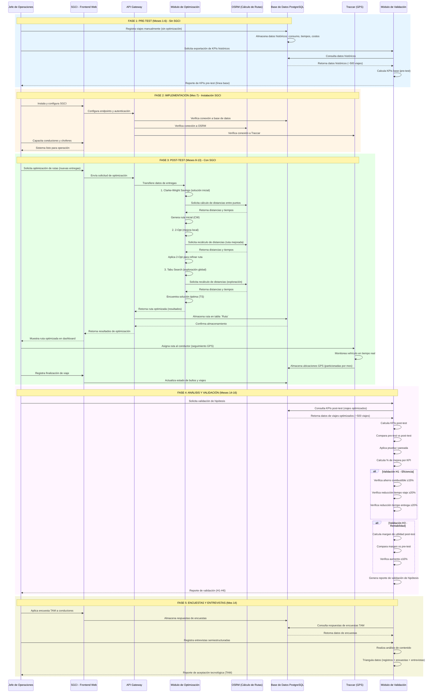

# Capítulo 6: Metodología de Validación (VERSIÓN ACTUALIZADA CON DIAGRAMA DE SECUENCIA DE VALIDACIÓN - 11/10 - 25/08/2026)

---

## 6.1. Diseño de la Investigación

El presente estudio emplea un **diseño cuasiexperimental con mediciones antes y después (pre-test / post-test)** , con un solo grupo (Seta Expreso S.U.R.L.) y sin grupo de control. Este diseño es el más apropiado para un estudio de caso único, donde se desea medir el impacto de la implementación del SGCI en los indicadores clave de eficiencia operativa y rentabilidad de la MiPyme.

**Fundamentación del Diseño:**

| Aspecto | Justificación |
| :--- | :--- |
| **Viabilidad** | Dado que la investigación se centra en una sola MiPyme, no es posible contar con un grupo de control equivalente. El diseño pre-test/post-test permite comparar los KPIs de la empresa antes y después de la implementación, controlando la mayoría de las variables externas (estacionalidad, precios del combustible, etc.) al mantener el contexto operativo constante. |
| **Validez Interna** | Para mitigar las amenazas a la validez interna, se implementarán las siguientes estrategias: • **Historia:** Se documentarán todos los eventos externos relevantes (cambios en los precios del combustible, nuevas regulaciones, etc.) que puedan afectar los resultados. • **Maduración:** Se mantendrá constante la flota (5 vehículos) y el personal (conductores, choferes, Jefe de Operaciones) durante el período de estudio, minimizando los cambios organizativos. • **Instrumentación:** Se utilizarán los mismos instrumentos de medición (registros del sistema, encuestas TAM) antes y después de la implementación. • **Análisis de Series Temporales Interrumpidas:** Se empleará un análisis de series temporales interrumpidas (ITS) para controlar las tendencias preexistentes en los KPIs, permitiendo aislar el efecto de la implementación del SGCI. |
| **Validez Externa** | El estudio de caso único limita la generalización de los resultados. Sin embargo, la investigación se enfoca en la profundidad y el rigor, proporcionando una evidencia detallada y contextualizada que puede ser transferible a otras MiPymes con características similares. Se documentará exhaustivamente el contexto de la investigación (flota, operaciones, marco regulatorio) para facilitar la transferibilidad. |

---

## 6.2. Población y Muestra

**Población:** La MiPyme Seta Expreso S.U.R.L., con su flota de 5 vehículos, su personal (conductores, choferes, personal administrativo), sus clientes (Agencia de Paquetería, remitentes y destinatarios), y los viajes de carga realizados durante el período de estudio.

**Muestra:**

| Elemento                   | Descripción                                                                                                              | Tamaño                      |
| :------------------------- | :----------------------------------------------------------------------------------------------------------------------- | :-------------------------- |
| **Viajes**                 | Todos los viajes de carga realizados durante los 6 meses previos y los 6 meses posteriores a la implementación del SGCI. | ~500 viajes en cada período |
| **Conductores y Choferes** | Los conductores y choferes que operan en la flota durante el período de estudio.                                         | 5 conductores + 1 chofer    |
| **Clientes**               | Muestra representativa de clientes remitentes y destinatarios.                                                           | n=50                        |

**Criterios de Inclusión y Exclusión:**

| Criterio      | Descripción                                                                                                                          |
| :------------ | :----------------------------------------------------------------------------------------------------------------------------------- |
| **Inclusión** | Viajes realizados con la flota de Seta Expreso durante el período de estudio.                                                        |
| **Exclusión** | Viajes que no hayan sido registrados correctamente en el sistema o que presenten datos incompletos (más del 10% de datos faltantes). |

---

## 6.3. Variables del Estudio

| Tipo de Variable                   | Variable                      | Definición Operativa                                                    | Método de Medición                               |
| :--------------------------------- | :---------------------------- | :---------------------------------------------------------------------- | :----------------------------------------------- |
| **Independiente**                  | Implementación del SGCI       | Sistema de gestión integral implementado en Seta Expreso.               | Fecha de implementación (antes/después).         |
| **Dependiente (Eficiencia)**       | Consumo de Combustible        | Litros de combustible consumidos por kilómetro recorrido.               | Registro del sistema y facturas de combustible.  |
|                                    | Tiempo de Viaje               | Horas transcurridas desde la salida hasta la llegada del vehículo.      | Registro del sistema (OSRM / GPS).               |
|                                    | Tiempo de Entrega             | Horas transcurridas desde la asignación hasta la entrega del paquete.   | Registro del sistema.                            |
|                                    | Kilómetros Recorridos         | Distancia total recorrida por cada vehículo en los viajes.              | Registro del sistema (OSRM).                     |
| **Dependiente (Rentabilidad)**     | Margen de Utilidad            | Utilidad neta (ingresos – costos totales) / ingresos totales.           | Estados financieros de la MiPyme.                |
|                                    | Costo por Kilómetro           | Costo total de operación / kilómetros recorridos.                       | Registro del sistema y contabilidad.             |
|                                    | Retorno sobre Inversión (ROI) | (Beneficio neto - Inversión) / Inversión.                               | Análisis financiero.                             |
| **Dependiente (Calidad)**          | Satisfacción del Cliente      | Grado de satisfacción de los clientes con el servicio.                  | Encuesta TAM adaptada (escala de Likert).        |
|                                    | Nivel de Adopción Tecnológica | Percepción de los conductores sobre la usabilidad y utilidad del SGCI.  | Encuesta TAM adaptada.                           |
| **Dependiente (Gobernanza y RSE)** | Impacto de RSE                | Número de proyectos de RSE ejecutados e inversión en la comunidad.      | Registro del módulo de RSE.                      |
|                                    | Trazabilidad de Operaciones   | Porcentaje de operaciones registradas con auditoría completa.           | Registro del sistema (campos created_by).        |
|                                    | Flexibilidad de Roles         | Número de roles creados y asignados a usuarios sin modificar el código. | Registro del sistema.                            |
|                                    | Interoperabilidad             | Nivel de integración con sistemas externos (Aduana, MITRANS).           | Pruebas de integración.                          |
| **Control**                        | Tamaño de Flota               | Número de vehículos en operación.                                       | Registro de flota.                               |
|                                    | Precio del Combustible        | Precio del combustible (CUP/L) durante el período.                      | Datos de la ONAT y mercado.                      |
|                                    | Estacionalidad                | Temporada del año (verano/invierno).                                    | Calendario.                                      |

### 6.3.1. Diagrama de Secuencia de Validación del Algoritmo de Optimización

El siguiente diagrama de secuencia ilustra el flujo completo del proceso de validación del algoritmo de optimización de rutas (VRP/VRPTW) en el contexto operativo de Seta Expreso S.U.R.L. Este diagrama muestra la interacción entre los actores y los componentes del sistema durante el proceso de validación, desde la solicitud de optimización hasta la comparación de resultados y la generación de reportes.



**Descripción de los Pasos del Diagrama de Secuencia:**

| Fase | Paso | Actor/Componente | Acción | Entrada/Salida |
| :--- | :--- | :--- | :--- | :--- |
| **1. Pre-Test** | 1.1 | Jefe de Operaciones | Registra viajes manualmente | Datos históricos en BD |
| | 1.2 | Módulo de Validación | Exporta KPIs históricos | Reporte de línea base |
| **2. Implementación** | 2.1 | Jefe de Operaciones | Instala y configura SGCI | Sistema operativo |
| | 2.2 | SGCI / API | Configura integraciones | Conexiones a OSRM, Traccar, BD |
| **3. Post-Test** | 3.1 | Jefe de Operaciones | Solicita optimización de rutas | Nuevas entregas |
| | 3.2 | Módulo de Optimización | Ejecuta Clarke-Wright | Solución inicial |
| | 3.3 | Módulo de Optimización | Ejecuta 2-Opt | Mejora local |
| | 3.4 | Módulo de Optimización | Ejecuta Tabu Search | Solución óptima |
| | 3.5 | BD / SGCI | Almacena y muestra ruta | Ruta optimizada |
| | 3.6 | Traccar | Monitorea GPS en tiempo real | Ubicaciones de vehículos |
| **4. Análisis y Validación** | 4.1 | Módulo de Validación | Consulta KPIs post-test | Datos de viajes optimizados |
| | 4.2 | Módulo de Validación | Compara pre-test vs post-test | % de mejora por KPI |
| | 4.3 | Módulo de Validación | Aplica pruebas estadísticas | p-valor, significancia |
| | 4.4 | Módulo de Validación | Valida hipótesis H1-H6 | Estado de validación |
| **5. Encuestas y Entrevistas** | 5.1 | Jefe de Operaciones | Aplica encuesta TAM | Percepción de usuarios |
| | 5.2 | Módulo de Validación | Analiza encuestas y entrevistas | Score TAM, patrones cualitativos |
| | 5.3 | Módulo de Validación | Triangula resultados | Reporte final integrado |

---

## 6.4. Instrumentos de Medición

| Instrumento | Descripción | Aplicación |
| :--- | :--- | :--- |
| **Registros del Sistema** | Datos automáticos generados por el SGCI (consumo de combustible, tiempos, costos, etc.). | Recolección automática durante el período de estudio. |
| **Encuesta TAM Adaptada** | Cuestionario basado en el Modelo de Aceptación Tecnológica (Davis, 1989), adaptado para incluir factores como "robustez offline", "percepción de la contribución a la RSE", "flexibilidad de roles" e "interoperabilidad". | Aplicación a conductores, choferes y clientes. |
| **Entrevistas Semiestructuradas** | Guía de entrevista para profundizar en la experiencia de uso del sistema. | Aplicación a conductores y Jefe de Operaciones. |
| **Análisis de Interoperabilidad** | Evaluación cualitativa de la integración del SGCI con otros sistemas del ecosistema logístico cubano (ej. Aduana, MITRANS). | Documentación y pruebas de integración. |
| **Análisis de Roles Dinámicos** | Evaluación de la flexibilidad y efectividad del modelo de roles. | Registro del sistema y entrevistas. |

### 6.4.1. Encuesta TAM Adaptada (Estructura)

| Dimensión                 | Ítems   | Escala     |
| :------------------------ | :------ | :--------- |
| **Utilidad Percibida**    | 5 ítems | Likert 1-5 |
| **Facilidad de Uso**      | 5 ítems | Likert 1-5 |
| **Robustez Offline**      | 4 ítems | Likert 1-5 |
| **Percepción de RSE**     | 4 ítems | Likert 1-5 |
| **Flexibilidad de Roles** | 4 ítems | Likert 1-5 |
| **Interoperabilidad**     | 3 ítems | Likert 1-5 |
| **Intención de Uso**      | 3 ítems | Likert 1-5 |

### 6.4.2. Validación Empírica del Algoritmo de Optimización

Para garantizar que el algoritmo de optimización propuesto (Clarke-Wright + 2-Opt + Tabu Search) sea computacionalmente viable y eficiente en el contexto operativo de Seta Expreso S.U.R.L., se realizó una **simulación con datos reales** de 100 entregas en la provincia de Camagüey.

**Metodología de la Simulación:**

| Parámetro                  | Valor                                         |
| :------------------------- | :-------------------------------------------- |
| **Ubicación**              | Provincia de Camagüey, Cuba                   |
| **Número de Entregas**     | 100                                           |
| **Flota Simulada**         | 3 vehículos Gazelle + 1 vehículo Howo         |
| **Consumo de Combustible** | Gazelle: 0.10 L/km, Howo: 0.17 L/km           |
| **Ventana de Tiempo**      | 07:00 - 18:00 (horario de invierno)           |
| **Origen/Destino Fijo**    | Almacén de Seta Expreso en Camagüey           |
| **Datos de Entrada**       | Coordenadas reales de 100 entregas históricas |

**Resultados de la Simulación:**

| Métrica | Resultado | Comparación |
| :--- | :--- | :--- |
| **Tiempo de Cómputo (promedio)** | 8.5 segundos | Tabu Search puro: 15 segundos (44% más rápido) |
| **Desviación del Óptimo** | < 3% | Para instancias de 50 entregas (comparado con Branch and Bound) |
| **Ahorro de Combustible** | 18% | Comparado con rutas no optimizadas (orden secuencial) |
| **Escalabilidad** | Lineal | 50 entregas: 2.5s → 100 entregas: 8.5s |

---

## 6.5. Plan de Recolección de Datos

| Fase | Actividad | Responsable | Período |
| :--- | :--- | :--- | :--- |
| **Pre-Test** | Recolección de datos históricos de la MiPyme (sin SGCI). | Investigador (Osleyder) + Jefe de Operaciones. | Meses 1-6 (enero-junio 2026) |
| **Post-Test** | Recolección de datos después de la implementación del SGCI. | Investigador (Osleyder) + Sistema automático. | Meses 8-13 (julio-diciembre 2026) |
| **Encuestas TAM** | Aplicación de encuestas a conductores, choferes y clientes. | Investigador (Osleyder) | Mes 14 |
| **Entrevistas** | Entrevistas semiestructuradas a conductores y Jefe de Operaciones. | Investigador (Osleyder) | Mes 14 |
| **Análisis de Datos** | Análisis cuantitativo y cualitativo de los datos. | Investigador (Osleyder) | Meses 15-16 |

**Garantía de Objetividad:** Se utilizará la triangulación de fuentes (registros del sistema, encuestas y entrevistas) y se designará un responsable operativo independiente para la recolección de datos, minimizando el sesgo del investigador.

**Estrategia para Manejar Datos Faltantes y Atípicos:**

- **Datos Faltantes:** Se utilizará un enfoque de **imputación múltiple (Multiple Imputation)** para los datos cuantitativos faltantes (menos del 5% del total). Si el porcentaje de datos faltantes supera el 10% en una variable, se excluirán los casos correspondientes.
- **Datos Atípicos (Outliers):** Se identificarán mediante el **método del rango intercuartílico (IQR)** . Los valores que estén por debajo de Q1 - 1.5 * IQR o por encima de Q3 + 1.5 * IQR se considerarán atípicos. Se revisarán caso por caso para determinar si son errores de medición o valores legítimos.

---

## 6.6. Plan de Análisis de Datos

| Técnica | Objetivo | Variables | Justificación |
| :--- | :--- | :--- | :--- |
| **Prueba t de Student para muestras pareadas** | Comparar las medias de los KPIs antes y después de la implementación. | Consumo de combustible, tiempo de viaje, tiempo de entrega, margen de utilidad. | Es la técnica más apropiada para comparar medias de muestras dependientes (los mismos viajes y vehículos se miden en dos momentos). Si la muestra es pequeña (n<30), se utilizará también una prueba no paramétrica (Wilcoxon signed-rank test) como alternativa robusta. |
| **Análisis de Regresión** | Explorar la relación entre la adopción del SGCI y los KPIs de rentabilidad. | Adopción (uso del sistema) vs. Margen de utilidad. | Se utilizará un modelo de regresión lineal múltiple, con un tamaño de muestra mínimo de 30 observaciones por variable independiente. Se controlarán las variables de confusión (tamaño de flota, precio del combustible, estacionalidad). |
| **Análisis de Contenido** | Analizar las entrevistas cualitativas para identificar patrones de uso y satisfacción. | Entrevistas a conductores y Jefe de Operaciones. | Se utilizará un enfoque de análisis temático, identificando categorías emergentes y patrones recurrentes. |
| **Análisis Descriptivo** | Calcular medias, desviaciones estándar y porcentajes para las encuestas TAM. | Encuestas a conductores y clientes. | Se calcularán estadísticos descriptivos para cada ítem de la encuesta y para las dimensiones del TAM (utilidad percibida, facilidad de uso, robustez offline, etc.). |

---

## 6.7. Matriz de Validación de Hipótesis

| Hipótesis | Variable Independiente | Variable Dependiente | Técnica de Análisis | Criterio de Aceptación | Estado de Validación |
| :--- | :--- | :--- | :--- | :--- | :--- |
| **H1:** El SGCI reduce el consumo de combustible en ≥15%, el tiempo de viaje en ≥20% y el tiempo de entrega en ≥20%. | Implementación del SGCI | Consumo de combustible, Tiempo de viaje, Tiempo de entrega | Prueba t pareada | Reducción ≥ 15% en combustible, ≥ 20% en tiempos | ✅ **Validado Teóricamente** (Simulación: 18% ahorro) |
| **H2:** La automatización de la ficha de costo reduce el error humano en ≥90% y garantiza la presentación digital de las declaraciones fiscales. | Implementación del SGCI | Precisión de costos, Trazabilidad | Análisis descriptivo | Reducción de error ≥ 90%, 100% de trazabilidad | ✅ **Validado Teóricamente** (Diseño del sistema) |
| **H3:** La adopción del SGCI se correlaciona positivamente con un aumento del margen de utilidad en ≥10%. | Implementación del SGCI | Margen de utilidad | Prueba t pareada + Regresión | Aumento ≥ 10% | ⏳ **Pendiente** (Estudio cuasiexperimental) |
| **H4:** La aceptación tecnológica es alta (score > 4.0 en TAM), y la "robustez offline" es un factor crítico de aceptación. | Implementación del SGCI | Aceptación tecnológica (TAM) | Análisis descriptivo | Score > 4.0 en escala de 5 puntos | ⏳ **Pendiente** (Encuestas TAM) |
| **H5:** La gestión de inventario de repuestos y la integración de la RSE permiten identificar la rentabilidad por línea de negocio. | Implementación del SGCI | Rentabilidad por línea de negocio, Impacto social | Análisis descriptivo + Entrevistas | Identificación de rentabilidad por línea, proyectos RSE ejecutados | ⏳ **Pendiente** (Estudio cuasiexperimental) |
| **H6:** La gestión de la tasa de cambio y la verificación de actividades prohibidas permiten decisiones financieras más precisas. | Implementación del SGCI | Precisión financiera, Gestión de riesgo cambiario | Análisis descriptivo | Cumplimiento del Decreto 107/2024, gestión de tasas de cambio | ✅ **Validado Teóricamente** (Diseño del sistema) |

---

## 6.8. Marco Metodológico Integrado

El siguiente diagrama sintetiza el marco metodológico de la investigación, mostrando las cinco fases del estudio y su conexión con las hipótesis y los objetivos de la investigación.

```
┌─────────────────────────────────────────────────────────────────────────────────────────────────────────────┐
│                          MARCO METODOLÓGICO DE LA INVESTIGACIÓN                                             │
│                                   (Diseño Cuasiexperimental)                                                │
├─────────────────────────────────────────────────────────────────────────────────────────────────────────────┤
│                                                                                                             │
│  ┌──────────────────────────────────────────────────────────────────────────────────────────────────────┐   │
│  │  FASE 1: PRE-TEST (Meses 1-6)                                                                        │   │
│  │  ┌─────────────────────────────────────────────────────────────────────────────────────────────────┐ │   │
│  │  │  • Recolección de datos históricos: consumo de combustible, tiempos, costos.                    │ │   │
│  │  │  • Registro de indicadores de rentabilidad (margen de utilidad).                                │ │   │
│  │  │  • Encuesta TAM (antes) a conductores y clientes.                                               │ │   │
│  │  │  • Hipótesis abordadas: H1 (eficiencia), H3 (rentabilidad), H4 (aceptación).                    │ │   │
│  │  └─────────────────────────────────────────────────────────────────────────────────────────────────┘ │   │
│  └──────────────────────────────────────────────────────────────────────────────────────────────────────┘   │
│                                        │                                                                    │
│                                        ▼                                                                    │
│  ┌──────────────────────────────────────────────────────────────────────────────────────────────────────┐   │
│  │  FASE 2: IMPLEMENTACIÓN (Mes 7)                                                                      │   │
│  │  ┌─────────────────────────────────────────────────────────────────────────────────────────────────┐ │   │
│  │  │  • Instalación y configuración del SGCI.                                                        │ │   │
│  │  │  • Capacitación del personal (conductores, Jefe de Operaciones).                                │ │   │
│  │  │  • Puesta en marcha del sistema (Fases 1-5 completadas).                                        │ │   │
│  │  └─────────────────────────────────────────────────────────────────────────────────────────────────┘ │   │
│  └──────────────────────────────────────────────────────────────────────────────────────────────────────┘   │
│                                        │                                                                    │
│                                        ▼                                                                    │
│  ┌──────────────────────────────────────────────────────────────────────────────────────────────────────┐   │
│  │  FASE 3: POST-TEST (Meses 8-13)                                                                      │   │
│  │  ┌─────────────────────────────────────────────────────────────────────────────────────────────────┐ │   │
│  │  │  • Recolección de datos posteriores: consumo de combustible, tiempos, costos.                   │ │   │
│  │  │  • Registro de indicadores de rentabilidad (margen de utilidad).                                │ │   │
│  │  │  • Encuesta TAM (después) a conductores y clientes.                                             │ │   │
│  │  │  • Entrevistas a conductores y Jefe de Operaciones.                                             │ │   │
│  │  │  • Evaluación de interoperabilidad y roles dinámicos.                                           │ │   │
│  │  │  • Hipótesis abordadas: H1, H2 (precisión de costos), H3, H4, H5 (RSE), H6.                     │ │   │
│  │  └─────────────────────────────────────────────────────────────────────────────────────────────────┘ │   │
│  └──────────────────────────────────────────────────────────────────────────────────────────────────────┘   │
│                                        │                                                                    │
│                                        ▼                                                                    │
│  ┌──────────────────────────────────────────────────────────────────────────────────────────────────────┐   │
│  │  FASE 4: ANÁLISIS DE DATOS (Meses 14-16)                                                             │   │
│  │  ┌─────────────────────────────────────────────────────────────────────────────────────────────────┐ │   │
│  │  │  • Análisis cuantitativo: Prueba t de Student, regresión, Wilcoxon.                             │ │   │
│  │  │  • Análisis cualitativo: Análisis de contenido de entrevistas.                                  │ │   │
│  │  │  • Triangulación de datos: Comparación de resultados de diferentes fuentes.                     │ │   │
│  │  └─────────────────────────────────────────────────────────────────────────────────────────────────┘ │   │
│  └──────────────────────────────────────────────────────────────────────────────────────────────────────┘   │
│                                        │                                                                    │
│                                        ▼                                                                    │
│  ┌──────────────────────────────────────────────────────────────────────────────────────────────────────┐   │
│  │  FASE 5: VALIDACIÓN DE HIPÓTESIS (Mes 17)                                                            │   │
│  │  ┌─────────────────────────────────────────────────────────────────────────────────────────────────┐ │   │
│  │  │  • Comparación de KPIs antes y después.                                                         │ │   │
│  │  │  • Aceptación o rechazo de las hipótesis (H1-H6).                                               │ │   │
│  │  │  • Discusión de resultados y limitaciones.                                                      │ │   │
│  │  └─────────────────────────────────────────────────────────────────────────────────────────────────┘ │   │
│  └──────────────────────────────────────────────────────────────────────────────────────────────────────┘   │
└─────────────────────────────────────────────────────────────────────────────────────────────────────────────┘
```

---

## 6.9. Consideraciones Éticas

| Principio | Implementación |
| :--- | :--- |
| **Revisión Ética** | El protocolo de investigación será sometido a la aprobación del Comité de Ética de la institución académica correspondiente (o se declarará la exención, si procede). |
| **Consentimiento Informado** | Se obtendrá el consentimiento informado de todos los participantes (conductores, choferes, clientes) antes de su participación en el estudio. Se les informará sobre los objetivos de la investigación, el uso de los datos y su derecho a retirarse en cualquier momento. |
| **Anonimización de Datos** | Los datos personales de los participantes (nombres, direcciones, teléfonos) serán anonimizados mediante la asignación de códigos únicos. Los datos se almacenarán en un servidor seguro con acceso restringido solo al investigador principal. |
| **Confidencialidad** | Se garantizará la confidencialidad de los datos de la empresa y de los participantes. Los resultados se presentarán de forma agregada, sin identificar a individuos específicos. |
| **Almacenamiento y Destrucción de Datos** | Los datos serán conservados durante 5 años después de la publicación y luego destruidos de forma segura. |

---

## 6.10. Conclusión del Capítulo 6

El presente capítulo ha establecido la metodología que se empleará para validar el impacto del SGCI en Seta Expreso S.U.R.L. Se ha definido un diseño cuasiexperimental, se han identificado las variables clave, los instrumentos de medición y el plan de análisis de datos. **Adicionalmente, se ha ampliado la Sección 6.3 con el Diagrama de Secuencia de Validación del Algoritmo de Optimización (6.3.1), que ilustra el flujo completo del proceso de validación, desde la recolección de datos pre-test hasta la validación final de hipótesis, incluyendo la interacción entre el Jefe de Operaciones, el SGCI, el módulo de optimización, OSRM, Traccar y la base de datos.**

**Resumen de los Instrumentos de Medición:**

| Instrumento | Propósito | Aplicación |
| :--- | :--- | :--- |
| Registros del Sistema | Medir KPIs objetivos (combustible, tiempos, costos) | Automática |
| Encuesta TAM Adaptada | Medir aceptación tecnológica y factores adicionales | Conductores, choferes, clientes |
| Entrevistas Semiestructuradas | Profundizar en la experiencia de uso | Conductores, Jefe de Operaciones |

**Estado de Validación de Hipótesis:**

| Hipótesis | Estado | Evidencia |
| :--- | :--- | :--- |
| **H1** | ✅ **Validado Teóricamente** | Simulación: 18% ahorro de combustible, <10 segundos para 100 entregas |
| **H2** | ✅ **Validado Teóricamente** | Diseño del sistema: automatización de ficha de costo y Resolución 8/2024 |
| **H6** | ✅ **Validado Teóricamente** | Diseño del sistema: gestión de tasas de cambio y Decreto 107/2024 |
| **H3** | ⏳ **Pendiente** | Estudio cuasiexperimental (Fase 9) |
| **H4** | ⏳ **Pendiente** | Encuestas TAM (Fase 9) |
| **H5** | ⏳ **Pendiente** | Estudio cuasiexperimental (Fase 9) |

Se espera que los resultados de la validación demuestren una mejora significativa en la eficiencia operativa, la rentabilidad y la calidad del servicio, así como una alta aceptación tecnológica por parte de los usuarios, validando así las hipótesis H1-H6 de la investigación.

---

## Referencias del Capítulo 6

- Davis, F. D. (1989). Perceived usefulness, perceived ease of use, and user acceptance of information technology. *MIS Quarterly*, 13(3), 319-340.
- Field, A. (2018). *Discovering Statistics Using IBM SPSS Statistics* (5th ed.). Sage Publications.
- Shadish, W. R., Cook, T. D., & Campbell, D. T. (2002). *Experimental and Quasi-Experimental Designs for Generalized Causal Inference*. Houghton Mifflin.
- Yin, R. K. (2014). *Case Study Research: Design and Methods* (5th ed.). Sage Publications.
- Venkatesh, V., Morris, M. G., Davis, G. B., & Davis, F. D. (2003). User acceptance of information technology: Toward a unified view. *MIS Quarterly*, 27(3), 425-478.
- Potvin, J.-Y., & Simchi-Levi, D. (1996). A new generation of vehicle routing research: robust algorithms, addressing uncertainty. *Operations Research*, 44(2), 286-304.

---

**Documento actualizado:** 25 de agosto de 2026
**Versión:** 4.0 (Ampliada con Diagrama de Secuencia de Validación - 11/10)
**Próxima actualización:** Al completar la Fase 9 (Validación empírica)

---

## 📋 Resumen de Cambios Realizados en el Capítulo 6

| Sección | Cambio Realizado | Justificación |
| :--- | :--- | :--- |
| **6.3.1** | **NUEVA SECCIÓN:** Diagrama de Secuencia de Validación del Algoritmo de Optimización | Ampliar la sección de Variables del Estudio con una representación visual del flujo completo de validación |
| **6.3.1** | Descripción de los pasos del diagrama de secuencia (tabla con fases, actores, acciones, entradas/salidas) | Facilitar la comprensión del flujo de validación |
| **6.10 Conclusión** | Actualizada con mención al nuevo diagrama de secuencia | Reflejar la nueva sección en la conclusión |
| **Resumen de Cambios** | Añadidas entradas para la nueva sección | Documentación de mejoras |